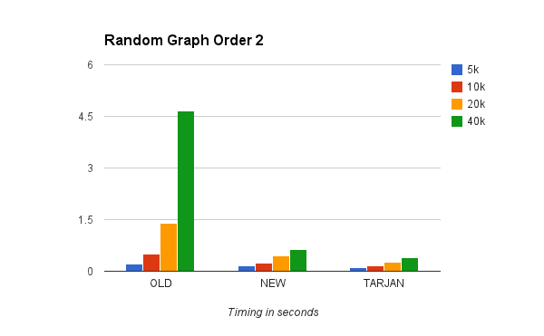

The Xamarin.Android 4.14 series updates `OpenTK-1.0.dll` to
improve compatibility with Xamarin.iOS and reduces installation size.

 

 

#  [Xamarin.Android 4.14.0](#Xamarin.Android_4.14.0)

### New Features

<ul>
  <li><code>OpenTK-1.0</code> now has an API that is more compatible with Xamarin.iOS. Check these 2 samples as an example of shared code between Android and iOS apps, which uses OpenTK 1.0:
  	<ul>
  		<li><a href="https://github.com/xamarin/mobile-samples/tree/rodo-consolidate-opentk/GLKeysES30">GLKeysES30</a></li>
  		<li><a href="https://github.com/xamarin/mobile-samples/tree/rodo-consolidate-opentk/TexturedCubeES30">TexturedCubeES30</a></li>
  	</ul>
  </li>
  <li><code>OpenTK-1.0</code> now has an improved OpenGL ES 3.0 API with more specific enums.</li>
  <li>The
  	<a href="/guides/android/deployment,_testing,_and_metrics/profiling/">profiler</a>
  	now works!</li>
  <li>On OS X the installer size is 36% smaller (147MB vs. 229MB).</li>
  <li>On Windows the Xamarin.Android installer is now bundled with the Xamarin.iOS installer.</li>
  <li>The <code>Mono.Android.GoogleMaps.dll</code> assembly is now obsolete and
	  will be removed in a future release. Please use the
	  <a href="http://components.xamarin.com/view/googleplayservices">Google Play
	  Services</a> component.</li>
  <li>The <code>Mono.Android.Support.v4.dll</code> assembly is now obsolete and
	  will be removed in a future release. Please use the
  	<a href="http://components.xamarin.com/view/xamandroidsupportv4-18">Android
  	Support Library v4</a> component.</li>
  <li>The <code>Mono.Android.Support.v13.dll</code> assembly is now obsolete and
	  will be removed in a future release. Please use the
  	<a href="http://components.xamarin.com/view/xamandroidsupportv13-18">Android
  	Support Library v13</a> component.</li>
  <li>Xamarin.Android version information is now embedded into <code>Mono.Android.dll</code>
    within a <a href="http://msdn.microsoft.com/en-us/library/system.reflection.assemblyinformationalversionattribute(v=vs.110).aspx">AssemblyInformationalVersionAttribute</a> custom attribute. To lookup this information
    for <em>diagnostic</em> purposes:
    <pre><code class=" syntax brush-C#">var attrs = (System.Reflection.AssemblyInformationalVersionAttribute[])
    typeof (Java.Lang.Object)
    .Assembly
    .GetCustomAttributes(typeof(System.Reflection.AssemblyInformationalVersionAttribute), inherit: true);
string version = attrs [0].InformationalVersion;
// version is like "4.13.350.144144054; git-rev-head:89776b6; git-branch:master"</code></pre>
  </li>
  <li>
Two new experimental GC Bridge modes added. The GC Bridge is responsible for making sure memory management works fine across Xamarin.Android and Dalvik.
    The new modes, named new and tarjan, fix some algorithmic non linearities that can result in performance improvements of over 10x. Two new modes proved necessary
    as they have unique performance characteristics that better fit different applications. The better scalability can be seen in the following benchmark, showing
    how the new modes perform compared to the old one. 

    

    
To ensure maximum reliability to current applications, the new modes must be explicitly enabled by passing <code>bridge-implementation=new</code> or <code>bridge-implementation=tarjan</code>
    to the MONO_GC_PARAM environment. For more information see the guides on <a href="/guides/android/advanced_topics/environment/">Environment</a> and
    <a href="/guides/android/advanced_topics/garbage_collection/#GC_Bridge_Options">Garbage Collection</a>.
  </li>
</ul>

### Bug fixes

-   [4902](https://bugzilla.xamarin.com/show_bug.cgi?id=4902) : Determine TimeZone from  `java.util.TimeZone` , not  `persist.sys.timezone` . 
-   [7384](https://bugzilla.xamarin.com/show_bug.cgi?id=7384) : Improve compatibility of  `OpenTK-1.0` between Xamarin.Android and Xamarin.iOS. 
-   [8182](https://bugzilla.xamarin.com/show_bug.cgi?id=8182) : OpenTK app +  `Intent.CreateChooser()` crashes. 
-   [10894](https://bugzilla.xamarin.com/show_bug.cgi?id=10894) :  `OpenTK.FrameEventArgs.set_Time` crash 
-   [11846](https://bugzilla.xamarin.com/show_bug.cgi?id=11846) : Some warnings can't find its source file. 
-   [12048](https://bugzilla.xamarin.com/show_bug.cgi?id=12048) : Missing static methods from type  `android.graphics.Color` . 
-   [13963](https://bugzilla.xamarin.com/show_bug.cgi?id=13963) : AIDL bound services error when service and client are run under separate PIDs. 
-   [15022](https://bugzilla.xamarin.com/show_bug.cgi?id=15022) : Android sample 'Gesture Builder' gives build error with Linker Option "Link ALL" on Release mode. 
-   [16589](https://bugzilla.xamarin.com/show_bug.cgi?id=16589) : Not all dependent assemblies are searched for .jars. 
-   [16621](https://bugzilla.xamarin.com/show_bug.cgi?id=16621) : TestRunner Does Not Execute TestFixtureSetUp/TearDown When Running Individual Tests. 
-   [16805](https://bugzilla.xamarin.com/show_bug.cgi?id=16805) : Class reference in  `<fragment class="">` not properly resolved in Library project. 
-   [17128](http://bugzilla.xamarin.com/show_bug.cgi?id=17128) : Seek on  `Filestream` passed 2GB raises exception. 
-   [17155](https://bugzilla.xamarin.com/show_bug.cgi?id=17155) :  `TimeZoneInfo.ConvertTime` adjustment rules aren't considered between Jan 1st and DateEnd. 
-   [17658](https://bugzilla.xamarin.com/show_bug.cgi?id=17658) : AndroidResgen does not encode (certain?) reserved f# keywords. 
-   [17710](https://bugzilla.xamarin.com/show_bug.cgi?id=17710) : Debug installation failure in FastDev assembly directory creation. 
-   [17788](https://bugzilla.xamarin.com/show_bug.cgi?id=17788) : Generated code references members which don't exist. 
-   [17884](https://bugzilla.xamarin.com/show_bug.cgi?id=17884) : Changing the managedName of a class that matches a namespace part does not stop the "naming violation" warning. 
-   [17994](https://bugzilla.xamarin.com/show_bug.cgi?id=17994) : Android AudioTrack constructor and static GetMinBufferSize have inconsistent channel configuration parameters. 
-   [18016](https://bugzilla.xamarin.com/show_bug.cgi?id=18016) : Weird behaviour on Renderscript bc files under Resources/raw folder. 
-   [18255](https://bugzilla.xamarin.com/show_bug.cgi?id=18255) : Generated gdb.env file on windows does not work correctly. 
-   [18259](https://bugzilla.xamarin.com/show_bug.cgi?id=18259) : WCF service call throws NullReferenceException in release configuration. 
-   [18369](https://bugzilla.xamarin.com/show_bug.cgi?id=18369) :  `Java.Lang.StringBuilder.Append(string s)` throws NoSuchMethod exception. 
-   [18526](https://bugzilla.xamarin.com/show_bug.cgi?id=18526) : I18n dlls do not exist in debug apks. 
-   [18580](https://bugzilla.xamarin.com/show_bug.cgi?id=18580) : Linker strips  `__TypeRegistrations` and JNI type mappings fail. 
-   [18609](https://bugzilla.xamarin.com/show_bug.cgi?id=18609) : Android FileObserver invalid mask. 
-   [18640](https://bugzilla.xamarin.com/show_bug.cgi?id=18640) :  `View.CanScroll(Horizontally|Vertically)` incorrect parameter type. 
-   [18763](https://bugzilla.xamarin.com/show_bug.cgi?id=18763) : Native SIGSEGVs don't invoke Android's SIGSEGV handler. 
-   [18962](https://bugzilla.xamarin.com/show_bug.cgi?id=18962) : On Android, SslStream authentication does not know about the system's default trusted roots, causing "Invalid certificate received from server" 
-   [19282](https://bugzilla.xamarin.com/show_bug.cgi?id=19282) : Slow build times. 
-   [19748](https://bugzilla.xamarin.com/show_bug.cgi?id=19748) : Android build tools should use  `aapt --max-res-version` , with the API level that the app is compiled against 
-   [20179](https://bugzilla.xamarin.com/show_bug.cgi?id=20179) : PCLv2 facade assemblies aren't installed when required. 
-   [20606](https://bugzilla.xamarin.com/show_bug.cgi?id=20606) : Types with  `[Export]` ed methods cannot be constructed. 
-   [20672](https://bugzilla.xamarin.com/show_bug.cgi?id=20672) :  `ListChangedEventArgs.PropertyDescriptor` is always  `null` in  `BindingList.ListChanged` event args 
-   [20911](https://bugzilla.xamarin.com/show_bug.cgi?id=20911) : Support  `zipalign` location change in build-tools r20. 

### Integrated Mono features/fixes

Based on [Mono 3.6.0](http://www.mono-project.com/Release_Notes_Mono_3.6) [commit 5ff701f7](https://github.com/mono/mono/commit/5ff701f7b73ff3b3d455e6e00065debcc17d08bd).

-   [9541](https://bugzilla.xamarin.com/show_bug.cgi?id=9541) :  `XPathNavigator.SchemaInfo` is  `null` after navigating  `XmlDocument` . 
-   [13640](https://bugzilla.xamarin.com/show_bug.cgi?id=13640) : Debugger steps to line which is not executed 
-   [14987](https://bugzilla.xamarin.com/show_bug.cgi?id=14987) : localized resource loading is overoptimized. 
-   [15695](https://bugzilla.xamarin.com/show_bug.cgi?id=15695) : sgen hangs when creating threads with pthread_create 
-   [16439](https://bugzilla.xamarin.com/show_bug.cgi?id=16439) : Exception thrown in async call is bypassing catch block. 
-   [16974](https://bugzilla.xamarin.com/show_bug.cgi?id=16974) :  `SslStream.AuthenticateAsServer` only send the EndCertificate, but not its chain... 
-   [17615](https://bugzilla.xamarin.com/show_bug.cgi?id=17615) : Unexpected parsing with Lithuanian culture. 
-   [17878](https://bugzilla.xamarin.com/show_bug.cgi?id=17878) : Bug in awaiters (unnecessary Post). 
-   [18113](https://bugzilla.xamarin.com/show_bug.cgi?id=18113) :  `XslCompiledTransform` does not handle whitespace in value-of elements correctly. 
-   [18114](https://bugzilla.xamarin.com/show_bug.cgi?id=18114) :  `XslCompiledTransform` throws  `XsltException` when executing the  `msxsl:node-set` function on a node set. 
-   [18118](https://bugzilla.xamarin.com/show_bug.cgi?id=18118) :  `XslCompiledTransform` uses incorrect context when a global variable references another global variable 
-   [18182](https://bugzilla.xamarin.com/show_bug.cgi?id=18182) :  `ConcurrentQueue<T>.TryPeek()` is not thread safe. 
-   [18213](https://bugzilla.xamarin.com/show_bug.cgi?id=18213) :  `System.Runtime.Caching.MemoryCache` doesn't honor  `SlidingExpiration` . 
-   [18235](https://bugzilla.xamarin.com/show_bug.cgi?id=18235) :  `System.Runtime.Caching.MemoryCache` doesn't order expirable items correctly. 
-   [18245](https://bugzilla.xamarin.com/show_bug.cgi?id=18245) :  `System.Runtime.MemoryCache.GetValues()` throws  `LockRecursionException` with expired items 
-   [18248](https://bugzilla.xamarin.com/show_bug.cgi?id=18248) :  `CompileQuoteUnaryExpression` is not implemented. 
-   [18361](https://bugzilla.xamarin.com/show_bug.cgi?id=18361) :  `FileInfo.MoveTo()` does not work with absolute paths 
-   [18378](https://bugzilla.xamarin.com/show_bug.cgi?id=18378) : WebStack: Missing method implementations 
-   [18400](https://bugzilla.xamarin.com/show_bug.cgi?id=18400) : Searching an array with indexOf is sometimes far slower than with a for loop 
-   [18494](https://bugzilla.xamarin.com/show_bug.cgi?id=18494) :  `System.Net.Http.Headers.RangeHeaderValue.Parse()` throws  `FormatException` . 
-   [18564](https://bugzilla.xamarin.com/show_bug.cgi?id=18564) : Race condition in  `XNamespace.GetName()` . 
-   [18574](https://bugzilla.xamarin.com/show_bug.cgi?id=18574) : Fix parsing of IPv6 addresses. 
-   [18599](https://bugzilla.xamarin.com/show_bug.cgi?id=18599) :  `StringBuilder.AppendFormat()` stopped working in multithreading. 
-   [18673](https://bugzilla.xamarin.com/show_bug.cgi?id=18673) : Quadratic Time for  `Enumerable.GroupBy()` 
-   [18687](https://bugzilla.xamarin.com/show_bug.cgi?id=18687) :  `HashSet.TrimExcess()` doubles the size of the collection each time it is called 
-   [18770](https://bugzilla.xamarin.com/show_bug.cgi?id=18770) :  `System.Globalization.SortVersion` missing 
-   [18848](https://bugzilla.xamarin.com/show_bug.cgi?id=18848) :  `System.Net.Http.HttpClientHandler` doesn't close TCP connections after  `Dispose()` call 
-   [18898](https://bugzilla.xamarin.com/show_bug.cgi?id=18898) : Cannot access DataRowView data from a DataView with a state filter. 
-   [18914](https://bugzilla.xamarin.com/show_bug.cgi?id=18914) : Unhandled exception is raised on attempt to watch local var after async/await call. 
-   [19082](https://bugzilla.xamarin.com/show_bug.cgi?id=19082) :  `Assembly.GetAssembly(x).DefinedTypes.Select(v => v.AsType())` vs  `typeof(X)` . 
-   [19083](https://bugzilla.xamarin.com/show_bug.cgi?id=19083) : Bug in mini_emit_memset 
-   [19235](https://bugzilla.xamarin.com/show_bug.cgi?id=19235) : Assertion at hazard-pointer.c:233, condition `small_id &lt; HAZARD_TABLE_OVERFLOW' not met 
-   [19343](https://bugzilla.xamarin.com/show_bug.cgi?id=19343) : SIGSEGV crash in garbage collector. 
-   [19460](https://bugzilla.xamarin.com/show_bug.cgi?id=19460) : View Accessor for Zero byte file MemoryMappedFile. 
-   [19564](https://bugzilla.xamarin.com/show_bug.cgi?id=19564) :  `Lazy<T>.Value` throws  `InvalidOperationException` instead of original exception when called by second thread 
-   [19644](https://bugzilla.xamarin.com/show_bug.cgi?id=19644) :  `System.Net.Http` doesn't encode Content-MD5 correctly 
-   [19667](https://bugzilla.xamarin.com/show_bug.cgi?id=19667) :  `System.Net.Http.HttpClient.GetStringAsync()` return strings with unicode BOM 
-   [19738](https://bugzilla.xamarin.com/show_bug.cgi?id=19738) :  `Process.PrivateMemorySize64` always returns 0. 
-   [19823](https://bugzilla.xamarin.com/show_bug.cgi?id=19823) :  `InvalidOperationException` in  `ServicePoint.RemoveConnectionGroup` . 
-   [19825](https://bugzilla.xamarin.com/show_bug.cgi?id=19825) : Mono Reflection cannot handle Custom Attributes constructors that take Jagged Arrays. 
-   [19864](https://bugzilla.xamarin.com/show_bug.cgi?id=19864) : Overloaded  `Process.WaitForExit()` method returns false immediately 
-   [19881](https://bugzilla.xamarin.com/show_bug.cgi?id=19881) :  `ProductInfoHeaderValue` fails to parse User-Agent string without version 
-   [19915](https://bugzilla.xamarin.com/show_bug.cgi?id=19915) :  `new Guid("{ 0x00000001, 0x0002, ...")` throws  `FormatException` due to whitespace 
-   [19924](https://bugzilla.xamarin.com/show_bug.cgi?id=19924) : Step over  `AppDomain.Unload` results into continued execution. 
-   [20052](https://bugzilla.xamarin.com/show_bug.cgi?id=20052) : Memory mappped files bug. 
-   [20591](https://bugzilla.xamarin.com/show_bug.cgi?id=20591) :  `MemoryMappedFile`  `CreateNew` aborts on  `using` statement. 
-   [519648](https://bugzilla.novell.com/show_bug.cgi?id=519648) :  `DataRowCollection.Find` throws  `System.IndexOutOfRangeException` when passed  `new object [] {null}` . 

 

### API Changes

-  API Level 4:  [Mono.Android.dll](xamarin.android_4.14/level_4_diff/mono.android.dll) ,  [Mono.Android.GoogleMaps.dll](xamarin.android_4.14/level_4_diff/mono.android.googlemaps.dll) ,  [Mono.Android.Support.v4.dll](xamarin.android_4.14/level_4_diff/mono.android.support.v4.dll) ,  [OpenTK.dll](xamarin.android_4.14/level_4_diff/opentk.dll) ,  [OpenTK-1.0.dll](xamarin.android_4.14/level_4_diff/opentk-1.0.dll) 
-  API Level 7:  [Mono.Android.dll](xamarin.android_4.14/level_7_diff/mono.android.dll) 
-  API Level 8:  [Mono.Android.dll](xamarin.android_4.14/level_8_diff/mono.android.dll) 
-  API Level 10:  [Mono.Android.dll](xamarin.android_4.14/level_10_diff/mono.android.dll) 
-  API Level 12:  [Mono.Android.dll](xamarin.android_4.14/level_12_diff/mono.android.dll) 
-  API Level 14:  [Mono.Android.dll](xamarin.android_4.14/level_14_diff/mono.android.dll) ,  [Mono.Android.Support.v13.dll](xamarin.android_4.14/level_14_diff/mono.android.support.v13.dll) 
-  API Level 15:  [Mono.Android.dll](xamarin.android_4.14/level_15_diff/mono.android.dll) 
-  API Level 16:  [Mono.Android.dll](xamarin.android_4.14/level_16_diff/mono.android.dll) 
-  API Level 17:  [Mono.Android.dll](xamarin.android_4.14/level_17_diff/mono.android.dll) 
-  API Level 18:  [Mono.Android.dll](xamarin.android_4.14/level_18_diff/mono.android.dll) 
-  API Level 19:  [Mono.Android.dll](xamarin.android_4.14/level_19_diff/mono.android.dll)
