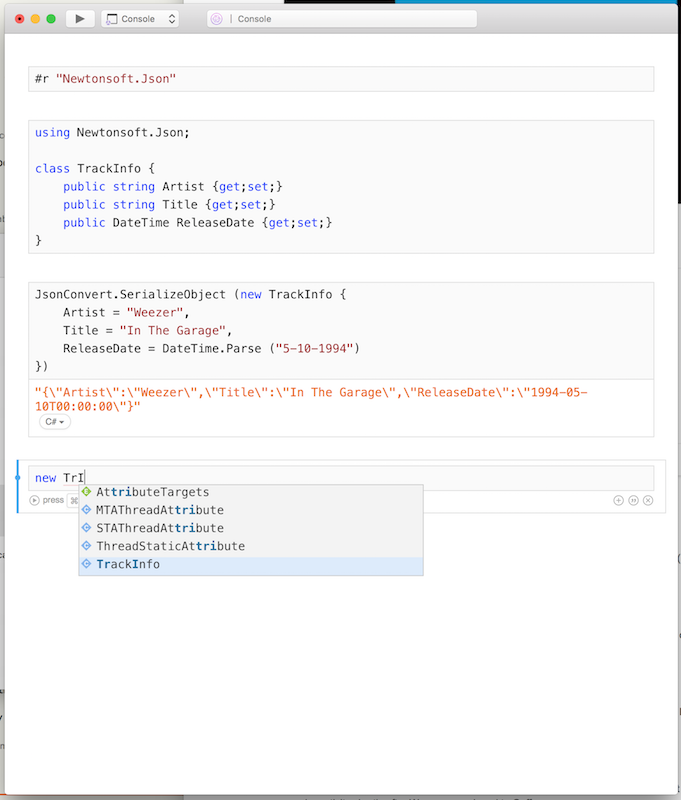
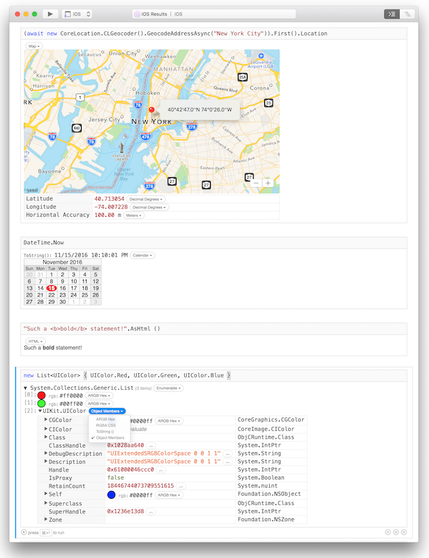
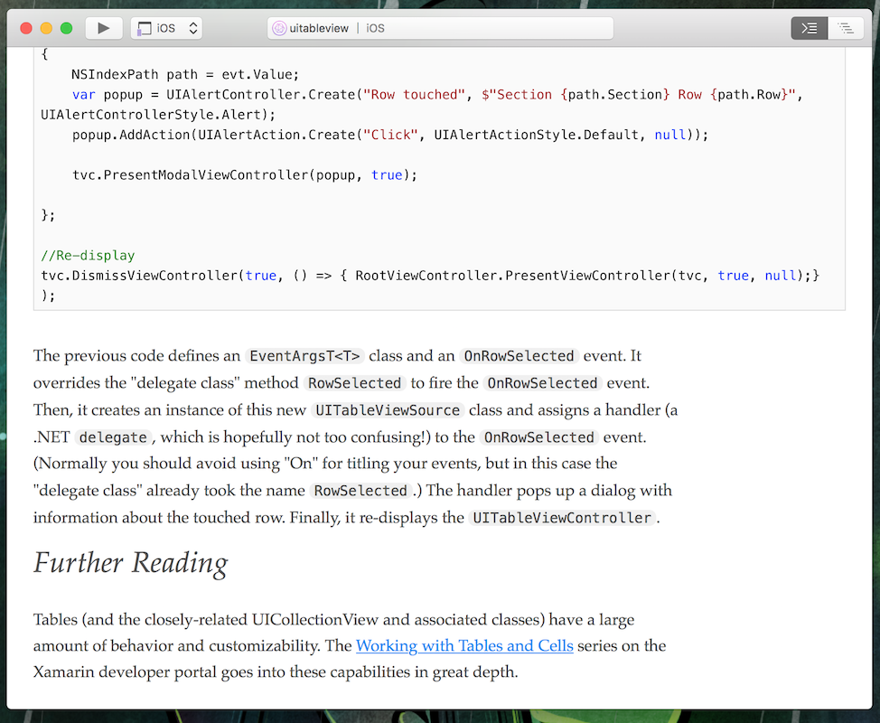
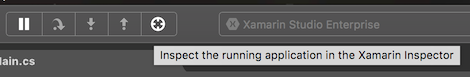

* [Download for Mac](https://dl.xamarin.com/interactive/XamarinInteractive-1.0.0.0.pkg)
* [Download for Windows](https://dl.xamarin.com/interactive/XamarinInteractive-1.0.0.0.msi)

Xamarin Workbooks & Inspector provide interactive tools for learning,
experimenting, and even modifying your running app.

## Workbooks

Xamarin Workbooks provide a blend of documentation and code that is perfect for
experimentation, learning, and creating guides and teaching aides.

### Live Code

Create a rich C# workbook for Android, iOS, Mac, WPF, or Console, and get instant
live results as you learn these APIs.

Workbooks are powered by the same underlying editor as Visual Studio Code, with
completion results provided by the Roslyn compiler suite, for a very comfortable
editing experience.

Workbooks can even reference external assemblies, NuGet packages, or `.csx` C#
script files.

### Rich results

Xamarin Workbooks understand the results of your code, and show rich representations
of those results whenever possible.

Examples:

* Images
* Colors
* Dates
* GeoLocations
* HTML
* Enumerables
* Strings
* Numbers

For any result, choose "Object Members" to look through the object's public
properties and fields.

### Rich Content

Workbooks can be saved and shared with others, and are perfect for teaching new
concepts, demonstrating features, or even making bug reports.

As such, workbooks support rich text cells in addition to C# code cells. Now you
can author lovely explanatory content within an interactive C# workbook.

Images and other resources can be bundled together into workbook packages, so
you can distribute a single download to other workbooks users.

### And More!

Workbooks can be retargeted to any supported platform, so you can test your
cross-platform code everywhere you want it to run.

Console workbooks are great for when you want to demonstrate core cross-platform
C# capabilities without waiting for a mobile app to load. 

## Live App Inspector

Live app inspection provides an interactive editing experience similar to workbooks,
but you are connected to your own running app.

This feature is provided as a Visual Studio and Xamarin Studio extension.

When you debug a Xamarin.Android, Xamarin.iOS, Xamarin.Mac, or WPF app in
your IDE, the Inspector extension lets you begin live app inspection with
a single click.

From the Inspector client, you can explore your app's view hierarchy, check out
view properties, and run C# code directly in your running app, all without
pausing the debugger.

Please see our documentation for live app inspection requirements.

### View Inspector

The view inspector lets you explore your UI in 2D or 3D, show hidden views,
explore iOS and Mac backing layers, and more! Xamarin.Forms apps can see both
the native view hierarchy and the Xamarin.Forms visual tree.

The view highlighter allows you to hover over your app, pick a view, and get
a live reference to it in the C# REPL.

Exploring and modifying your running C# app has never been this easy!

## KNOWN ISSUES

* Cycle 9 Xamarin (alpha channel as of this writing) is not yet supported.
* macOS 10.12 Sierra may experience workbook rendering issues.
* Xamarin.Forms features are not yet supported for iOS on Windows.
* NuGet Limitations
  - Android Workbooks are not yet supported.
  - iOS Workbooks on Windows are not yet supported.
  - Native libraries are not yet supported.
  - Packages which depend on `.target` files or PowerShell scripts will likely
    fail to work as expected.
  - To remove or modify a package dependency, edit the workbook's manifest with
    a text editor. Proper package management is on the way.

## UPDATES SINCE [0.99.3](/releases/interactive/preview/inspector-0.99.2)

* The Inspector extension for Visual Studio support now explicitly requires
  Xamarin 4.2.x. 4.3.x is not yet supported.
* Various fixes to new workbook package format.
* Fixed an issue with extra buttons showing up in the Mac client's toolbar.
* Windows installer now permits downgrading.
* Various other minor bug fixes.

