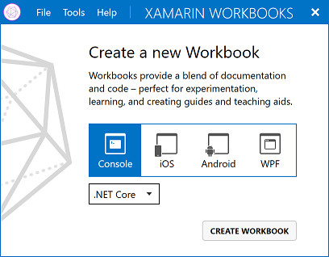
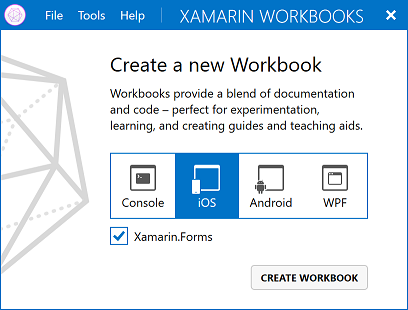
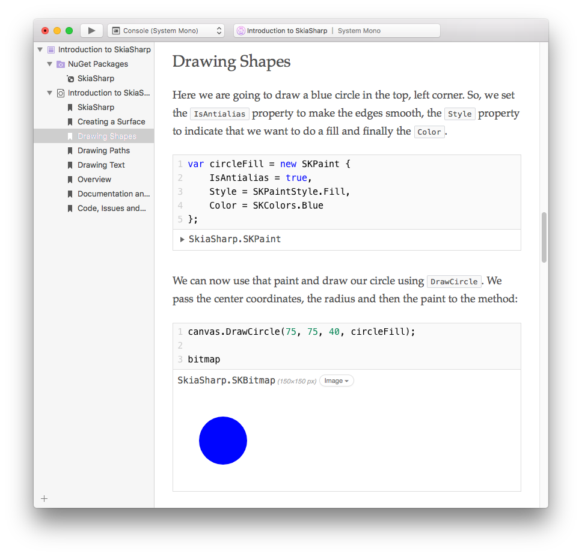
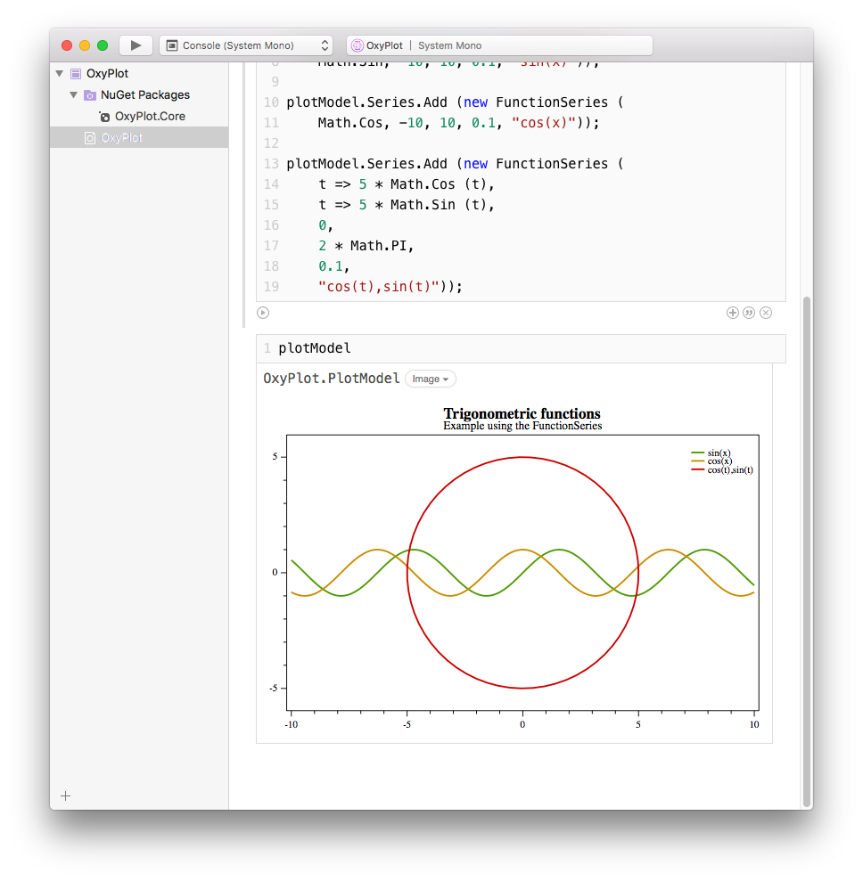
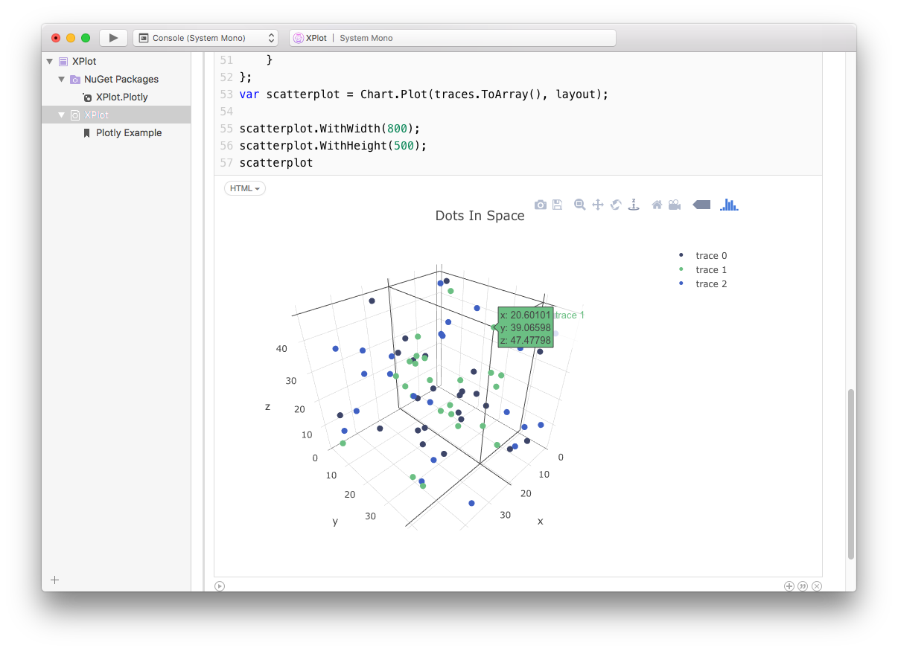
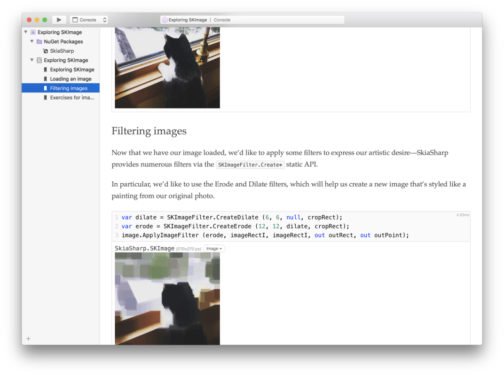

* [Download for Windows](https://dl.xamarin.com/interactive/XamarinInteractive-1.3.2.msi)
* [Download for Mac](https://dl.xamarin.com/interactive/XamarinInteractive-1.3.2.pkg)

Xamarin Workbooks & Inspector provide interactive tools for learning,
experimenting, and even modifying your running app.

This is a significant update to the [1.2 series][12-series], with a number of
new features:

* [.NET Core 2.0][dotnetcore] support
* NuGet improvments, including support for .NET Standard 2.0 packages
* Support for C# 7.1
* A new sidebar for Workbooks
* Easily enable Xamarin.Forms support when creating a new workbook
* Automatic rendering of SkiaSharp, XPlot, and OxyPlot types
* Improved accessibility on Windows

## 1.3 Series Releases

* [1.3.2](#1.3.2_October_3_2017) _(October 3, 2017)_
* [1.3.1](#1.3.1_September_21_2017) _(September 21, 2017)_
* [1.3.0](#1.3.0_September_14_2017) _(September 14, 2017)_

## .NET Core 2.0 Workbooks

You can now create Workbooks targeting [.NET Core 2.0][dotnetcore], the new
.NET platform for fast cross-platform server and console applications.

.NET Core 2.0, .NET Framework 4.6.1, and the latest Xamarin platforms
implement .NET Standard 2.0 and can reference .NET Standard NuGet packages.

## NuGet Improvements

Workbooks now use the same version of NuGet as Visual Studio 2017, opening up
access to the latest packages, including those targeting .NET Standard 2.0.

Packages installed in a Workbook now show up in the new sidebar, and can be
uninstalled via the context menu.

Workbooks use standard [NuGet.config files][nuget-config] to search the same
repositories you have configured in Visual Studio. The
[global package cache][nuget-cache] is now used to save disk space and speed up
package installation.

## C# Updates

The latest Roslyn update [introduces support for C# 7.1][csharp71] with
default expressions, inferred tuple names, and pattern-matching with generics:
small improvements to [C# 7][csharp7].

IntelliSense now has improved method signatures to show `ref`, `out`, `params`,
and optional parameter details.

## User Interface Improvements

The _New Workbook_ dialog has been redesigned to accommodate .NET Core and
platforms that support Xamarin.Forms. For Console workbooks, either .NET Core
or the system .NET Framework / Mono can be selected. For iOS and Android,
Xamarin.Forms can easily be enabled.
  

Workbooks now feature a sidebar that represents the structure of a workbook,
including NuGet packages and a navigable table of contents.

The table of contents is produced automatically based on markdown headers
(levels 1-3). The headers can be linked to from within the document, using the
same approach as GitHub (`[link text](#a-header)` to link to `# A Header`).

The Windows app now sports an "Open Recent" menu for parity with the Mac app.

### Accessibility Improvements on Windows

  - A high contrast theme is now available and automatically activated
    when high contrast mode is in use within Windows.
  - The default theme has improved contrast throughout.
  - All supplementary dialogs can now be closed via <kbd>Esc</kbd>

.
  - Improved support for screen readers by annotating some controls.

## Rendering Improvements

Plot objects returned from cells will now render directly in the
editor surface. Currently [OxyPlot](http://oxyplot.org) and
[XPlot](https://tahahachana.github.io/XPlot/) are supported.
[Sample workbooks](https://github.com/xamarin/Workbooks/tree/workbooks-1.3/charts/)
are available to get started with these libraries.

New [SkiaSharp][skdocs] renderers have been introduced for `SKSurface`,
`SKPixmap`, and `SKColor`.
[Sample workbooks](https://github.com/xamarin/Workbooks/tree/workbooks-1.3/graphics/skiasharp/images/images.workbook)
are also available to help learn SkiaSharp.

### Images

- SVG images are now supported (`ImageFormat.Svg`).
- New convenience `Image` functions are available (run `help` in a Workbook).

## Markdown Authoring

Special renderings for blockquotes starting with an emoji has been added.

- `> ℹ️` will render as a note with a blue background
- `> ⚠️` will render as a warning with a yellow background
- `> 🚫` will render as a problem with a red background

## SDK and Integrations

The [Workbooks SDK][sdk] allows library developers to integrate with Xamarin
Workbooks and Inspector to provide enhanced experiences.

In the 1.3 release, the SDK is now [published as a NuGet package][nuget].
This makes it easier to build integrations as projects, and ship them directly
in a library's NuGet package. As an example, check out SkiaSharp, which
[now ships Workbooks integrations within its own NuGet package](https://github.com/mono/SkiaSharp/tree/v1.59.1/source/SkiaSharp.Workbooks).

Custom integrations are loaded from NuGet packages, or when referenced directly
via `#r`.

## Notable Bug Fixes

### 1.3.2 _(October 3, 2017)_

* Fixed support for Mac Workbooks when running on macOS 10.13 High Sierra.
  See [bug #59749](https://bugzilla.xamarin.com/show_bug.cgi?id=59749) for
  details.

* Fixed stitching/Z-fighting on macOS in the 3D View Inspector when
  selecting views.

### 1.3.1 _(September 21, 2017)_

* Fixed an issue where the UrhoSharp NuGet on Windows failed to load.

* Improved performance when changing the zoom level of large workbooks.

* Addressed a connection failure when inspecting a Xamarin.Forms app using
  Visual Studio for Mac 7.1. See
  [bug #59601](https://bugzilla.xamarin.com/show_bug.cgi?id=59601) for details.

* Fixed a regression where workbooks would be unusable after reconnecting to
  a previously disconnected session.

### 1.3.0 _(September 14, 2017)_

* Code cells with `#load` directives will now be properly reloaded if the
  `.csx` script file has changed. Fixes
  [bug #59257](https://bugzilla.xamarin.com/show_bug.cgi?id=59257).

* On Mac, the update channel will now be discerned from Visual Studio for
  Mac if it is installed, falling back to Xamarin Studio otherwise.

* Links in HTML cell results now open in the default browser.

* Fixed a number of cases in which System.Drawing's `Bitmap` type would not
  render correctly as an image.

* Evaluated cells now properly re-evaluate when switching agents.

* Fixed a crash that could occur when copying and pasting within markdown cells.

* Fixed center positioning in the 3D view when representing `CALayer`s.

* Fixed a bug when using `System.ValueTuple` on Windows systems with
  .NET 4.7 installed.

* Fixed content scaling issues in 3D view.

* Addressed an issue that sometimes caused broken installations on Windows.

* Fixed [a bug](https://bugzilla.xamarin.com/show_bug.cgi?id=58018) which
  caused empty strings to render as null.

* Fixed [a bug](https://bugzilla.xamarin.com/show_bug.cgi?id=58801) on Windows
  where deserializing fully qualified JSON via Newtonsoft.Json would fail to
  look up types defined in the workbook.

* Fixed [a bug](https://bugzilla.xamarin.com/show_bug.cgi?id=57773) that would
  sometimes cause inconsistent rendering of Console output from the agent.

* Fixed [a bug](https://bugzilla.xamarin.com/show_bug.cgi?id=53522) that could
  cause Android workbook connection to hang on Mac.

## Known Issues

* NuGet Limitations
  - Native libraries are supported only on iOS, and only when linked with
    the managed library.
  - Packages which depend on `.targets` files or PowerShell scripts will likely
    fail to work as expected.
  - To modify a package dependency, edit the workbook's manifest with
    a text editor. A more complete package management UI is on the way.

[12-series]: /releases/interactive/interactive-1.2
[skdocs]: /guides/cross-platform/skiasharp/
[sdk]: /guides/cross-platform/workbooks/sdk/

[skintegration]: https://github.com/mono/SkiaSharp/tree/v1.59.1/source/SkiaSharp.Workbooks

[dotnetcore]: https://www.microsoft.com/net/core/platform

[csharp7]: https://docs.microsoft.com/en-us/dotnet/csharp/whats-new/csharp-7
[csharp71]: https://docs.microsoft.com/en-us/dotnet/csharp/whats-new/csharp-7-1

[nuget]: https://nuget.org/packages/Xamarin.Workbooks.Integration
[nuget-config]: https://docs.microsoft.com/en-us/nuget/consume-packages/configuring-nuget-behavior
[nuget-cache]: https://docs.microsoft.com/en-us/nuget/consume-packages/managing-the-nuget-cache
