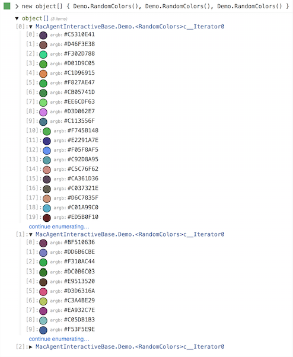

* [Download for Mac](https://download.xamarin.com/inspector/XamarinInspector.pkg)
* [Download for Windows](https://download.xamarin.com/inspector/XamarinInspector.msi)

This is a bugfix and feature update of
[the last Xamarin Inspector preview](http://developer.xamarin.com/releases/inspector/preview/inspector-0.3.2/).

Check out
[the initial release notes](http://developer.xamarin.com/releases/inspector/preview/inspector-0.3.1/#What_does_it_do)
or
[our documentation](https://developer.xamarin.com/guides/cross-platform/inspector/)
for more details on the Inspector.

Also be sure to ask questions on the [Inspector forum](http://forums.xamarin.com/categories/inspector)
and [file any bugs](https://bugzilla.xamarin.com/enter_bug.cgi?product=Workbooks%20%26%20Inspector) you may encounter.

[bugs]: https://bugzilla.xamarin.com/enter_bug.cgi?product=Workbooks%20%26%20Inspector

# Changes Since 0.3.2

* The serialization of evaluation results from your app to the Inspector client
  has been overhauled, resulting in greater stability and opening the door for
  some great features next year.

* Improved interactive rendering of results

  - Enumerables can be expanded or collapsed. Results can be loaded instantly,
    10 items at a time, with a single click. Enumerables within other
    enumerables can still be expanded.

  - Clicking on the new and improved color renderer cycles between different
    representations.

  - 

  - More on the way!

* New "standalone" mode in the Mac client.

  - Go to `File -> New Standalone Session` to launch an Inspector window that
    connects to an agent app we've bundled (like in Sketches).

  - Quick access to a C# REPL in any supported environment.

  - Android, iOS, and WPF support coming soon!

* Mac client is now installed to `/Applications`. The Xamarin Studio add-in
  expects it to be exactly there.

* Mac installer package should now properly support Active Directory
  users (#[36229][36229]).

* Mac and iOS REPL sessions now default to `using` Foundation, CoreGraphics,
  and AppKit/UIKit.

* Visual Studio Community Edition is now supported (#[36229][36229]).

* Visual Studio 2013 support has been restored (#[36509][36509]).

[36229]: https://bugzilla.xamarin.com/show_bug.cgi?id=36229
[34859]: https://bugzilla.xamarin.com/show_bug.cgi?id=34859
[36509]: https://bugzilla.xamarin.com/show_bug.cgi?id=36509

# Known Issues

* When inspecting WPF apps, exceptions may have [missing stack frames][35838].
  This appears to be an issue with the .NET (Microsoft) runtime. iOS, Mac, and
  Android applications are not affected since they use the Mono runtime.

* Inspecting 64-bit WPF apps is not supported (#[37134][37134])

[35838]: https://bugzilla.xamarin.com/show_bug.cgi?id=35838
[37134]: https://bugzilla.xamarin.com/show_bug.cgi?id=37134

