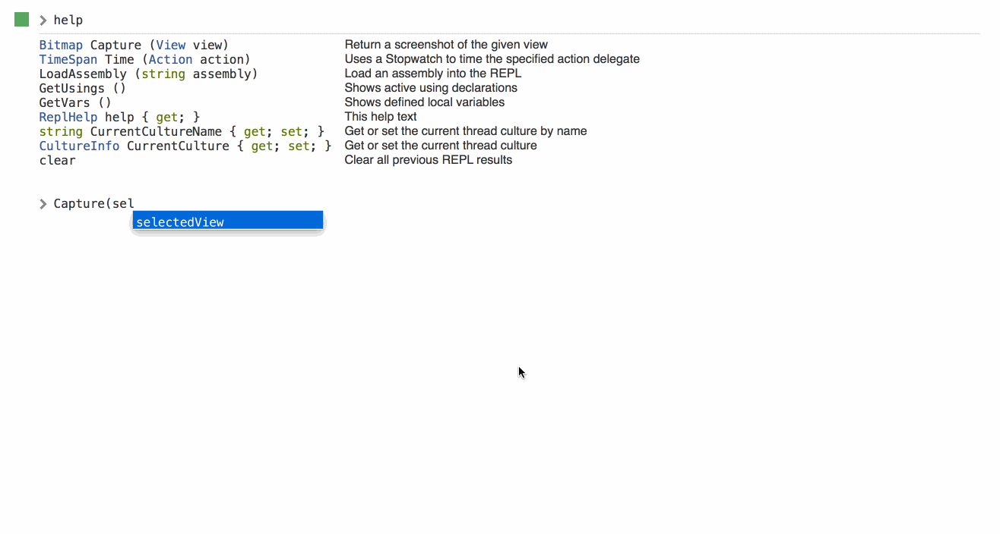

* [Download for Mac](https://download.xamarin.com/inspector/XamarinInspector.pkg)
* [Download for Windows](https://download.xamarin.com/inspector/XamarinInspector.msi)

This is a bugfix and feature update of
[the last Xamarin Inspector preview](http://developer.xamarin.com/releases/inspector/preview/inspector-0.4.0/).

Check out
[the initial release notes](http://developer.xamarin.com/releases/inspector/preview/inspector-0.3.1/#What_does_it_do)
or
[our documentation](https://developer.xamarin.com/guides/cross-platform/inspector/)
for more details on the Inspector.

Also be sure to ask questions on the [Inspector forum](http://forums.xamarin.com/categories/inspector)
and [file any bugs][bugs] you may encounter.

[bugs]: https://bugzilla.xamarin.com/enter_bug.cgi?product=Workbooks%20%26%20Inspector

# Changes Since 0.4.0

* Building on the serialization and rendering improvements in 0.4.0, the REPL
  now features better exploration of all data types. Any object we don't provide
  a special renderer for now expands to an interactive table of member values,
  each of which can itself be expanded.

* Additional interactive rendering improvements:

  - DateTime, number types, enums, and strings have improved rendering.

  - Rendering takes into account the inspected app's CultureInfo.

  - Many types have multiple viewing formats, which can be cycled between by
    clicking the result.

  - 

  - Exceptions, stdout, and stderr all render more nicely as well.

  - More on the way!

* New "standalone" mode target: iOS (in addition to Mac).

  - Go to `File → New Standalone Session` to launch an Inspector window that
    connects to an agent app we've bundled (like in Sketches).

  - Quick access to a C# REPL in any supported environment.

  - Android and WPF support coming soon!

* Clear the REPL screen with the `clear` command.

* Improved (and interactive!) `GetUsings()` and `GetVars()` built-ins.

* View objects no longer render as images unless you call `Capture(...)` on
  them. This allows deeper view inspection by default.

* Mac view highlighting now works across multiple windows.

* Bugfixes to auto-complete and REPL input history.

* You no longer have to quit the Inspector to access its log files on Windows.

# Known Issues

* When inspecting WPF apps, exceptions may have [missing stack frames][35838].
  This appears to be an issue with the .NET (Microsoft) runtime. iOS, Mac, and
  Android applications are not affected since they use the Mono runtime.

* Inspecting 64-bit WPF apps is not supported (#[37134][37134])

[35838]: https://bugzilla.xamarin.com/show_bug.cgi?id=35838
[37134]: https://bugzilla.xamarin.com/show_bug.cgi?id=37134

