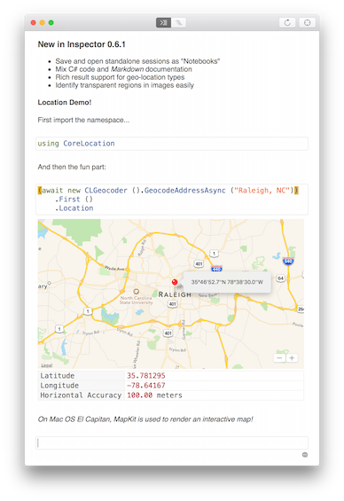
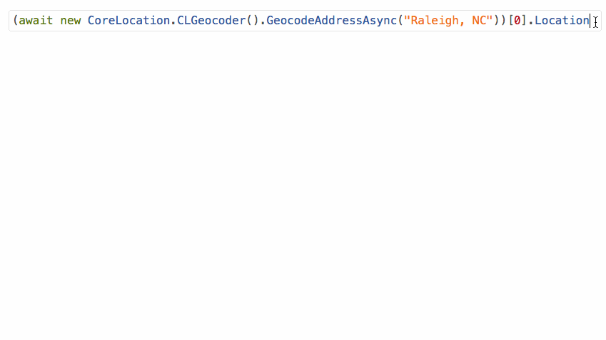

* [Download for Mac](https://download.xamarin.com/inspector/XamarinInspector.pkg)
* [Download for Windows](https://download.xamarin.com/inspector/XamarinInspector.msi)

This is a bugfix and feature update of
[the last Xamarin Inspector preview](http://developer.xamarin.com/releases/inspector/preview/inspector-0.6.0/).

Check out
[the initial release notes](http://developer.xamarin.com/releases/inspector/preview/inspector-0.3.1/#What_does_it_do)
or
[our documentation](https://developer.xamarin.com/guides/cross-platform/inspector/)
for more details on the Inspector.

Also be sure to ask questions on the [Inspector forum](http://forums.xamarin.com/categories/inspector)
and [file any bugs][bugs] you may encounter.

[bugs]: https://bugzilla.xamarin.com/enter_bug.cgi?product=Workbooks%20%26%20Inspector

**NOTE:** *Xamarin Inspector 0.6.1 still requires Xamarin Studio 5.10, and is not
yet compatible with the new Xamarin Studio 6.0 (available in the alpha channel).
Please stick with the Beta or Stable channel to continue using the Inspector.
The next Xamarin Inspector release will require Xamarin Studio 6.0.*

# Changes Since 0.6.0

* Notebooks

  - Notebooks are standalone Inspector sessions that can be saved and loaded as
    reference documents or for educational use.

  - Notebooks save in a [CommonMark](http://commonmark.org/) Markdown format for
    easy viewing outside of the Inspector client.

  - Rich descriptive text can be inserted (and subsequently edited) in between
    existing code submissions.
    

* Location rendering

  - `CLLocation`, `CLLocationCoordinate2D`, and `Android.Locations.Location` now
    display as a table of properties.

  - Measurement types can be clicked on to cycle between different units.

  - On El Capitan, a native `MapKit` map will be displayed as well.
    

* Adjustable background for transparent images

  - When rendering image results, a slider appears above the image, allowing the
    background to darken from white to black, to help identify transparent
    regions in the image.
    

* `String.AsHtml()` extension method will insert the given string into an
  `iframe`'d HTML `body` and render the result.

# Known Issues

* Inspecting 64-bit WPF apps is not supported (#[37134][37134])

[37134]: https://bugzilla.xamarin.com/show_bug.cgi?id=37134

