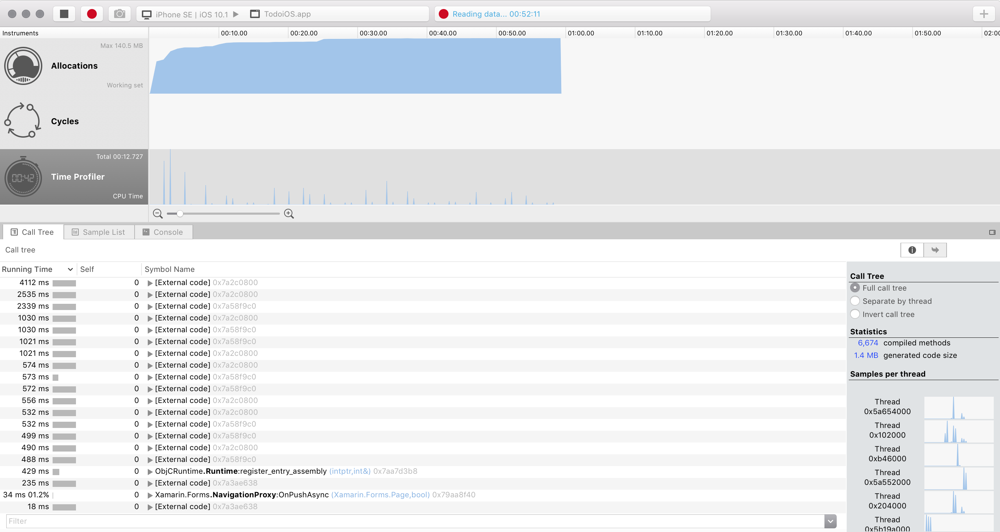

After more than two years of development, we are happy to announce the release of Xamarin Profiler 1.0.
The Profiler is a new companion to the already extensive set of Xamarin development tools and allows you to profile the behavior of your applications, ensuring your apps are free from performance and memory related issues.

**Allocations on Windows**

**Time Profiler on Mac**

This 1.0 release includes the following features:

* Profile Xamarin.Android, Xamarin.iOS, Xamarin.Mac, and desktop applications.
* Separate instruments for profiling of different aspects of your application:
 * Memory-related performance profiling
 * Time-related performance profiling
 * Cycle detection
* Take memory snapshots to check how memory looks in your application at different points in time
* Trace back object references in your code to eliminate memory leaks
* Per-thread views of memory and time information
* Concise text and visual representations of data
* Zoom-in feature to analyze only the parts you're interested in

The new release is [available](http://xamarin.com/profiler) now for download.

**Release notes**

Common:

* Display tooltips in paths to roots
* Include runtime settings in New Session dialog

Bugs fixed:

* [44590](https://bugzilla.xamarin.com/show_bug.cgi?id=44590) - Unable to sort snapshots by count
* [45043](https://bugzilla.xamarin.com/show_bug.cgi?id=45043) - Paths to roots items don't resize
* [44828](https://bugzilla.xamarin.com/show_bug.cgi?id=44828) - File format dropdown truncated
* [43459](https://bugzilla.xamarin.com/show_bug.cgi?id=43459) - Search filter doesn't match UI
* [44824](https://bugzilla.xamarin.com/show_bug.cgi?id=44824) - Search box dropdown not working properly
* [44245](https://bugzilla.xamarin.com/show_bug.cgi?id=44245) - Missing tooltip in allocations pie chart
* [44623](https://bugzilla.xamarin.com/show_bug.cgi?id=44623) - Confusing colors in snapshots' growth values
* [45235](https://bugzilla.xamarin.com/show_bug.cgi?id=45235) - 'Hide extension' checkbox missing in Save dialog
* [44426](https://bugzilla.xamarin.com/show_bug.cgi?id=44426) - Unable to start profiling from VS
* [45542](https://bugzilla.xamarin.com/show_bug.cgi?id=45542) - Xcode 8.1 beta not supported
* [43196](https://bugzilla.xamarin.com/show_bug.cgi?id=43196) - No data in inverse references tree
* [44826](https://bugzilla.xamarin.com/show_bug.cgi?id=44826) - Logs at wrong location
* [44683](https://bugzilla.xamarin.com/show_bug.cgi?id=44683) - UI not cleared when refreshing data
* [45361](https://bugzilla.xamarin.com/show_bug.cgi?id=45361) - New session dialog weird resizing
* [45359](https://bugzilla.xamarin.com/show_bug.cgi?id=45359) - Black background in new session dialog
* [45553](https://bugzilla.xamarin.com/show_bug.cgi?id=45553) - Can't expand inspector area
* [44924](https://bugzilla.xamarin.com/show_bug.cgi?id=44924) - Extra blank column
* [44820](https://bugzilla.xamarin.com/show_bug.cgi?id=44820) - Data not loaded
* [45374](https://bugzilla.xamarin.com/show_bug.cgi?id=45374) - Snapshot button disabled
* [45197](https://bugzilla.xamarin.com/show_bug.cgi?id=45197) - New session dialog fails at being used with keyboard
* [45799](https://bugzilla.xamarin.com/show_bug.cgi?id=45799) - Text color makes text invisible
* [45877](https://bugzilla.xamarin.com/show_bug.cgi?id=45877) - Table column not resizing correctly
* [45990](https://bugzilla.xamarin.com/show_bug.cgi?id=45990) - Black background in new session dialog
* [44985](https://bugzilla.xamarin.com/show_bug.cgi?id=44985) - Snapshot filtering problem when drilling down
* [46181](https://bugzilla.xamarin.com/show_bug.cgi?id=46181) - Menu item behaving wrong
* [40999](https://bugzilla.xamarin.com/show_bug.cgi?id=40999) - Profiler starts alternatively via VS
* [40989](https://bugzilla.xamarin.com/show_bug.cgi?id=40989) - Profiler process is not killed when exiting
* [45323](https://bugzilla.xamarin.com/show_bug.cgi?id=45323) - Wrong tooltip showing up
* [41427](https://bugzilla.xamarin.com/show_bug.cgi?id=41427) - No timing information
* [39667](https://bugzilla.xamarin.com/show_bug.cgi?id=39667) - Runtime wrappers in call tree are confusing
* [46471](https://bugzilla.xamarin.com/show_bug.cgi?id=46471) - Samples stacktraces are inverted
* [46543](https://bugzilla.xamarin.com/show_bug.cgi?id=46543) - Can't profile on iOS simulator
* [46465](https://bugzilla.xamarin.com/show_bug.cgi?id=46465) - Call tree scrolls to the right when navigating
* [46466](https://bugzilla.xamarin.com/show_bug.cgi?id=46466) - Highlighting siblings slows down the call tree
* [46540](https://bugzilla.xamarin.com/show_bug.cgi?id=46540) - NRE when closing window while loading MLPD
* [46677](https://bugzilla.xamarin.com/show_bug.cgi?id=46677) - Choose button enabled when no instrument template selected
* [46698](https://bugzilla.xamarin.com/show_bug.cgi?id=46698) - Race condition on certain Android devices/simulators
* [46319](https://bugzilla.xamarin.com/show_bug.cgi?id=46319) - Search bar not shown for console view
* [46629](https://bugzilla.xamarin.com/show_bug.cgi?id=46629) - Can't profile iOS apps from VS

While this is a stable product now, and work is already underway to make the product better as well as
have shiny new features, there are still some known limitations:

* No official support for profiling Release builds
* Time instrument not available for tvOS profiling

We encourage users to get in touch and [file bug reports](https://bugzilla.xamarin.com/enter_bug.cgi?product=Profiler) so we can continue to make this tool more useful.

