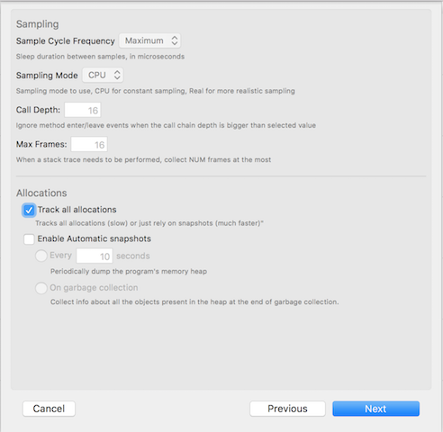
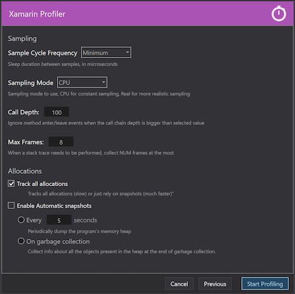
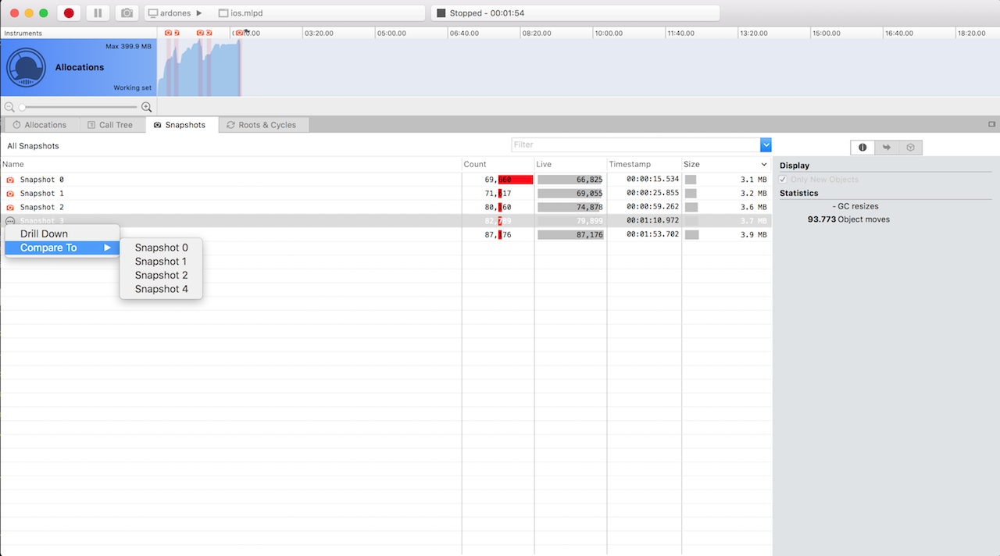
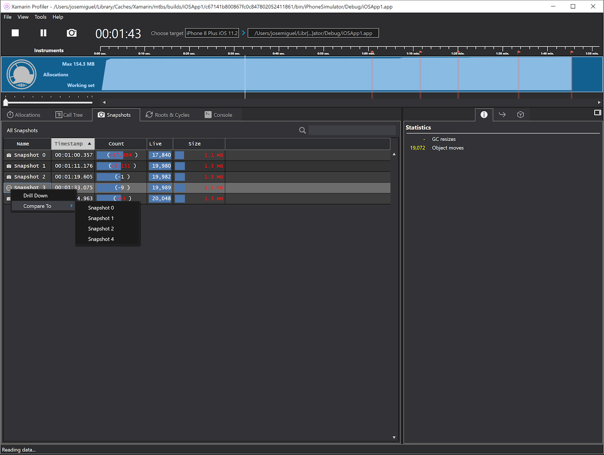
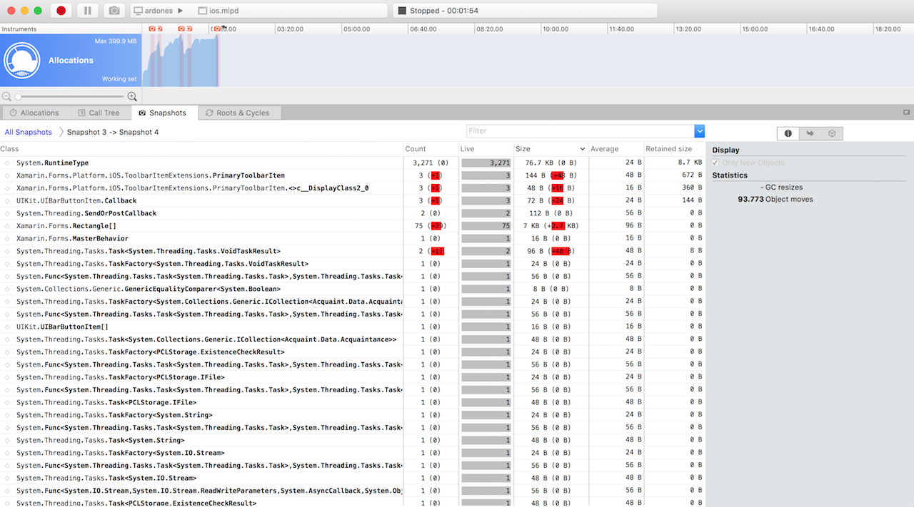
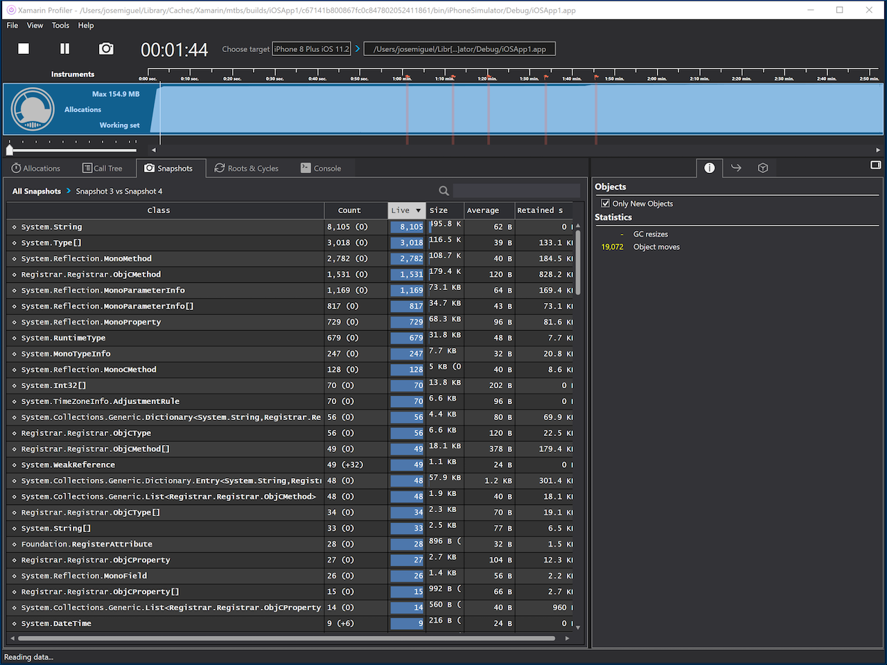

# 1.6.2-165 (2018-05-31)

* [Xamarin Profiler for Mac](https://dl.xamarin.com/profiler/profiler-mac-1.6.2-165.pkg)
* [Xamarin Profiler for Windows](https://dl.xamarin.com/profiler/XamarinProfiler.Windows.Installer.1.6.2-165.msi)

## What's new in this release

* Adapt EULA and Telemetry to GDPR

# 1.6.2-162 (2018-04-18)

* [Xamarin Profiler for Mac](https://dl.xamarin.com/profiler/profiler-mac-1.6.2-162.pkg)
* [Xamarin Profiler for Windows](https://dl.xamarin.com/profiler/XamarinProfiler.Windows.Installer.1.6.2-162.msi)

## What's new in this release

* Several translations-related fixes
* [Mac] Fix disappearing scrollers on data lists
* [Windows] Fix problem with Path to Roots popups not being dismissed
* [Windows] Never disable "Drill down" menu in snapshots view
* [Windows] Use clearer colors in Path to Roots view so that cycles are easily distinguished from normal references
* [Windows] Several improvements in New Session dialog
* [Windows] Further improvements to remote iOS simulator support

# 1.6.2-145 (2018-04-04)

**This is a beta of the upcoming Xamarin Profiler 1.6.2 release. These previews are unsupported builds to allow
developers to test the new features, and to gather feedback and bug reports. Your help is very appreciated!**

* [Xamarin Profiler for Mac](https://dl.xamarin.com/profiler/profiler-mac-1.6.2-145.pkg)
* [Xamarin Profiler for Windows](https://dl.xamarin.com/profiler/XamarinProfiler.Windows.Installer.1.6.2-145.msi)

## What's new in this release

* Re-add passing of maxframes setting to Mono runtime profiler
* Ignore object allocators in stack traces, so that allocations show in the real methods
* Remove unused Call Depth setting from New Session dialog
* [Windows] Fix snapshot frequency setting to use milliseconds instead of seconds
* [Windows] Improve usage of remote iOS simulator

# 1.6.2-133 (2018-03-19)

**This is a beta of the upcoming Xamarin Profiler 1.6.2 release. These previews are unsupported builds to allow
developers to test the new features, and to gather feedback and bug reports. Your help is very appreciated!**

* [Xamarin Profiler for Mac](https://dl.xamarin.com/profiler/profiler-mac-1.6.2-133.pkg)
* [Xamarin Profiler for Windows](https://dl.xamarin.com/profiler/XamarinProfiler.Windows.Installer.1.6.2-133.msi)

## What's new in this release

* Move "Max Frames" setting to a common section, so that it can be changed whatever instrument the user selects
* Enable translations on Mac UI
* Fix remembering of last run when it is for local files
* Add missing Xamarin.Android.Tools.AndroidSdk to the Windows installer
* Improved performance

# 1.6.2-127 (2018-03-08)

**This is a beta of the upcoming Xamarin Profiler 1.6.2 release. These previews are unsupported builds to allow
developers to test the new features, and to gather feedback and bug reports. Your help is very appreciated!**

* [Xamarin Profiler for Mac](https://dl.xamarin.com/profiler/profiler-mac-1.6.2-127.pkg)
* [Xamarin Profiler for Windows](https://dl.xamarin.com/profiler/XamarinProfiler.Windows.Installer.1.6.2-126.msi)

## Improve light allocations mode

In 1.6.1 there was an initial implementation of a light allocations mode, which allows profiling without
recording every single bit of data for the profiled app. This helps in making the Xamarin Profiler much
more usable with big or bad performing apps, which might generate such a huge amount of data that waiting
for the whole data to be processed was a big problem.

To enable it, just uncheck the *Track all allocations* setting in the New Session dialog:

This makes the Xamarin Profiler not record information about every single allocation in the profiled
application, and instead allow users to just take snapshots whenever they want to see current memory
usage of the profiled app. This doesn't provide full information for the whole lifetime of the
application, but instead allows users to perform much faster profiling to check for problems like
memory leaks.

In this new release, a lot of under-the-scenes work has been done to further improve this feature.

## Improve snapshots comparison

In previous releases, Xamarin Profiler only allowed comparing snapshots with its previous snapshot
(by double clicking on a snapshot in the snapshots list, by default it showed new objects compared
to the previous snapshot). This feature has now been extended to allow comparing any snapshots,
which helps a lot in finding allocations through the snapshots taken via profiling your application.

To use this feature, just hover the mouse over the snapshot you want to compare, and click on the
"..." button that shows up:

This will open the usual list of allocations on the selected snapshot grouped by class, but with the
addition of several stats about object and size growth:

## Several performance improvements

As always, performance is a top priority for us, as profiling generates a huge amount of data. Lots of
small and not-so-small improvements have been added to this new release that should make using
Xamarin Profiler for profiling big or misbehaving apps much nicer.
