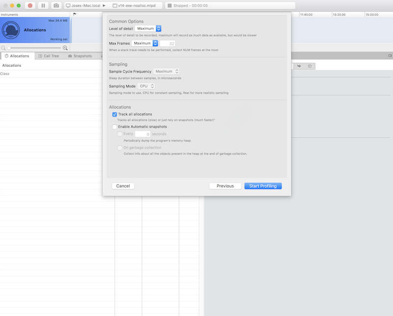
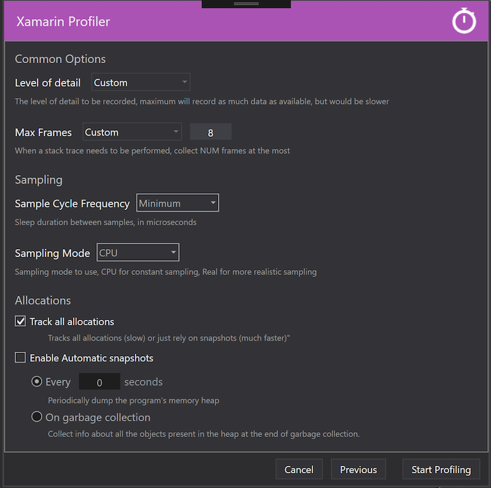
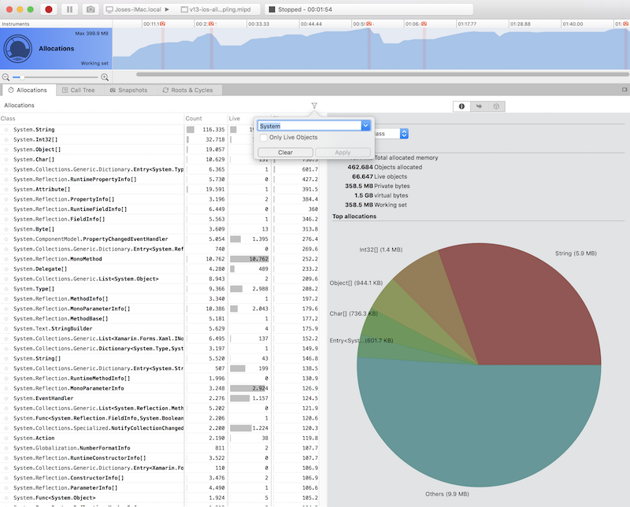
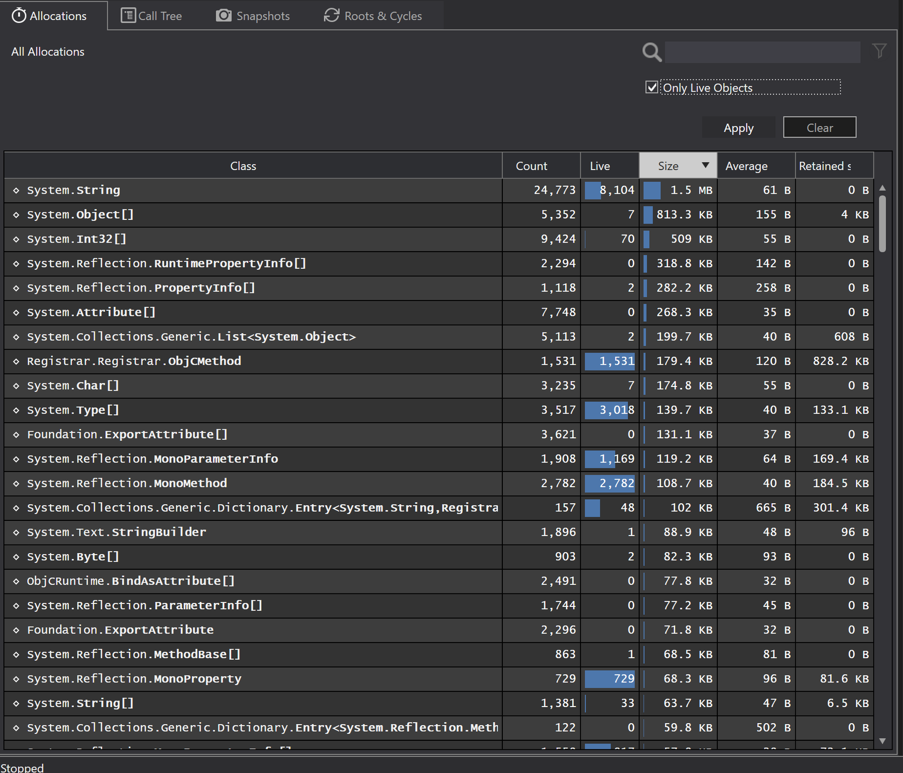

# 1.6.3-456 (2018-08-20)

* [Xamarin Profiler for Mac](https://dl.xamarin.com/profiler/profiler-mac-1.6.3-444.pkg)
* [Xamarin Profiler for Windows](https://dl.xamarin.com/profiler/XamarinProfiler.Windows.Installer.1.6.3-444.msi)

## What's new in this release

* Fix auto-collapsing of inspector view when profiling fails
* Fix Start Profiling menu item/keyboard 
* Fix persisting of settings in New Session dialog
* Fix crash after failed settings migration
* Fix startup crash on Windows because of missing Newtonsoft.Json

# 1.6.3-444 (2018-07-23)

**This is a beta of the upcoming Xamarin Profiler 1.6.3 release. These previews are unsupported builds to allow
developers to test the new features, and to gather feedback and bug reports. Your help is very appreciated!**

* [Xamarin Profiler for Mac](https://dl.xamarin.com/profiler/profiler-mac-1.6.3-444.pkg)
* [Xamarin Profiler for Windows](https://dl.xamarin.com/profiler/XamarinProfiler.Windows.Installer.1.6.3-444.msi)

## What's new in this release

* Fix profiling Mac and iOS from Console tool
* Several fixes in migration to new recent targets settings
* Fix timed snapshots to work correctly at the specified time, even if the profiled application is doing nothing
* Fix redrawing of tabs
* Fix "Start profiling" button/menu item on Windows UI

# 1.6.3-435 (2018-07-09)

**This is a beta of the upcoming Xamarin Profiler 1.6.3 release. These previews are unsupported builds to allow
developers to test the new features, and to gather feedback and bug reports. Your help is very appreciated!**

* [Xamarin Profiler for Mac](https://dl.xamarin.com/profiler/profiler-mac-1.6.3-435.pkg)
* [Xamarin Profiler for Windows](https://dl.xamarin.com/profiler/XamarinProfiler.Windows.Installer.1.6.3-435.msi)

## What's new in this release

* Fix recovery of settings in Windows New Session dialog
* Fix an issue with how the call tree is generated from stack traces

# 1.6.3-433 (2018-06-20)

**This is a beta of the upcoming Xamarin Profiler 1.6.3 release. These previews are unsupported builds to allow
developers to test the new features, and to gather feedback and bug reports. Your help is very appreciated!**

* [Xamarin Profiler for Mac](https://dl.xamarin.com/profiler/profiler-mac-1.6.3-433.pkg)

## What's new in this release

* Fix crash when connection to Android devices fails.
* Fix misplaced per-threads charts on Windows UI.
* Use new Mono profiler arguments. This allows for a much better light allocations mode, as the new arguments allow much more detailed specification of what needs to be disabled/enabled when profiling.
* Fix misleading text in main charts' tooltips.
* Display more detailed GC-related information stats for Snapshots.

# 1.6.3-400 (2018-05-31)

**This is a beta of the upcoming Xamarin Profiler 1.6.3 release. These previews are unsupported builds to allow
developers to test the new features, and to gather feedback and bug reports. Your help is very appreciated!**

* [Xamarin Profiler for Mac](https://dl.xamarin.com/profiler/profiler-mac-1.6.3-400.pkg)
* [Xamarin Profiler for Windows](https://dl.xamarin.com/profiler/XamarinProfiler.Windows.Installer.1.6.3-400.msi)

## What's new in this release

* Improve Xamarin.Profiler.Console report, which now includes per GC generation and lock contention stats
* UI tweaks and improvements in inspector area, tab views, charts
* Sorts out column visibility when snapshots are added dynamically
* More performance improvements
* GDPR-compliant EULA and Telemetry usage

# 1.6.3-333 (2018-05-07)

**This is a beta of the upcoming Xamarin Profiler 1.6.3 release. These previews are unsupported builds to allow
developers to test the new features, and to gather feedback and bug reports. Your help is very appreciated!**

* [Xamarin Profiler for Mac](https://dl.xamarin.com/profiler/profiler-mac-1.6.3-333.pkg)
* [Xamarin Profiler for Windows](https://dl.xamarin.com/profiler/XamarinProfiler.Windows.Installer.1.6.3-333.msi)

## What's new in this release

* [Add level of detail selection in New Session dialog](#level-of-detail-selection)
* [Improve search/filtering UI/UX](#improve-filtering-ux)
* [Performance improvements](#performance-improvements)
* [Save recent targets](#save-recent-targets)
* [Console profiler](#console-profiler)

### Bugs fixed

* Autosize data columns correctly to use all available space on the Windows UI

### Level of detail selection

Continuing on the improvements for the light mode introduced in previous releases, the New Session
dialog now provides an easy to use UI to select what level of detail the user wants when profiling.

This greatly simplifies the dialog, as it is clearer what settings are used for every mode, while,
at the same time, customization of all the values is still possible.

### Improve filtering UX

There were several ways to filter the displayed data (search box, options in right side panel, etc),
each of which was firing a query to the underlying data, which resulted in useless CPU and memory
usage when more than one filtering option was needed, as well as a not-so-good UX, as options
were scattered around different parts of the UI.

This is the beginning of a much better filtering/querying UI/UX, which will allow users to easily
query the data being displayed without having to, first, use unneeded resources (i.e., fire
several queries against the data when just one refresh is needed), and 2nd, query the data
in much better ways to help diagnosing problems much easier.

### Performance improvements

As always, we take performance very seriously, and so, as usual, this new release includes several
performance improvements:

* Charts now draw much faster (hard to notice with the naked eye though, but trust us, they are much faster :D)
* Memory and CPU usage have been reduced also

### Save recent targets

Up till now, Profiler just remembered the last 10 "desktop" files (.app, .exe on Mac, and .mlpd's on
both Mac and Windows) you had opened, but didn't remember the last iOS/Android apps you had profiled.
Not anymore, now the last 10 targets, whatever they are, are remembered, so it's easier to launch
a profiling session against your day-to-day applications without having to launch the IDEs. Of course,
this would only work if the app being profiled (in the case of iOS and/or Android) has already been
deployed to the device/simulator and the device/simulator is attached to your machine. But it should
help a lot in profiling the same app over and over in a much faster way, as no IDE intervention is
needed.

### Console profiler

While having a UI for profiling your apps is great, we have made publicly available now an internal
tool we had for profiling our code in an automated way (in CI/CD): Xamarin.Profiler.Console.exe. This
is basically just a console version of the Xamarin Profiler, which you can easily use to automate
profiling in your CI builds. It profiles the app and generates a report (in JSON) which you can
easily store somewhere (i.e. on a Database) and, from it, generate some sort of reporting to see
how the performance of your application degrades or improves over time.

This small tool has already helped the Xamarin Profiler in finding several problems, so we hope it
will do the same for external users. It is though the 1st version we make available, so please let
the team know of any problems you might encounter as well as any suggestion for making it suit
your needs.