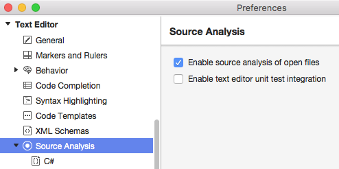
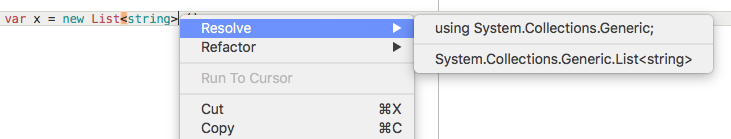
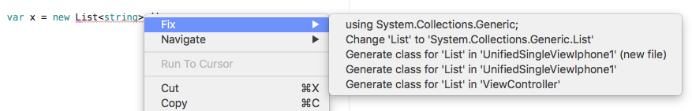
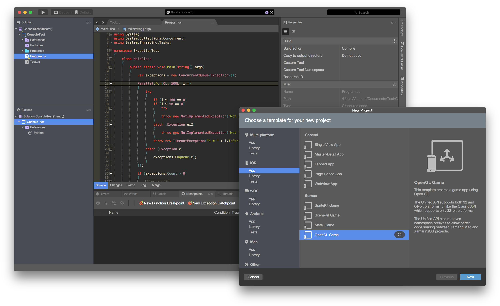
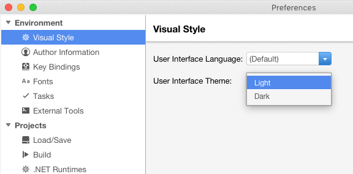
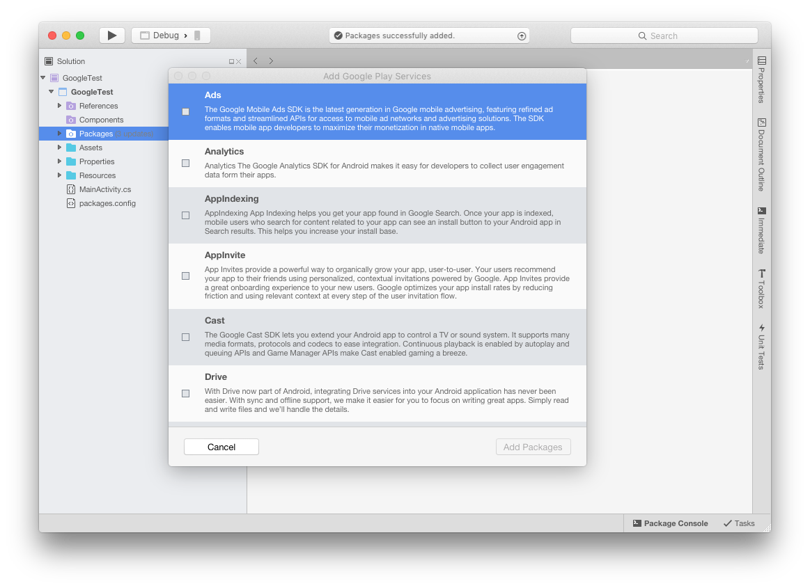
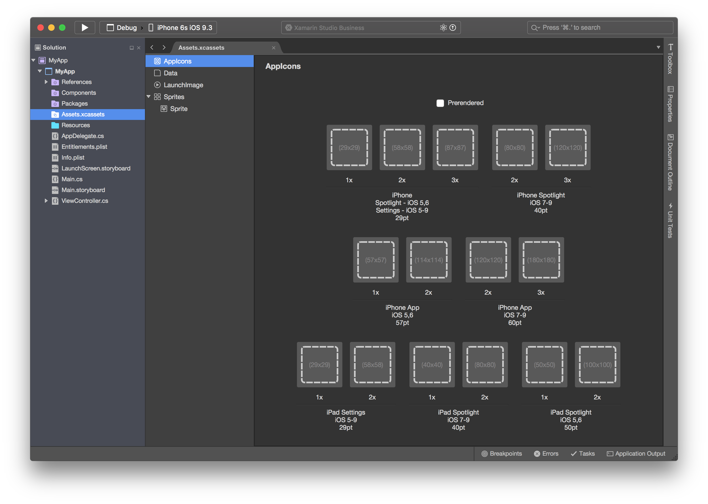
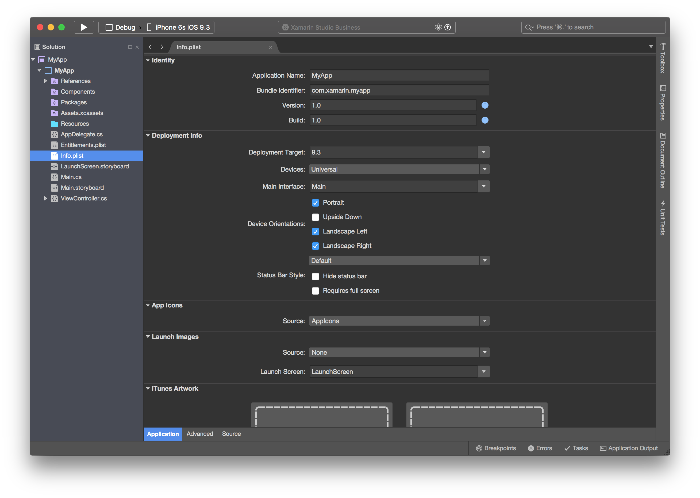
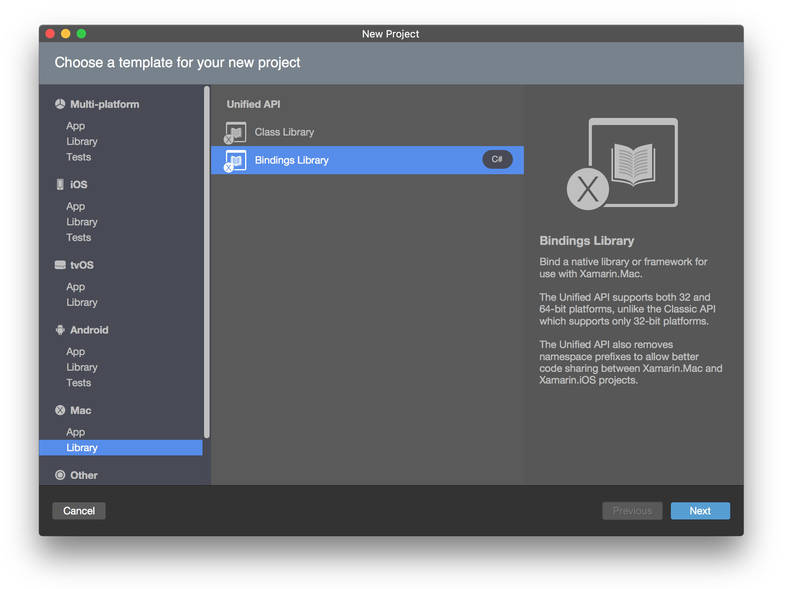
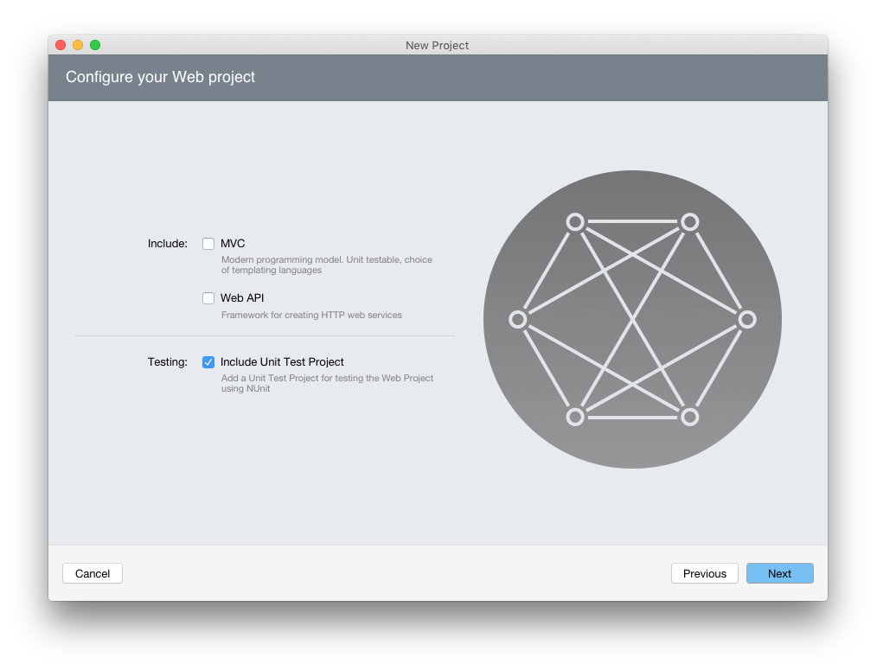

id:{DFD82C96-6F8B-4EAF-BF0A-E63422E67A80}
title:Xamarin Studio 6.0  

# Xamarin Studio 6.0.2

* New: Android Http Client Handler build option allows you to choose between different HttpClient implementations.
* Updated: NuGet updated to 2.12.
* Fixed: [41752](https://bugzilla.xamarin.com/show_bug.cgi?id=41752): I updated to Version 6.0 and it can run Console.Readline() but without any reaction which is weird.
* Fixed: 41604: File not found exception logged every second into IDE log when not project not compiled.
* Fixed: 40344: [Cycle7] When user creates a project with same name then XS create two Projects.
* Fixed: 40099: [Toolbar] Wrong behavior when showing close button in full screen.
* Fixed: [41245](https://bugzilla.xamarin.com/show_bug.cgi?id=41245): Attribute code completion not showing all constructors and showing too many things.
* Fixed: [42011](https://bugzilla.xamarin.com/show_bug.cgi?id=42011): Code Template Failing.
* Fixed: [41658](https://bugzilla.xamarin.com/show_bug.cgi?id=41658): Cannot compile old projects. Starting a new solution from scratch gives the same problem.
* Fixed: [41774](https://bugzilla.xamarin.com/show_bug.cgi?id=41774): [Regression] Project not recognized as Android project after update to Xamarin Studio 6.
* Fixed: [41825](https://bugzilla.xamarin.com/show_bug.cgi?id=41825): "Error while trying to load the project ... Object reference not set to an instance of an object" when attempting to open a project if the `.csproj` file calls an MSBuild property function on a return value of an MSBuild property function, such as `<Foo>$(Bar.Split('.').Length)</Foo>`.
* Fixed: [41795](https://bugzilla.xamarin.com/show_bug.cgi?id=41795): Generated documentation includes "returns" tag for void methods.
* Fixed: [41358](https://bugzilla.xamarin.com/show_bug.cgi?id=41358): Xamarin Stuidio crashed on add GTK# widget signal handler.
* Fixed: [40915](https://bugzilla.xamarin.com/show_bug.cgi?id=40915): Assembly Reference Aliases are not support.
* Fixed: [41580](https://bugzilla.xamarin.com/show_bug.cgi?id=41580): Icon for file links is not clear.
* Fixed: 37577: [Search/Shell] Closing the "Find in Files" window also closes the search panel.
* Fixed: [41236](https://bugzilla.xamarin.com/show_bug.cgi?id=41236): New file not saved correctly.
* Fixed: [40538](https://bugzilla.xamarin.com/show_bug.cgi?id=40538): Code completion isn't filtering properly.
* Fixed: [41351](https://bugzilla.xamarin.com/show_bug.cgi?id=41351): No arguments code completion for methods called via ?. operator.
* Fixed: [40898](https://bugzilla.xamarin.com/show_bug.cgi?id=40898): Unreadable text in solution pad selection.
* Fixed: [41320](https://bugzilla.xamarin.com/show_bug.cgi?id=41320): Run Unit Tests from Run Menu isn't working. Shows NRE in log.
* Fixed: [41790](https://bugzilla.xamarin.com/show_bug.cgi?id=41790): Xamarin Studio fatal error when running project build custom commands.
* Fixed: [41722](https://bugzilla.xamarin.com/show_bug.cgi?id=41722): Build failed with Custom Commands.
* Fixed: 41499: Searching for a NuGet package takes five to ten minutes to populate the results.
* Fixed: [41694](https://bugzilla.xamarin.com/show_bug.cgi?id=41694): Roslyn doesn't "load" in projects that XS doesn't support.
* Fixed: 41388: Code completion is incorrect for array types.
* Fixed: [39328](https://bugzilla.xamarin.com/show_bug.cgi?id=39328): [Regression] Copy/paste line no longer works in XS in Windows.
* Fixed: [40888](https://bugzilla.xamarin.com/show_bug.cgi?id=40888): Extension methods shown on types.
* Fixed: [42575](https://bugzilla.xamarin.com/show_bug.cgi?id=42575): Type string=String doesn't syntax highlight correctly.
* Fixed: [41541](https://bugzilla.xamarin.com/show_bug.cgi?id=41541): App Config is not read in Unit Tests.
* Fixed: 41113: On clicking '+' button of ToolBox window, XS get hanged for few seconds.
* Fixed: [42284](https://bugzilla.xamarin.com/show_bug.cgi?id=42284): CTRL+Space doesn't bring up code completion.
* Fixed: [42239](https://bugzilla.xamarin.com/show_bug.cgi?id=42239): Cannot use single-character DU case sub-label names.
* Fixed: 42051: Error when editing control name in storyboard, outlets/actions not regenerated.
* Fixed: [41808](https://bugzilla.xamarin.com/show_bug.cgi?id=41808): Setting UILabel Text type to "Attributed", then back to "Plain" causes compilation error in Storyboard.
* Fixed: 41887: Unable to remove duplicate events generated for widgets.
* Fixed: 41907: XS crashes on changing the properties of Widgets on both Main.storyboard and Interface.storyboard.
* Fixed [41909](https://bugzilla.xamarin.com/show_bug.cgi?id=41909): The new "On-Demand Resources" step of the Ad Hoc "Sign and Distribute" workflow for iOS projects is always displayed even if the app doesn't contain any on-demand resources.
* Fixed: 41615: XS shows many errors in subclasses of Forms ContentPage.
* Fixed: [41572](https://bugzilla.xamarin.com/show_bug.cgi?id=41572): An error "The call is ambiguous between the following methods or properties 'ClassName.InitializeComponent()' and 'ClassName.InitializeComponent()'" is displayed in the Source Code Editor when editing .xaml.cs code-behind files.
* Fixed: 40714: Old XS icon(blue color) is appearing previous to 'About' option under Help menu in windows XS.
* Fixed: 41862: Unable to open Android Designer in XS on certain projects.
* Fixed: [41894](https://bugzilla.xamarin.com/show_bug.cgi?id=41894): Xamarin Studio crashes when trying to open "Options" on an Android Bindings project.
* Fixed: 41317: Bar Button Item gets disappear on placing Fixed/Flexible space bar item between them.
* Fixed: 41862: Unable to open Android Designer in XS on certain projects.
* Fixed: 42051: Error when editing control name in storyboard, outlets/actions not regenerated.
* Fixed: 41499: Searching for a NuGet package takes five to ten minutes to populate the results.
* Fixed: 42795: The "View | Focus Document" command is not functioning.

## Known Issues

* [41727](https://bugzilla.xamarin.com/show_bug.cgi?id=41727): Document Outline Pad - When document outline pad is floating and an item is clicked the caret is not moved to item on text editor.

# Xamarin Studio 6.0.1

* Fixed: [41565](https://bugzilla.xamarin.com/show_bug.cgi?id=41565): "Could not load solution:" and "Load operation failed." when attempting to open certain projects that use Components.  This fix automatically deletes the general Android library or iOS library project type GUIDs from projects that also include more specific library subtype GUIDs such as Android bindings libraries or iOS extension projects.  This is necessary because the new Project Model disallows certain redundant combinations of `ProjectTypeGuids` that were accepted in XS 5.x.
* Fixed: [41661](https://bugzilla.xamarin.com/show_bug.cgi?id=41661): Subversion support is not available in the IDE on Mac if **libsvn\_client** cannot be located. Xcode does _not_ install this library by default.  This fix provides a dialog that runs `xcode-select --install` to install the missing library.

## Known Issues

* [41572](https://bugzilla.xamarin.com/show_bug.cgi?id=41572): An error "The call is ambiguous between the following methods or properties 'ClassName.InitializeComponent()' and 'ClassName.InitializeComponent()'" is displayed in the Source Code Editor when editing .xaml.cs code-behind files.
* [41825](https://bugzilla.xamarin.com/show_bug.cgi?id=41825): "Error while trying to load the project ... Object reference not set to an instance of an object" when attempting to open a project if the `.csproj` file calls an MSBuild property function on a return value of an MSBuild property function, such as `<Foo>$(Bar.Split('.').Length)</Foo>`.
* [41909](https://bugzilla.xamarin.com/show_bug.cgi?id=41909): The new "On-Demand Resources" step of the Ad Hoc "Sign and Distribute" workflow for iOS projects is always displayed even if the app doesn't contain any on-demand resources.  That step also does not indicate which option to select if the app doesn't use on-demand resources.  **Workaround**: Select _Embed on-demand resources in the app bundle._

# Xamarin Studio 6.0.0

## Content

* [Roslyn integration](#Roslyn_integration) 
* [New Project Model](#New_Project_Model) 
* [New visual style and Dark theme](#New_visual_style_and_Dark_theme) 
* [F# Enhancements](#F_Enhancements) 
* [64bit build on Mac](#64bit_build_on_Mac) 
* [NuGet](#NuGet) 
* [Android](#Android) 
* [Android Designer](#Android_Designer) 
* [iOS](#iOS) 
* [iOS Designer](#iOS_Designer) 
* [tvOS](#tvOS) 
* [Mac](#Mac) 
* [Insights](#Insights) 
* [ASP.NET](#ASP.NET) 
* [Text Editor](#Text_Editor) 
* [Debugger](#Debugger) 
* [Version Control](#Version_Control) 
* [Profiler](#Profiler) 
* [Other Improvements and Bug Fixes](#Other_Improvements_and_Bug_Fixes) 
* [Changes Since Last Preview](#Changes_Since_Last_Preview) 

## Roslyn integration

Xamarin Studio’s type system is now based on Roslyn, Microsoft’s open source .NET compiler platform. Even though this is an internal change, it has several practical benefits:

* The behavior of code completion is more accurate and will work much better when a file contains syntax or semantic errors.
* Refactoring operations cover more cases and are more reliable.
* C# 6.0 is now fully supported for code completion and refactoring operations.
* The formatting engine got replaced and it now defaults to the Visual Studio format. Indenting with spaces is easier and feels like tab based indenting.
* Typing flow got improved and is now more fluid.
* Code completion import symbol support greatly improved – will no longer interfere with the typing flow and it doesn’t have a performance impact.
* The new formatting engine is now compatible with Visual Studio, but does not support custom formatting schemes from prior versions of Xamarin Studio because of the changed engine & option model.

### Related Changes

* The _Quick Fix_ keyboard shortcut now requires _Xamarin Studio > Preferences > Text Editor > Source Analysis > Enable source analysis of open files_ to be switched on:

    

* The _Resolve_ and _Refactor_ context menu items for undefined symbols:

    

    Have been combined into a single _Fix_ item:

    

    This new submenu is only available when _Xamarin Studio > Preferences > Text Editor > Source Analysis > Enable source analysis of open files_ is switched on.

## New Project Model

The Project Model is the service in charge of loading and building projects, and provides an API which is used by the rest of the IDE to manage information about projects. This release introduces a completely revamped project model which has a deeper integration with MSBuild, and which can handle projects that take advantage of advanced MSBuild features. Here are some features that are now supported:

* Conditional file and reference inclusion are now properly handled.
* Project files can import other projects, and properties will be properly loaded.
* Project files are evaluated before loading, so properties can be used in item definitions, and will be properly replaced.
* The extension model has changed, and will make it easier to implement add-ins that need to directly manipulate MSBuild files.
* Projects are built in parallel when possible. This should speed up the build time of solutions with many projects.
* Xamarin Studio is now much better at handling projects generated in Visual Studio, and will not make unnecessary changes to the project files when saving.
* Added support for different architectures of Mono so user can pick 32bit or 64bit version to start debugging.
* Support for MSBuild tools v14.

### Known issues

* [41565](https://bugzilla.xamarin.com/show_bug.cgi?id=41565): "Could not load solution:" and "Load operation failed." when attempting to open certain projects that use Components in Xamarin Studio 6.0.  This issue also produces the error "System.InvalidOperationException: Already bound to project" in the Xamarin Studio log files.  These errors occur because certain combinations of `ProjectTypeGuids` that were accepted in Xamarin Studio 5.x are no longer allowed by the new Project Model.  **Recommended fix**: Open the problematic `.csproj` file in a text editor and remove the conflicting item from the `<ProjectTypeGuids>` element.  For iOS extension projects, the most common fix is to remove the `{FEACFBD2-3405-455C-9665-78FE426C6842};` item from the list.

    

* [41825](https://bugzilla.xamarin.com/show_bug.cgi?id=41825): "Error while trying to load the project ... Object reference not set to an instance of an object" when attempting to open a project if the `.csproj` file calls an MSBuild property function on a return value of an MSBuild property function, such as `<Foo>$(Bar.Split('.').Length)</Foo>`.

### Bug fixes

* Fixed: Project references don’t handle Condition attributes.
* Fixed: If a solution has two projects with the same name, project references may not work correctly.
* Fixed: Configurations defined in project imports are ignored.
* More fixes to avoid unnecessary changes when saving a project.
* Fixed: Project loading issue when the SolutionDir MSBuild property is used in an import.
* Fixed: Diagnostic build output sometimes omits some of the Task and Target ‘performance summary’ lines.
* Fixed: Code completion and File Search don’t take into account files added by Import declaration in project file.
* Fixed: Xamarin Studio does not recognise base class assignment in Forms’ XAML files.
* Fixed: Environment variables being removed from custom commands.

## New visual style and Dark theme

In this release we are presenting the new look of Xamarin Studio. It has a more modern style, a dark variant and many visual tweaks to make Xamarin Studio more pleasant to use. Here are the highlights:

* 5727 new icons! (including light, dark and selection variants),
* new Windows toolbar and improved menu appearance,
* new dark IDE theme,
* new dark highlighting editor scheme,
* fine-tuned light IDE theme,
* appearance fixes to Code Completion and Code Hint popovers,
* fixes in New Project Dialog and Welcome page,
* the drop down button in the solution pad is gone – the context menu can be used instead.

The theme can be changed in the global preferences, Visual Style section.

**Known issues:** the new UI is still work in progress and we are aware of some issues that we plan to fix:

* Appearance of some UI elements is not finished yet.

## F# Enhancements

### Portable Class Libraries

We now support F# portable class library projects, and include a template to support them.

This was one of the most requested features to allow developers to write shared logic in F# and consume this from either F# or C# applications across multiple platforms.

### Shared Projects

F# joins the world of shared projects. We are pioneering this support in Xamarin Studio as the equivalent functionality has not been implemented in Visual Studio yet.

These let you write common code that is referenced by a number of different application projects. The code is compiled as part of each referencing project and can include compiler directives to help incorporate platform-specific functionality into the shared code base.

Unlike Portable Class Library, shared projects do not have strict requirements of being a standalone library, nor force you to pick an API profile to be compiled against. This is just a convenient way of reusing and recompiling the same code in various projects at the same time.

### Xamarin.Forms Templates

We also include a new Xamarin Forms template for F# projects. This solution includes a core project containing common code, an iOS project and an Android project. A test project is also included that can run tests against both platforms.

### New Features

* Global F# symbol search, you can now search for F# symbols across all open solutions from the search bar at the top right.
* FAKE integration (preview). You can access fake build scripts by typing "FAKE" into the search bar. Any FAKE tasks from the build.fsx in the project root folder will be displayed in the search results and can be filtered further and ran. FAKE output appears in a new pad.
* Document outline pad now available for F# files.
* Highlighting improvements – Mutable variables are now highlighted red to make them stand out. The color can be changed in the theme or disabled completely. The F# interactive pad also includes syntax highlighting.
* Code navigation improvements: Goto base type, Find Overloads, and Find derived types.
* Support for F#4.

### Enhancements

* Completion lists are now sorted and grouped by object hierarchy.
The more relevant completions come to the top. This is similar to what we have been doing for C# already.
* Improved auto indenter – the auto-indenter now allows copy and pasting of code between different indentation levels.
* Tooltip improvements:
  * Generic types display type constraints. 
  * Tooltips for keywords, active patterns and double ticked functions are now functional. 
  * All right hand side > now align. 
  * Containing type (or module) and assembly for members is now displayed.
* Improved parse performance – semantic highlighting appears faster when a solution is first loaded and completions are now faster.
* Go to source code from the NUnit test runner.
* Go to declaration can now jump to C# code from F# code and vice versa.
* Find references shows both C# and F# references.
* Better syntax highlighting so that source code looks good before
  semantic information becomes available.
* Cmd (or ctrl) click working for go to definition. Identifiers that can
  be jumped to are underlined as you hover.
* Generated projects are compatible with more versions of Visual Studio.
* Aggressive intellisense so that there is no need to press ctrl+space. Can be switched off.

### Bug fixes

* Fixed: Project folders in solution pad are collapsed after reordering files.
* Fixed: with "Enable Source Analysis" option switched on, the margin always displays 1 error.
* #commands fixed inside the F# Interactive panel.
* Prevent completion and tooltips working inside comments and docstrings.
* Remove display of empty tooltips on Android projects.
* NUnit test runner – fix tests that contain spaces in the name.

## 64bit build on Mac

This release of Xamarin Studio for Mac is a 64bit application, so you’ll be able to take advantage of all the memory of your system when working with large solutions.

## NuGet

### Improved support for pre-release NuGet packages

Updating to a later pre-release NuGet package is now supported in the Solution window. An individual pre-release NuGet package can be updated by right clicking and selecting Update. When all packages in a project or solution are updated then pre-release NuGet packages will be updated to later pre-release NuGet packages if they are available.

The "Show pre-release Packages" setting in Add Packages dialog will now be remembered on a per solution basis.

The "Check for package updates" setting will now check for updates to pre-release NuGet packages as well as stable packages.

### Support for watchOS and tvOS

Xamarin.TVOS and Xamarin.WatchOS target frameworks are now supported in NuGet packages.

### Package License Acceptance

A license acceptance dialog will now be displayed if a NuGet package requires a license to be accepted before it is installed. The NuGet package license can be viewed from the dialog by clicking View License hyperlink. If the license is declined then the NuGet package will not be installed.

### Other bug fixes and improvements

* Support NuGet packages that use icons from local files.
* Fixed: Incorrect update count displayed after updating NuGet packages.
* Error dialog is now displayed if the NuGet.Config file cannot be read.
* Fixed: NuGet restore and update support for workspaces.

## Android

### Improved selection of Google Play Services

The option to add Google Play Services to a new project has been removed from the New Project Dialog and replaced with a new dialog that lists all the known Google Play Services NuGets that we have bindings for. This dialog is accessible from the Packages node in the Solution Pad and from the Project menu.

### Support for Visual Studio Emulators

We have added support for enumerating and launching Visual Studio Android Emulators on Windows. Access to the various emulator managers (Google, XAP, VS) has been improved and it is now more consistent.

### Bug Fixes

* Fixed: Xamarin Studio would hang with a specific version Xamarin Android Player.
* Improved: Minor updates to the project templates.
* Enhancement: The Android ResGen pad is now reused.
* Fixed: Starter Edition could not build a new project.
* Fixed: The name of a project would be incorrect for new Xamarin.Forms apps.
* Fixed: The designer would display an incorrect value after the project was created.
* Fixed: Xamarin Studio would not stop a deployment when the user pressed the stop button.
* Fixed: ProGuard and Dex options were not persisted.
* Fixed: "MultiDexMainDexList" was not included in the available list of build actions.
* Improved: When you attach a phone the device target will change to the phone if the current device target is a non-running emulator.
* Fixed: Issues with the SDK Tools preview that prevented Xamarin Studio from obtaining the AVD name.
* Improved: Build actions are updated when moving files in and out of asset and resource folders.
* Improved: Inform users that in order to publish an app to the Google Play Store they first need to manually upload an Ad Hoc build.
* Improved: Error messages when Archiving for Distribution
* Fixed: Migration from Novell to Xamarin build targets would put the new import in the wrong place in the project file.
* Android project templates now target the latest Android framework that is installed
  on the machine.
* UITest project templates now use Xamarin.UITest 1.1.1 and Xamarin.TestCloudAgent 0.16.2.
* Fixed opening AndroidManifest.xml after creating Forms App leads Manifest being marked as dirty.
* Fixed: Project properties removed on loading Android project.

## Android Designer

### Improvements

* Better error recovery with invalid XML.
* Improve user themes handling.
* Improve toolbox performance.
* Code folding and document outline support for XML layout editor.

### Bugfixes

* Fix resource creation with embedded text editor.
* Fix autocompletion of some elements (e.g. `RelativeLayout`) and attributes.
* Fix layout outline appearance.
* Fix in-layout scrolling.
* Fix launching SDK with right permissions on Windows.
* Fix preferred theme not being re-used between solution opening.

## iOS

### Asset Editor

The assets folder hierarchy is not shown anymore in the solution pad. Double clicking on the asset folder opens the asset editor with a left hand side list of your different assets. The asset editor has several improvements:

* The asset editor now works better with smaller displays.
* Updated asset catalog file templates.
* Added “On Demand Resources Tags” text box to Image and Data assets allowing developers
  to tag their resources.
* Supports watchOS 2 and tvOS assets.
* Every asset type gets its own icon in the left hand side panel.
* The currently selected asset type is now shown on the top left of the editor.

### Plist Editor

The plist editor received a global set of updates with the introduction of the dark theme. The controls look more native, sections have been updated to show a discrete line and all elements have been centered.

We removed the old UI for App Icons and Launch Images. If you were setting your assets in the plist editor you will see a migration button, offering you to move to Asset Catalogs. All those assets will then be automatically transferred and you will have the opportunity to add the ones required by recent versions of iOS.

### New HttpClient stack selector

This controls which HttpClient implementation to use. The default continues to be an HttpClient that is powered by HttpWebRequest, while we can now optionally switch to an implementation that uses iOS’s native transports (NSUrlSession or CFNetwork depending on the OS). The upside is smaller binaries, and faster downloads, the downside is that it requires the event loop to be running for async operations to be executed.

### New SSL/TLS implementation build option

This controls the SSL/TLS backend used by Xamarin.iOS, and switches between Apple’s TLS stack (default) present in Mac and iOS and Mono’s own TLS stack.

Note: the underlying value (Legacy) used when the Mono (TLS 1.0) option is selected isn’t supported by older versions of Xamarin Studio (prior to 6.0). A csproj error will appear if you try to open a solution with a project that has this legacy value. In such case, open your .csproj and delete `<MtouchTlsProvider>Legacy</MtouchTlsProvider>`.

### On-Demand Resources

On-Demand Resources allow your application to download resources from the App Store as they are needed rather than downloading them as part of the initial install of your application.

In order to take advantage of this, you will need to tag your assets and/or bundle resources and then define which tags should be included in the initial install and the pre-fetch ordering for all remaining tags in your **Project Options** under the new tab, **iOS On-Demand Resources**. Enter the appropriate tags in each of the text fields separated by a comma (,).

To tag an asset, simply edit your asset catalogs as normal. Each asset will have an **On-Demand Resource Tags** text field allowing you to specify a list of tags to assign to the resource (once again, enter tags separated by a comma).

To tag a bundle resource, right-click on the bundle resource in the Solution tree and select **Properties**. In the **Properties** panel, locate the **On-Demand Resource Tags** text field and enter the tags separated by a comma.

For more information, please see Apple's [On-Demand Resources Guide](https://developer.apple.com/library/prerelease/tvos/documentation/FileManagement/Conceptual/On_Demand_Resources_Guide/index.html#//apple_ref/doc/uid/TP40015083).

### Native Frameworks

It is now possible to reference native iOS Framework directories in the “Native References” folder of an iOS project and have them be included in the compiled app bundle.

### Known issues

* [41909](https://bugzilla.xamarin.com/show_bug.cgi?id=41909): The new "On-Demand Resources" step of the Ad Hoc "Sign and Distribute" workflow for iOS projects is always displayed even if the app doesn't contain any on-demand resources.  That step also does not indicate which option to select if the app doesn't use on-demand resources.  **Workaround**: Select _Embed on-demand resources in the app bundle._

### Other improvements and bug fixes

* Only show iPhone devices that are paired with watches when a WatchKit App is
  set as startup project.
* The mtouch verbosity is now based on the msbuild verbosity level (Preferences > Projects > Build > Log Verbosity).
* [Publishing workflow] *.ipa file now contains On Demand Resources assets.
* [Binding Project] Renamed StructsAndEnums.cs to Structs.cs.
* Unit Test App is now compatible with larger iPhone screen sizes.
* We now prevent user from enabling iCloud if it’s not supported by the provisioning profile.
* Fixed: Perpetual ‘The app icon set "AppIcons" has an unassigned child’ warning.
* Fixed: Entitlements.plist Personal VPN key.
* Fixed: Sign and Distribute dialog needs columns auto-sized in width.
* Fixed: 4GB option is missing in data set view (new with Xcode 7.2).
* Fixed: Metal 3v1 option is missing in data set view (new with Xcode 7.2).
* Fixed: Action Extension template.
* Fixed: Sprite Atlas context menu options are sometimes not clickable.
* Fixed: Xcode integration generates "System.Single" instead of “float”.
* Fixed: iTunesArtwork is not copied to the IPA in an AdHoc build.
* Fixed: xcassets added via Interface Builder are incorrectly imported by Xamarin Studio.
* UITest project templates now use Xamarin.UITest 1.1.1 and Xamarin.TestCloudAgent 0.16.2.

## iOS Designer

We’ve been profiling hard to help improve performance and reduce lag when interacting with the designer. We’ve also fixed many small issues in the property panel and design surface.

### Bug Fixes

* Fixed several places where constraints would not render correctly, typically when they had a value of ‘0’ they would have their horizontal instead of vertical, or vice versa.
* The bottom layout guide bounds are displayed correctly in all cases now.
* Improved property panel reloading performance.
* Panning/scrolling in the design surface should feel smoother and more natural.
* When an item is deleted all related size class variations should be cleaned up too.
* Support for OTF fonts has been added.
* Fixed an issue which could cause ViewControllers to vanish from the surface when one of their properties changes. This typically happened when specific combinations of segues where set.
* Fixed a typo in the xml when we generated OutletCollections.

## tvOS

### Introducing support for tvOS

When coupled with the Xamarin.iOS tvOS previews, it is now possible to create tvOS applications. We have included new project types, file templates and designer support for it. New in this release is support for binding projects for tvOS, which allow your projects to easily consume native libraries in tvOS, in the same way that you do for iOS, as well as support for the tvOS GameCenter features.

You can run your applications on both the tvOS simulator as well as a physical tvOS device.

### Bitcode support for tvOS apps

Bitcode allows the App Store to re-optimize your app binary. Therefore you will not need to re-submit your app to the store to take advantage of new processor capabilities.

The project build option menu now provides a sub option to the LLVM optimizing compiler: the "Enable Bitcode" option. Bitcode is exclusively available when you enable LLVM and only for the release mode on device. 

It is required to publish your tvOS app on the App Store.

## Mac

### New binding project support

Available for previews of Xamarin.Mac with binding support. This feature has been available on iOS projects for a long time, and we have finally brought it to the Mac.

### Mac Entitlements

The Entitlements.plist editor has been completely rewritten to match the iOS
Entitlements.plist editor. The Info.plist editor no longer contains the Mac Entitlements. New projects will include an Entitlements.plist by default.

The iCloud Entitlements options have been updated for CloudKit (instead of the obsolete iCloud entitlement keys).

In order to enable Entitlements in an existing project without an Entitlements.plist, the developer will need to create an Entitlements.plist and add it to the project. It is recommended that developers use the “Property List” file template located in **File -> New -> File...** dialog under the Mac section.

### Other improvements and bug fixes

* New Metal project template.
* Fixed: Adding app icons to project does not reflect when running app.

## Insights

* Improved: Better error handling from the API server.
* Improved: The Insights NuGet is added to the PCL project in a new Xamarin.Forms app.
* Fixed: The initialization call was missing from the Android project in a new Xamarin.Forms app.
* Fixed: Projects that did not have Insights enabled would still try to upload symbols when publishing the app.

## ASP.NET

ASP.NET support has been greatly improved. There is a new project wizard for creating Web Forms and MVC projects and all templates have been reviewed and updated.

## Text Editor

### Navigational link support

Navigational link support: if you hold the Command (on Mac) or Control (on Windows) key while moving the mouse over a symbol, the symbol is converted to a link, which can be clicked to jump to the declaration.

### Regular expression support improvements

Working with regular expressions is easier than ever in this release:

* To make regular expressions more readable, XS now uses different colors to highlight different parts of a regular expression. 
* There is code completion support for "\" in regexes, which show regular expression escape sequences.
* Groups are inserted into the completion list.
* There is a new code action inside regex patterns: "Validate regular expression" that opens the regex inside the regex toolkit.

### Other improvements and bug fixes

* The "Standard Header" panel in the options lists all the available variables.
* Fixed: Pasting sometimes fails to paste current clipboard contents.
* XML code formatting settings now work for .xaml files
* Omit XML declaration setting now affects xml formatting.
* Fixed being unable to open .m and .h files in the source code editor.

This release does not include the VI mode. 

## NUnit 3

This release includes support for NUnit 3. There are no project templates for this NUnit version yet. If you want to use NUnit 3, just create a regular NUnit project and update the NuGet package to 3.0.

## Debugger

* Fixed: The embedded exception display does not handle large content.
* Fixed: No locals and evaluation possible in statically constructed fields.
* Fixed: Debugger does not hit breakpoints on Windows.
* Fixed: Visualizer for strings removes underscore.
* Fixed: User is not able to inspect variables while debugging iOS application.
* Fixed: The "Locals" pad appends new items each time an item in the “Call Stack” is double-clicked.
* Fixed several issues with function breakpoints:
    * Setting the breakpoint now works when parameter type has full type name with dots.
    * Now it’s possible to set on methods without debug information (it places on ILOffset=0).
    * Now setting on all overloads also works for unloaded types.
* Fixed issue when evaluating enum values.
* Fixed: Breakpoints inside anonymous method not working on iOS Device.
* Fixed: Highlighting of current execution location to highlight statement instead of whole line(when ending line and column are available)

## Version Control

### Known Issues

* [41661](https://bugzilla.xamarin.com/show_bug.cgi?id=41661): Subversion support is not available in the IDE on Mac if **libsvn\_client** cannot be located.  Xcode does _not_ install this library by default.  **Recommended fix**: Run `xcode-select --install` in a **Terminal.app** command prompt to ensure that the **libsvn\_client** library is installed into the expected location.

### Enhancements

* Blame view now has syntax highlighting and supports jumping to the parent revision of the selected revision.
* The Diff View no longer reports a line change when line endings differ.
* The Last selected path in Checkout/Select repository is now remembered.
* Git: Merging from a branch no longer tries to do a fast forward merge.
* Status View now automatically refreshes the status of files modified while the view was open.
* Fixed: Log command from the Blame view now focuses the commit in the log view.
* Status View now automatically refreshes file status.
* When cloning a repository, a solution file is now recursively searched for.

### Fixes

* Fixed: Git credentials dialog no longer pops up multiple times.
* Fixed: Git Blame view would not account for local changes.
* Fixed: Blame view menus sometimes would not work.
* Fixed: Network operations would sometime lockup in Git.
* Fixed: URL parsing is more lax now for Git operations.
* Fixed: Probing for a Subversion repository could hang the IDE.
* Fixed: Subversion no longer blocks the editor from typing whenever an exception occurs.
* Fixed: The log of a file now includes the initial commit for Git.
* Fixed: Subversion now shows a proper error dialog for the native VC++ redist dependency.

## Profiler

* Added: Support for profiling tvOS apps.
* Fixed: Some edge-case for iOS apps caused the Start Profiling command to be hidden.

## Other Improvements and Bug Fixes

* High DPI displays on Windows are now much better supported.
* Fixed: Context menu’s options is not working properly.
* Fixed: Copying build errors un-selects them.
* Fixed: "Stop" button doesn’t change into “Play” button after stop the application in release mode.
* Fixed: "Stop" button doesn’t change into “Play” when executing long running build.
* Fixed: Editing user tasks in tasks pad when sorted modifies wrong task.
* Show active configuration in project options dialog.
* Fixed several memory leaks.
* Fixed: Directory separator characters not handled when renaming files and folders.
* Fixed: Prevent language keyword being used as new project name.
* Fixed: Status bar message changing too often on installing NuGet packages.
* Fixed: Prevent emoji being used when creating a new project.
* Fixed: Allow # and % characters in file names when creating a new project.
* Fixed: Do not show search results from closed solution in global search results.
* Fixed: Generate events for a web reference.
* Fixed: Crash in global search popup window due to badly behaved third party add-ins.
* Fixed: MVC Views Configuration file template not being displayed.
* Fixed: Exception when using parameterized T4 templates.
* Fixed: Sorting by completed column in Task Pad.
* Fixed: Copy and paste removing original file from project.
* Fixed: Cut and paste in solution pad not updating project file.
* Fixed: Open assemblies in assembly browser by default.
* Fixed: Prompt to save files before opening New Project dialog.
* Fixed: Use same simulator for UITest and debugger if simulators are duplicated.
* Fixed: Forms .xaml files not being migrated from MSBuild:Compile to MSBuild:UpdateDesignTimeXaml.
* Enhancement: Improved responsiveness of the global search bar.
* Fixed: Property Pad now displays the right target’s information when using auto-hide.
* Fixed: Issues with downgrading to Starter after a trial has expired.
* Improved: The Next, Previous and Cancel buttons in the Publishing wizard are focusable on Windows.
* Fixed: Importing .mdpolicy files would sometimes fail.
* Fixed: Downloaded link is disappearing while coming back to Stable channel at ‘Check For Updates’ window.
* Fixed: Searchbar popup correctly positioned when using multiple monitors.
* Fixed: Updater no longer occasionally fails if user’s language isn’t English.
* Fixed: Menus in OS X are no longer completely disabled after closing dialogs.
* Added: New file template for adding an app.manifest file so Windows Desktop applications can be manifested for Windows 8.1+.
* Improved Korean translatioin.
* Fixed: UI glitch when re-sizing Archives Pad.
* Fixed: Execution targets now get correctly remembered per project.
* Fixed: A few focus issues with the Windows toolbar.
* Fixed: Annoying behaviour when focusing searchbar would select whole
  text when issuing Go to File.
* Fixed: Small delay on opening the Document Switcher the first time.
* Fixed: Searching in files will no longer open multiple search results pad when not needed.
* Fixed being unable to add an automated UI test project to a Multiplatform Single View App
* Fixed migration from MonoMac to XamMac not updating project type guids. 
* Fixed being unable to select a folder with the open file dialog on Windows.
* Fixed being unable to remove a Xamarin component.
* Fixed component store window not being displayed.
* Fixed: Tree view tooltip is shown and then immediately hidden.
* Changed: Removed obsolete Edit - Word Count menu item.
* Add file icons for the following types: .css, .png, .plist, .metal, .sks, .scnp, .scn and .dae.
* The file that any newly generated ".designer" file depends on, now automatically gets its partial keyword.
* Fixed: NullReferenceException when opening a .xib or .xtoryboard file from an F# project
* Fixed: Unable to read warning message - too long for screen.
* Fixed: Shared project, adding file and changing configuration results in invalid file list for iOS/Android project.
* Fixed: Updates to Xamarin Studio corrupt the .app on Mac.
* Fixed: Updater stuck on "Attaching disk image...".
* Fixed: [Error Pad] Inverted click when errors/warnings are sorted descending.
* Fixed: Submit to Test Cloud fails when app name contains a space.
* Fixed: [ODRs/AdHoc] Incorrect URL for asset packs in AssetPackManifestTemplate.plist.
* Fixed: occasional crash when opening an Android solution.
* Fixed: [ODRs/AdHoc] Error while starting ODRDownloadRequest.
* Fixed: Device Dropdown getting "White" when user attach or remove the device.

## Changes Since Last Preview

This is a list of fixes and improvements since the last preview

### 6.0.0.5166 (Release Candidate 3)

* Fixed: Xamarin iOS designer crashes when two buttons are in the right bar.
* Fixed: Hang while activating the Document Outline pad with iOS designer open.
* Fixed: Properties window goes blank when changing the Build Action from the Properties window.
* Fixed: Code completion: Shift+Enter on imported type doesn't insert full type name.

### 6.0.0.5156 (Release Candidate 2)

* Fixed: Rebuild Solution only Cleans does not actually rebuild the solution.
* Fixed: Unable to save selected ABIs in Release configuration for an Android project.
* Fixed: Project failed to load with error "Requested value AppleTLS wasn't found".
* Fixed: Duplication of Compiler Define Symbols.
* Fixed: Go to definition failure with Xamarin.Mac.
* Fixed: iOS Page-BasedApp template has warnings.
* Fixed: Cannot create new FSharp.fsx files in a blank Workspace in Xamarin Studio 6.0.
* Fixed: Getting error on building the Xamarin.Forms template projects when Standard Header is set in XS-> Preferences.
* Fixed: Unable to create Xamarin.Forms Templates project when only Xamarin.Android is installed on the system.
* Fixed: UITest templates need Xamarin.UITest updated.
* Fixed: Problem running xamarin-component.exe.
* Fixed: Search Result links don't display properly if code is in a collapsed region.
* Fixed: Unable to launch iOS sample on device in DEBUG mode, application just uploaded on the DEVICE and debugger get disconnected.
* Fixed: On Demand Resource changes don't get reflected after changing the Build action.
* Fixed: Crash closing a window in XS.
* Fixed: NullReferenceException when loading android designer.
* Fixed: "and" keyword not syntax highlighted in F# projects.
* Fixed: The fix action "Using 'some namespace import'" sometimes fails with a null reference exception.
* Fixed: Contents of popup window of XS is not correct for long expired license.
* Fixed: Xamarin Android not installed for Xamarin Studio.
* Fixed: Renaming a AXML did not update the csproj.
* Fixed: Error deploying/debug when using enterprise Certificates.
* Fixed: Can't enter comment on blank last line of file.
* Fixed: On creating Generic project, it is showing error in Solution pad.
* Fixed: Once in a while the text editor stops working.
* Fixed: Unable to exit in "Full Screen" mode on Windows XS.
* Fixed: Context menu on selected solution explorer node does not represent selected node.
* Fixed: Opening a new solution doesn't get Syntax Highlighting or Code completion.
* Fixed: [mdtool] System.AggregateException with build/archive commands.
* Fixed: Opening a solution crashed XS.
* Fixed: Incorrect number of method overloads shown in intellisense.
* Fixed: Unable to upload iOS project's .ipa to Test Cloud.
* Fixed: Selected User Interface Language doesn't take effect on restarting XS.
* Fixed: XS crashes when user clicks on Disconnect button under iOS device log.
* Fixed: Search list is not closing after removing the search text in search box.
* Fixed: Status bar shows updates available when there are none after updating.
* Fixed: User is not able to Search dll in Assembly Browser.
* Fixed: NullReferenceException when profiling Android projects.
* Fixed: User should not able to change Active Configuration of running application in XS.
* Fixed: MSBuild Errors: Unknown MSBuild failure.
* Fixed: Unable to run tests for a project, NUnit3Runner crashes.
* Fixed: Holding down Ctrl key when opening recent solution closes existing solution in workspace on Windows.
* Fixed: Linker behavior should changed to "Link Framework sdks only" while selecting platform as "iPhone" in XS.
* Fixed: Expired Android Trial blocks usage of non-expired iOS License with "Thank you for evaluating Xamarin Studio Enterprise".
* Fixed: Upon changing "Build Action" property grid gets reset.
* Fixed: Environment.CurrentDirectory not set correctly when running unit tests.
* Fixed: F# Addin Breaks Find References in C#.
* Fixed: Restoring NuGet packages does not update the type system.
* Fixed: Widget does not move correctly on increasing and decreasing value of X and widget disappears.
* Fixed: After changing Origin property for any widget when we again select that widget, its coordinates values continue changes and widget disappears.

### Changes since 6.0.0.4968

* High DPI displays on Windows are now much better supported.
* Fixed: Shared project, adding file and changing configuration results in invalid file list for iOS/Android project.
* Fixed: Full screen mode turns toolbar white with white text.
* Fixed: Updates to Xamarin Studio corrupt the .app on Mac.
* Fixed: Solution Pad: Selected row should always have white text.
* Fixed: Updater stuck on "Attaching disk image...".
* Fixed: [Error Pad] Inverted click when errors/warnings are sorted descending.
* Fixed: Adding multiple Google Play Service packages leads to many of the packages not being installed even after License Acceptance.
* Fixed: Refactoring classes can break Code file.
* Fixed: Submit to Test Cloud fails when app name contains a space.
* Fixed: New F# Xamarin.Forms project using Shared library does not create the shared library.
* Fixed: [ODRs/AdHoc] Incorrect URL for asset packs in AssetPackManifestTemplate.plist.
* Fixed: Occasional crash when opening an Android solution.
* Fixed: [ODRs/AdHoc] Error while starting ODRDownloadRequest.
* Fixed: Device Dropdown getting "White" when user attach or remove the device.
* Fixed: Rename refactoring a method parameter causes subsequent document elements to be removed.
* Fixed: Rename refactoring is giving the wrong name.
* Fixed: The fix action "Using 'some namespace import'" sometimes fails with a null reference exception.
* Performance and memory use improvements.

### Alpha 4

* Licensing
  * Licensing now matches the licensing terms that was announced at Build 2016.
* Shell
  * Fixed: Focus issue with the Toolbar when selecting build configurations.
  * Fixed: Recent projects would be removed if they were not found.
  * Fixed: Maximising and Minimising the Preferences dialog should not be possible.
  * Improved: The Preferences panel remembers which panel was last used.
  * Fixed: Error pad icons were sometimes duplicated.
  * Fixed: When saving a file the encoding option was not visible.
  * Fixed: Moving a folder between projects fails to add files to the new project.
  * Fixed: Navigating to a type in the assembly browser could sometimes fail.
  * Fixed: The assembly browser would not remember the member visibility setting.
  * Improved: `Open with` is enabled for solution files.
  * Fixed: Meta+W would not save and close a file.
  * Fixed: Empty tags in project files would be reformatted when saving the project.
* Text Editor
  * Fixed: The tool tip for an attributes constructor did not show the correct namespace.
  * Fixed: No code completion in assembly attribute arguments.
  * Fixed: Nested classes should not be offered "Rename to match class" refactoring.
  * Fixed: Extract method no longer triggers an inline rename of the method.
  * Fixed: The refactoring preview window showed empty content.
  * Fixed: Incorrect code completion for properties.
  * Fixed: An issue where XS could crash whilst editing a file.
  * Fixed: Matching braces highlighting could not be disabled.
  * Fixed: Operator methods are not shown correctly in the breadcrumb.
  * Fixed: Rendering issue with breakpoint and warning icons.
  * Fixed: Autocomplete shows different list before and after typing `(`. 
  * Fixed: Code Foldings can hang Xamarin Studio.
  * Fixed: Code completion would sometimes error when completing statements.
* Debugger
  * Fixed: Live updating icon was not synchronised with Breakpoint pad.
* NuGet
  * Fixed: Issues when adding NuGet packages with .props files.
  * Fixed: Issue that would cause assemblies to not be located immediately after restoring a package.
  * Fixed: Uninstalling and reinstalling did not add back imports.
  * Fixed: Licenses could not always be accepted when installing multiple Google Play Service NuGets.
  * Fixed: It was not possible to add certain Google Play Service NuGets to a project.
* iOS
  * Fixed: Crash when editing Attributed text.
  * Fixed: Tap Gesture Recognizer was missing an Action in the designer.
  * Fixed: Image slicing info removed from Contents.json when editing and saving an Image Set that had slicing info from XCode.
  * Fixed: An issue where storyboards could not be opened.
  * Fixed: On Demand Resource tags could be set for images with a build action of None.
  * Fixed: "Application already installed." when uploading a rebuilt app to AppleTV.
* Mac
  * Updated: F# template now uses Storyboards.
  * Fixed: The template for mac applications was missing a Register attribute.
  * Fixed: Error when creating a new Mac app project.
* Android
  * Fixed: Sometimes the wrong app name was written to the AndroidManifest when creating a new project.
  * Fixed: Deploying an app to device would fail if the package name contained a hyphen.
  * Fixed: Third party tooltip providers would not work.
  * Fixed: Rendering issue in Add Google Play Service dialog for packages that were already added to the project.
* UITest
  * Fixed: An issue that would cause UITest to fail to connect.
* Other
  * Fixed: Column size of provisioning profiles when publishing an app are too small.
  * Fixed: Dark theme makes the publishing wizard unusable.
  * Fixed: "Create a project within the solution directory." checkbox in the New Project dialog did the opposite.
  * Fixed: Rendering issues with the Error pad focus icon.
  * Fixed: Xamarin Studio would throw an exception on a targets file with a particular form of Condition.
  * Fixed: A project might display no files when files exist in the project.
  * Fixed: Xamarin Studio could crash on startup.
  
### Alpha 3

* Projects
  * Fixed: XS saves annoying WarningLevel 0 tags in project files.
* NuGet
  * New dialog for accepting NuGet licences.
* Editor
  * Fixed: Event handler completion list sorting broken.
  * Fixed: Refactor Initialize Field from Parameter is generating wrong code.
  * Fixed: Code diagnostic suppressions doesn't work on compiler warnings.
  * Fixed: Search and replace not always working.
  * Fixed: Unable to read warning message - too long for screen.
  * Fixed some caret line marker rendering issues.
  * Fixed: Code completion should be case sensitive.
  * Removed use of italics on editor themes.
* Shell
  * Fixed: Global search can't be stopped.
* iOS
  * Fixed: Add / Add Native Reference does nothing.
  * Fixed: Device specific builds should use last known device.
  * Fixed: Device list does not show names of simulators as they are named in XCode.

### Alpha 2 (6.0.0.4761)

   * NuGet
      * Error dialog is now displayed if the NuGet.Config file cannot be read.
      * Fixed: NuGet restore and update support for workspaces.
   * NUnit
      * Fixed: Nunit3 runner does not respect ExplicitAttribute.
      * Fixed: [NUnit 3] When a test ends up being in an inconclusive state,
        it is still shown not run in Test Pad.
   * Projects
      * Fixed: Switching XM target framework from Mobile to 4.5 with a PCL
        reference leaves project as unloadable.
      * Fixed: Unable to open project when ProjectTypeGuids is not specified in
        the first property group.
   * Shell
      * Fixed: Tree view tooltip is shown and then immediately hidden.
      * Fixed: Translation project not available in New Project dialog due to missing icon.
      * Fixed: Color for modified value in Watch pad is too light.
      * Fixed: Toolbox being empty when the GTK# designer is open.
      * Removed obsolete Edit - Word Count menu item.
      * Fixed: Environment variables being removed from custom commands.
      * Fixed: Warning dialog shown on opening unsupported projects such as Windows Phone.
      * Fixed: Rendering glitches in toolbar when using dark theme.
      * Many other icon and visual tweaks.
   * Android
      * Fixed: XS is writing some empty properties to debug and release property groups
        in android projects.
      * Fixed: Android App template with Maximum Compatibility has build warnings.
   * iOS
      * Fixed: Invalid Xcode version leads to an error when trying to open the plist editor.
      * Fixed: XS attempts to migrate Launch images resources that are not part of the
        project, and that fails.
      * Fixed error installing on iPad and iPad mini.
      * Fixed error in signing app, and icloud entitlement for production/app store.
      * Fixed: [On demand resources] Incorrect app bundle structure on embedding
        resources to app bundle
      * Fixed: For Universal app, deployment info in info.plist file does not get
        updated for iPad
   * Mac
      * Added support for Mac Entitlements 
   * F#
      * New: Go to source code from the NUnit test runner.
      * New: Go to declaration can now jump to C# code from F# code and vice versa.
      * New: Find references shows both C# and F# references.
      * Improved: Better syntax highlighting so that source code looks good before
        semantic information becomes available.
      * New: Cmd (or ctrl) click working for go to definition. Identifiers that can
        be jumped to are underlined as you hover.
      * Fixed: Unable to create F# forms project on Windows.
      * Improved: Generated projects are compatible with more versions of Visual Studio.
      * Aggressive intellisense so there is no need to press ctrl+space. Can be switched off.
   * Version Control
      * Status View now automatically refreshes file status.
      * When cloning a repository, a solution file is now recursively searched for.
      * Fixed: The log of a file now includes the initial commit for Git.
      * Fixed: Subversion now shows a proper error dialog for the native VC++ redist dependency.
   * Xml Editor
      * Auto insertion of matching quotes was adding extra quote when it should not
      * Insertion of code completion when dot or colon was in suggestion duplicated existing text
   * Other
      * watchOS 2 support has been removed since it is not yet fully supported by Xamarin.iOS. 
      * Add file icons for the following types: .css, .png, .plist, .metal, .sks, .scnp, .scn and .dae.
      * The file that any newly generated ".designer" file depends on, now automatically gets its partial keyword.
      * Fixed: NullReferenceException when opening a .xib or .xtoryboard file from an F# project

### Alpha 1 (6.0.0.4520)

   * Fixed: XS 6 Preview does not build project when there are changes
   * Fixed: Code Analysis does not work
   * Fixed: When a project is reloaded due to changes in the underlying .csproj file,
     the project can't be executed anymore.
   * Fixed: web references in a project can't be updated.
   * Fixed: internal error when closing a solution just after opening it.

### Preview 4 (6.0.0.3668)

* Text Editor
    * Fixed: Typing "<" after IEnumerable deletes the text in front of it.
    * Fixed: Missing semicolons are not indicated as error in the editor.
    * Fixed: Writing a comment triggers code completion.
    * Fixed: Pressing ‘undo’ results in corrupt code.
    * Fixed: Go to Definition uses wrong file path in some cases (code-behind file).
    * Fixed: Toggle line comment does not comment selected XML.
    * Fixed: Format document command disabled for xml files.
    * Fixed: Conflict when the same type is defined by a Shared Project and an iOS Extension.
    * Fixed several type resolution issues when using shared projects.
* Projects
	* Added support for C# 6 on Windows.
    * Fixed: "Enable Code Analysis on Build" does not work.
    * Fixed: Fixed references not being saved to project file when updating a NuGet package.
    * Fixed: Unable to load or create translation projects.
    * Fixed: Project and solution policies not being saved.
    * Fixed: New PCL project added to solution not having any references.
    * Fixed: User preferences not loaded for workspace.
    * Fixed: Exception when adding a project to an empty solution.
    * Fixed: New files cannot be added to unsupported projects.
    * Fixed: Error building generic project.
    * Fixed: Hang when adding new extension to an iOS project.
    * Fixed: Unable to use Run with Mono Heapshot.
    * Fixed: Interface definitions being removed when migration projects from iOS Classic to Unified.
    * Fixed: References and .xib files being removed when migrating projects to Xamarin.Mac.
    * Fixed: Migration dialog not shown on opening MonoMac project.
    * Fixed: Add / remove references may fail in some cases.
    * Fixed: App does not deploy after cleaning project.
    * Fixed: IDE hangs when building an application after adding code to Razor template.
* Shell
    * Fixed crash in Find in Files when the solution has disabled projects.
    * Fixed: After fatal error occurs, the red icon in the status bar opens as a giant Alert box.
    * Fixed: No progress information in status bar when loading large solution.

### Preview 3 (6.0.0.1752)

* Fixed: Quick Fix no longer available.
* Fixed: Auto insert matching brace doesn’t work.
* Fixed: Matching brace highlighted when cursor is not next to a brace.
* Fixed: String formatting tooltip shown when it shouldn’t.
* Fixed: Code templates are not expanded if there isn’t a whitespace before the cursor.
* Fixed: Duplicate Find References results.
* Fixed: Closing a solution before it has fully loaded throws a bunch of exceptions.
* Fixed: Can’t goto declaration on items in code.
* Fixed: NuGet package license warning not shown in status bar.
* Fixed: Export command does not export project.
* Fixed: Items with multiple files in the include are split and duplicated (incorrectly) when saving project.
* Fixed: XS makes unnecessary changes to project.
* Fixed: Error while getting referenced assemblies – Collection was modified.
* Fixed: Can’t load certain project types that worked previously.
* Fixed: F# project will not open with message "UNC PAths should be in the form \Server\share".
* Fixed: Git doesn’t appear to be working (blame, changes, log, etc).
* Fixed: Warnings and Errors are not cleared from the status bar when the solution / workspace is closed.
* Fixed: Global search entry not focused when pressing CMD+dot.
* Fixed: Error logged when opening file from shared project.
* Fixed: Error opening assembly as solution.
* Fixed: Project folder is not created under solution while creating Generic Project.
* Fixed: Invalid warnings when archiving source files.
* Fixed: Error column appears off-by-one.
* Fixed: When entering string content as argument, one in a row, matching bracket is shown on next time.
* Fixed: Tooltip says "Parser error" for type resolution errors and warnings.
* Fixed: Assembly browser doesn’t show any names in TreeView.
* Fixed: Fold markers are invisible in assembly browser.
* Fixed: Unhandled text editor error when closing a very large file.
* Fixed: Holding down Command+Z Batches Undo.
* Fixed: Source tooltips do not always get removed.
* Fixed: Document Path / Jump list rendering issue.
* Fixed: Opening a workspace with multiple sln’s in it results in no intellisense, syntax highlighting etc.
* Fixed: Issues indicators get removed from side bar when showing namespace references.
* Fixed: F# compiler from parsing multiple times.
* Fixed: F# compiler issue where parse requests were not getting cancelled properly.
* Fixed: F# debugger expressions now evaluate properties on bindings.
* Fixed: F# Parameter tooltips now use semantic highlighting.

### Preview 2 (6.0.0.1449)

* Fixed: Checkout from Version Control causes XS to crash.
* Fixed: Cannot unload project after unloading and reloading solution on XS 6.0.
* Fixed: Resx designer file not created when new resx file added to project.
* Fixed: Build errors after adding new resx file to project.
* Fixed: Error popup is displayed while Create "Packaging Project" from Other >> Miscellaneous section.
* Fixed: MonoMac project produces an incomplete app.
* Fixed: Renaming a file in the solution pad doesn’t modify the project file.
* [Subversion] Fixed regression with top menu commands using single file.
* Fixed: [Git] Commits reordered when rebasing.
* Fixed: Auto complete / resolve / types completely hosed on new XM due to corrupted cache.
* Fixed: Parameters tooltip not showing all overloads.
* Fixed: Confusing search-in-selection behavior.
* Fixed: Can not modify the built in "#region" Code Template permanently.
* Fixed: Default ordering of search results is incorrect.
* Fixed: Control+Alt+Space doesn’t resolve types.
* Fixed: document navigator does not let me choose the types when there are multiple types.
* Fixed: Smart backspace should only work for C# files.
* Fixed: Unable to open Android .axml file in text editor.
* Fixed: Getting build error on Xam.Mac classic template.
* F# compiler parsing improvements to speed up.
