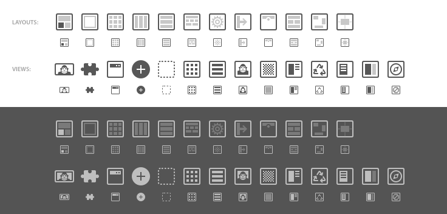
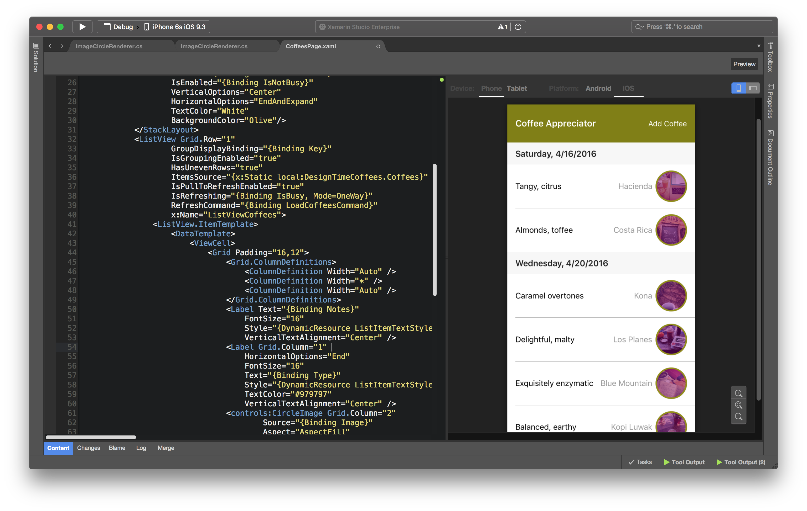

id:{DFD82C96-6F8B-4EAF-BF0A-E63422E67A80}
title:Xamarin Studio 6.1  

# Xamarin Studio 6.1.5

* Fixed: 51469 - Search (command dot) not working after opening iOS project properties.

# Xamarin Studio 6.1.4

* Updated: Xamarin.Forms templates to Xamarin.Forms 2.3.3.180.
* Fixed: 51160 - Error in intellisense.

# Xamarin Studio 6.1.3

This release adds support for Xcode 8.2.1.

## Bug Fixes

* Fixed: 41969 - On Mac with "Arabic" in the configured language list, Studio UI can end up right-to-left and unusable.
* Fixed: 43771 - Cannot view UIView width/height/X/Y values due to UI issue with Storyboard Designer.
* Fixed: 44392 - [watchOS] new InterfaceController.cs classes don't compile (missing `using WatchKit;`).
* Fixed: 46283 - Renaming a class breaks 'find in files'.
* Fixed: 46412 - Xamarin Designer crash when editing classes in property pan.
* Fixed: 46523 - Xamarin Studio creates invalid storyboard which crashes xcode.
* Fixed: 46980 - Storyboard fails to show on either stable or alpha branches.
* Fixed: 47114 - Project name with dot creates invalid xaml class name.
* Fixed: 47709 - [Xcode8Xml] XS Root view controller's 'Accessibility' section results in mismatched storyboard XML with Xcode.
* Fixed: 47826 - XS gets crashed on toggling 'Vibrancy' checkbox for control 'Visual Effect View with Blur'.
* Fixed: 47929 - Getting difference in XML file of Bar Button Item widget with XS & Xcode.
* Fixed: 48263 - [Xcode8Xml] Getting difference in xml file for Collection Reusable View widget.

# Xamarin Studio 6.1.2

## Bug Fixes

* Fixed: Subfolders of the mSYM folder are not copied to the archive folder (Android).
* Fixed: NSInvalidReceivePortException on opening solutions in XS 6.1 with Xcode 8 GM.
* Fixed: Cannot open some axml files using Layout Editor.
* Fixed: Xcode interface builder quits every time Xamarin studio.
* Fixed: XML documentation from 3rd party libraries is not properly loaded.
* Fixed: Simulator support for Xcode 8.1 beta 2.
* Fixed: When selecting the Apple Pay option in the Entitlements editor, the Apple Pay key is not properly generated.
* Fixed: Sporadic build error (Out of memory) leaves solution in unbuildable state until reload of project.
* Fixed: Avoid showing a warning that 32 bit apps "may slow down your iPhone".

# Xamarin Studio 6.1.1

## Bug Fixes

* Fixed: Crash when starting documentation browser.
* Fixed: Crash while loading project that uses the MakeRelative property function.
* Improved: Device selector in toolbar. When the selectors are compressed due to lack of space, the device selector will be expanded when selecting a new device.
* Fixed: Issue that caused strongly named package assemblies to not be found when building F# projects.
* Improved: Default profile of PCL library projects has been changed to Profile111 (same as Visual Studio). This fixes compatibility issues with some commonly used SDKs.
* Fixed: Android Designer with Custom Controls spins loading bar with Java JDK 1.8 x86 installed.
* Fixed: Hard crash when closing Android designer window and changing API level.
* Fixed: iOS and tvOS Broadcast UI/Upload extension fails to build.
* Fixed: iOS Designer initialization causes any already running iOS 10 simulator to hang.
* Fixed: Missing iPad Pro, iPhone 7 and Apple Watch Series 2 simulators.

# Xamarin Studio 6.1

## Content

* [NuGet](#NuGet) 
* [C# Refactorings](#C_Refactorings) 
* [F# Support](#F_Support) 
* [Android Designer](#Android_Designer) 
* [iOS Designer](#iOS_Designer) 
* [Xamarin Forms Previewer](#Xamarin_Forms_Previewer) 
* [Run Configurations](#Run_Configurations) 
* [Version Control](#Version_Control) 
* [Combined Device Log](#Combined_Device_Log) 
* [Usability improvements to the menu bar design](#Usability_improvements_to_the_menu_bar_design) 
* [System Font](#System_Font) 
* [Localizations](#Localizations) 
* [Keyboard Bindings](#Keyboard_Bindings) 
* [MSBuild Support](#MSBuild_Support) 
* [New "Exception caught" dialog](#New_Exception_caught_dialog) 
* [Other improvements and bug fixes](#Other_improvements_and_bug_fixes) 
* [Changes since last preview](#Changes_since_last_preview) 

## NuGet

* Added support for NuGet 3
  * NuGet 3's package source is now supported - https://api.nuget.org/v3/index.json.
  * NuGet packages that only support NuGet 3 or above can now be installed.
* Can now install a specific NuGet package version from the Add Packages dialog
  by selecting the version from a Version combo box.
* Project's can now use a project.json file instead of a packages.config file.
  The project.json file is a new package file format introduced with NuGet 3
  which supports transitive restore. More detailed information on project.json
  can be found in the [NuGet documentation](http://docs.nuget.org/consume/ProjectJson-Intro).
  The project.json file needs to be added manually and the project closed and
  re-opened before the project.json file is used in Xamarin Studio.
* The version of NuGet supported is now displayed in the About dialog when the
  Show Details button is selected.
* When adding a new NuGet package source a browse button has added to the Add
  Package Source dialog which can be used select a folder so a local package
  source can be created without having to type in the folder name.
* Add Package Source dialog has been changed to make it more obvious that either
  a URL or a folder can be used as a package source. The URL label has been
  change to Location and the placeholder text now specifies that a URL or a
  folder can be used.
* A NuGet package can now be removed when it not restored and is unavailable 
  from all package sources. When the NuGet  package removal fails a dialog
  will be displayed allowing the NuGet package to be removed by force. If the 
  option to remove the NuGet package is then selected Xamarin Studio will 
  then remove the package from the packages.config file, remove any references 
  and imports for the NuGet package from the project file.
* Custom package sources shown in Preferences are now only read from the global NuGet config file
  under _~/.config/NuGet/NuGet.Config_. Per-solution NuGet.Config files located
  in individual solution directories are no longer read. This matches the
  behavior of the NuGet package manager in Visual Studio.

## C# Refactorings

* Refactorings and code diagnostic fixes are no longer shown inside the context
  menu, instead the ‘Quick Fix’ command is shown. All fixes and diagnostics are
  shown when that command is selected.
* Refactoring previews are shown inside the Quick Fix command list when a code
  action is selected.
* There is a new menu inside the project Menu called ‘Analyze’ this allows to
  run the analyzers on the whole solution or individual project. Analyzers
  results are shown in the error list.
* When adding NuGet packages that contain analyzers (like Async Method Analyzer)
  the analyzers are shown inside the project tree under References/Analyzers and
  are being run as part of the background code analysis.

## F# Support

* F# interactive improvements:
  * Code completion
  * Parameter hints
  * Text zooming
  * Load / save as fsx script
* Code completion and syntax highlighting fixes.
* All operations that require parsing the project file are now much faster.

## Android Designer

*Because of an Android upstream issue, support for rendering API 24 is not available in this release*

### Custom controls support

The Android designer now supports loading both Java-based and .NET based custom controls referenced in layout files.

Custom controls can be edited like any other control in the property panel, including custom properties defined in a `<declare-styleable />` resource entry of the same name. You can also drag and drop them directly from the toolbox where two new categories, *Custom Controls* and *Support Libraries*, have been added for convenience.

*Android designer rendering a layout containing several support libraries components (AppBarLayout, Toolbar, RecyclerView, CoordinatorLayout, ...) and custom widgets implementation.*

<strong>⚠️ Warning:</strong> as the designer runs in a constrained Android environment, your custom control code may or may not work as it does on a real device or emulator. You can use the <a href="https://developer.xamarin.com/api/property/Android.Views.View.IsInEditMode/">IsInEditMode</a> property to detect if your view is being rendered in the designer and dynamically adapt its behavior for the restricted designer  environment.

### New toolbox icons

The toolbox has been visually refreshed with new icons that fully support Xamarin Studio new dark/light themes.

### Others

- Performance optimizations around loading time and property panel interactions.
- `RecyclerView` now supports the 'listitem' design property (of type layout) to allow mocked data display.
- Support `DrawerLayout` design attribute 'openLayout' to allow visualization of a drawer content.

## iOS

Xamarin Studio now includes all new iOS 10 extensions templates covering new framworks such as CallKit, Messages, ReplayKit, SiriKit and UserNotifications. A new asset type has been added for iMessage apps: the stickers icon set letting you add iMessage app icons.
In addition to that we've added support for tvOS extensions which also have some dedicated templates, including one to modify Top Shelf images at runtime.

## iOS Designer

We've been hard at work improving performance, reliability and accuracy. We have full support for Xcode 7.3 and iOS 9.3 with hundreds of changes to improve design time experience, especially for widgets like UIStackView. The highlights for this release are:

* The attributed string editor has been reworked to improve many aspects of it’s behaviour, including a beatiful new color picker.
* The ‘Shows Toolbar’ property should be respected for every type of View Controller now
* Fixed several rendering glitches in WatchOS storyboards. 
* Significantly improved the performance of code generation using Roslyn.
* Many changes to improve responsivity when interacting with the property panel.
* Resizes handles should now show up in the right places when in Xib mode.
* The designer respects the `RegisterAttribute.SkipRegistration` property when loading custom controls.
* Added missing support for the `primaryActionTriggered` event in tvOS storyboards.
* Malformed/corrupt images should never crash the designer now.
* Added missing support for the `TargetAction` for various Gesture Recognizers.
* Views that are marked as `Hidden` are no longer hidden on the design surface, they are faded out instead. This makes it significantly easier to work with views which are not visible by default.
* Full support for all tvOS simulated metrics.
* Fixed a layout issue when adding a `TitleView` to a `UINavigationItem`.

## Xamarin Forms Previewer

We're proud to annouce a sneak peek of the new Xamarin Forms Previewer. This renders xaml as you type so you can see exactly how it will look on iOS or Android. It has support for loading and executing custom renderers, so your platform specific UI modifications will show up in the previewer.

You can access the previewer by opening a xaml file and then clicking on the `Preview` button in the top right. You will need to install the latest Xamarin.Forms nuget for the Previewer to function.

## Run Configurations

Most project types currently have options you can set to customize how you want to run an application. For example, in a console project you can specify command line arguments or environment variables.

In this release we are introducing the concept of Run Configurations. A run configuration is basically a set of execution options with a name, and you can define several configurations in a project for different purposes.

Run configurations are defined at project level. You can choose to share configurations with other developers (in which case the configurations will be stored in the .csproj file) or to keep them for yourself (in which case they will be stored in a .user file). Projects will always have a default run configuration, but you can add as many as you want.

Some run configurations are automatically generated. For example, iOS projects with support for Background Fetch will offer a run configuration for starting the project in Background Fetch mode. Projects which contain unit tests will have a configuration for running the tests.

To make it easier to select which run configuration you want to use to execute a project, we have added a new selector to the toolbar, next to the build configuration selector.

### Android Run Configurations

Run Configurations for Android projects allow you to specify which activity, service or broadcast receiver to launch when running or debugging the project. You can pass intent extra data and set intent flags to be able to test your components under different launch conditions.

Activities other than the MainLauncher will need to have `Exported=true` added to the `Activity` attribute for debugging on a physical device, or have Intent filters defined.

## Version Control

* Performance improvements to status queries.
* Performance improvements to the tag dialog.
* Submodules now show the short SHA in the solution pad.

## Combined Device Log

The separate Device Logs for iOS devices and for Android devices have been combined into a single device log. This now gives the ability filter iOS logs in the same way that Android logs could be filtered.

Both iOS and Android devices show in the list of devices. Events can be filtered by severity (Error, Warning, Info) or by ‘Tag’. It is possible to drop Markers in the log to help navigate back to a particular moment.

## Usability improvements to the menu bar design

We’ve taken a look at most menus in the menubar and redesigned them to adhere to OS X’s human interface guidelines. Features are now grouped together where it makes sense, have more descriptive names, and are made more discoverable.

## System Font

On Mac we now use the system font for user interface elements, allowing us to use San Francisco font on El Capitan.

## Localizations

Thanks to the localization team at Microsoft we now have 13 fully localized translations for Xamarin Studio.

The supported languages are:
* Chinese Simplified
* Chinese Traditional
* Czech
* French
* German
* Italian
* Japanese
* Korean
* Polish
* Portugese (Brazil)
* Spanish
* Russian
* Turkish

## Keyboard Bindings

* Added multiple binding support
* New binding conflict detection
* Updated Visual Studio binding scheme
* Added new binding schemes on Mac:
  * ReSharper / Rider
  * Visual Studio
  * Visual Studio Code
  * Xcode

## MSBuild Support

Thanks to the open sourcing of Microsoft MSBuild last year, the msbuild command has been fixed to run on Mono and it is now available on Mac. This release includes experimental support for building projects using MSBuild on Mac, instead of using Mono's xbuild. We plan to make this change permanent in future releases. This option can be enabled in the global preferences, in the Projects / Build section.

## New "Exception caught" dialog

User experience is greatly improved when exception is caught and dialog "Exception caught" is shown. List of changes:

 * Navigating to inner exceptions is much easier via navigation tree on right side of dialog
 * Properties of exception object are all flattened, so no need to navigate to base class to see all properties
 * Stacktrace is more compact which allows displaying more stack frames
 * Stacktrace hides external code frames, making stacktrace more readable

## Other improvements and bug fixes

* Updated: Find in files dialog will now focus the search result pad if it is unpinned when closed.
* Fixed: several issues when switching to full-screen mode.
* Updated: Solution Pad now supports renaming files with just casing changes.
* Fixed: localization strings not being installed on Windows.
* Fixed: a crash when closing search result pads other than the main pad.
* Updated: Performance improvements to all tree/list views.
* Fixed: Full screen mode turns toolbar white with white text.
* Fixed: Wrong behavior when showing close button in full screen.
* Fixed: Cmd-A doesn’t work in search box in build output.
* Updated: Korean translation.
* Updated: Ukranian translation.
* Fixed: Solution Pad: Selected row should always have white text.
* Fixed: Debugger does not see interface members.
* Fixed: Device list does not show names of simulators as they are named in XCode.
* Updated: (Android) Upload to Device will prompt to choose which devices to deploy the app to when there are multiple devices connected. This allows you to deploy an app to several devices in one step.

## Known Issues

* **Intentional restriction**: "This version does not have support for files
  saved in Xcode 8 format." appears when attempting to use the Xamarin iOS
  Designer on a storyboard that has been saved in Xcode 8.  Support for Xcode 8
  storyboards will be added in a future version of the iOS Designer.

  * **Workaround**: Open the storyboard once more in Xcode 8, and then under the
    storyboard properties change _Opens In_ to _Xcode 7.x_.  After that use only
    the Xamarin iOS Designer to edit the storyboard.

  * **Alternate workaround**: Avoid using the Xamarin iOS Designer for now and
    instead use only Xcode 8 to edit the storyboard.

* [43358](https://bugzilla.xamarin.com/show_bug.cgi?id=43358): References are
  not displayed as expected in the Solution Pad when included conditionally via
  `<Choose> <When Condition="...">` elements in the .csproj file, but
  auto-completion and builds still work as expected.

* [43566](https://bugzilla.xamarin.com/show_bug.cgi?id=43566): The iOS Designer
  initialization process will cause any running iOS 10 simulator to become
  non-responsive. The designer initialization happens when opening an iOS
  project in Xamarin Studio and during the connection to the remote Mac in
  Visual Studio. This issue does _not_ affect Xcode 7.3, iOS 9.3 (and lower)
  simulators.

  * **Workaround**: Quit and restart the simulator after the designer has
    initialized. You can then proceed to use the simulator again as normal.

* [43978](https://bugzilla.xamarin.com/show_bug.cgi?id=43978): The Cmd-F
  shortcut pops up a text field search dialog when used in the Solution Pad, but
  that dialog does not accept input.

* [44108](https://bugzilla.xamarin.com/show_bug.cgi?id=44108): "Can't load AMD
  64-bit .dll on a IA 32-bit platform" when attempting to open .axml layout
  files that use custom controls. The fix for this bug will provide a fallback
  that skips rendering of custom controls (as in earlier versions of Xamarin)
  when using a 32-bit JDK.

  * **Optional fix**: Install a 64-bit version of the Java JDK, and then ensure
    it is selected under _Xamarin Studio > Preferences > Projects > SDK
    Locations > Android > Java SDK (JDK)_. This will enable the new [custom
    controls support](#Custom_controls_support).

* [44282](https://bugzilla.xamarin.com/show_bug.cgi?id=44282): The Broadcast UI
  template, for both iOS and tvOS, is using an old version of an API. To avoid
  getting a build error, in `BroadcastViewController.cs` line 32, when calling
  `ExtensionContext.CompleteRequest` replace `NSCoding` by `INSCoding`.

* [44283](https://bugzilla.xamarin.com/show_bug.cgi?id=44283): iPhone 7 and
  Apple Watch Series 2 simulators are missing.

## Changes since last preview

### September 13, 2016

6.1.0.5441 (Stable)

* This is the stable release of Xamarin Studio 6.1

### September 8, 2016

6.1.0.5436

* Fixed: [42362](https://bugzilla.xamarin.com/show_bug.cgi?id=42362): User is not able to migrate from iOS Classic to Unified project.
* Fixed: [42342](https://bugzilla.xamarin.com/show_bug.cgi?id=42342): Restore packages hangs when number of packages > 16.
* Fixed: [42566](https://bugzilla.xamarin.com/show_bug.cgi?id=42566): Xamarin can't find NDK 12b because ndk-stack.exe is now ndk-stack.cmd.
* Fixed: [42593](https://bugzilla.xamarin.com/show_bug.cgi?id=42593): Cannot open the Info.plist in a watchos extension project.
* Fixed: [42718](https://bugzilla.xamarin.com/show_bug.cgi?id=42718): Xamarin.Mac Extensions cannot be built on Yosemite as it needs OSX 10.11.4 on above.
* Fixed: [42722](https://bugzilla.xamarin.com/show_bug.cgi?id=42722): iPadPro 9.7 inch and iPhoneSE simulators are missing from XS Simulator drop down.
* Fixed: [42782](https://bugzilla.xamarin.com/show_bug.cgi?id=42782): Don't upload watchOS apps when running on iOS devices.
* Fixed: [42792](https://bugzilla.xamarin.com/show_bug.cgi?id=42792): Missing Privacy Settings for info.plist.
* Fixed: [43069](https://bugzilla.xamarin.com/show_bug.cgi?id=43069): [watchOS 2] WKInterfacePicker causing crashes when set to Sequence, containing more than 12 items, and ValueChange action outlet created.
* Fixed: [43503](https://bugzilla.xamarin.com/show_bug.cgi?id=43503): [FR] "Combinaisons de touches" > "Raccourcis clavier".
* Fixed: [43752](https://bugzilla.xamarin.com/show_bug.cgi?id=43752): Warning message should be displayed with yellow color in layout editor.
* Fixed: [43778](https://bugzilla.xamarin.com/show_bug.cgi?id=43778): Unable to deploy on iOS device due to an error "Specified cast is not valid".
* Fixed: [43797](https://bugzilla.xamarin.com/show_bug.cgi?id=43797): Moving class to its own file from Shared Asset Project adds the file to the wrong project.
* Fixed: [43806](https://bugzilla.xamarin.com/show_bug.cgi?id=43806): Different languages for different menu options and labels.
* Fixed: [43906](https://bugzilla.xamarin.com/show_bug.cgi?id=43906): Wrong tooltip message in Android Designer Zoom bar.
* Fixed: [43908](https://bugzilla.xamarin.com/show_bug.cgi?id=43908): On selecting the option 'Android Wear Round' under Device drop down in Layout editor, Android Designer does not render correctly.
* Fixed: [43909](https://bugzilla.xamarin.com/show_bug.cgi?id=43909): Getting "Waiting for the debugger..." in XS status bar while running Broadcast Upload Extension Project.
* Fixed: [43910](https://bugzilla.xamarin.com/show_bug.cgi?id=43910): AndroidSdkBase.ValidateAndroidSdkLocation fails on Windows.
* Fixed: [43913](https://bugzilla.xamarin.com/show_bug.cgi?id=43913): Getting build error with "Call Directory Extension" Project.
* Fixed: [43917](https://bugzilla.xamarin.com/show_bug.cgi?id=43917): "SpriteKit Game Extension" Project of WatchOS crashes as soon as it launches.
* Fixed: [43939](https://bugzilla.xamarin.com/show_bug.cgi?id=43939): Unable to open Android designer after adding the xml file under values folder.
* Fixed: [43954](https://bugzilla.xamarin.com/show_bug.cgi?id=43954): mSYM directory is missing from Android archive.
* Fixed: [43967](https://bugzilla.xamarin.com/show_bug.cgi?id=43967): Only allow/use WiFi for debugging watchOS apps on device.
* Fixed: [43969](https://bugzilla.xamarin.com/show_bug.cgi?id=43969): Xmal Forms Previewer still not working.
* Fixed: [44009](https://bugzilla.xamarin.com/show_bug.cgi?id=44009): Running a solution builds the whole solution.
* Fixed: [44021](https://bugzilla.xamarin.com/show_bug.cgi?id=44021): No way to set sticker icons source in iMessage extension.
* Fixed: [44022](https://bugzilla.xamarin.com/show_bug.cgi?id=44022): Getting message "Waiting for the debugger..." in XS status bar while running tvos Broadcast Upload Extension Project.

### August 31, 2016

6.1.0.5383

* Fixed: [42342](https://bugzilla.xamarin.com/show_bug.cgi?id=42342): Restore packages hangs when number of packages > 16.
* Fixed: [43246](https://bugzilla.xamarin.com/show_bug.cgi?id=43246): Custom code formatting (Indentation) settings are not stored and reset after the solution restart.
* Fixed: [43637](https://bugzilla.xamarin.com/show_bug.cgi?id=43637): [Custom controls] Custom control exception in ctor crash process on API level 23.
* Fixed: [43678](https://bugzilla.xamarin.com/show_bug.cgi?id=43678): Unable to open 'Create Layout Variation' window on clicking 'New Version' button.
* Fixed: [43739](https://bugzilla.xamarin.com/show_bug.cgi?id=43739): User is not able to select "Enable Proguard" option in Release configuration.
* Fixed: [43828](https://bugzilla.xamarin.com/show_bug.cgi?id=43828): Unhandled exception terminates Xamarin Studio in the Device Log.

### August 24, 2016

6.1.0.5365

* Updated: The translations for Xamarin Studio have been updated by the Microsoft translation team.
* Updated: Xamarin.Forms nuget package for new Forms projects.
* Fixed: [43078](https://bugzilla.xamarin.com/show_bug.cgi?id=43078): Highlights 'default' inside symbol, despite symbol not being keyword.

### August 17, 2016

6.1.0.5345

* Fixed: [42566](https://bugzilla.xamarin.com/show_bug.cgi?id=42566): Xamarin can't find NDK 12b because ndk-stack.exe is now ndk-stack.cmd.
* Fixed: [43231](https://bugzilla.xamarin.com/show_bug.cgi?id=43231): Android Previewer shows "XSPageRendererView" on opening .Xaml file of second project.
* Fixed: [43270](https://bugzilla.xamarin.com/show_bug.cgi?id=43270): Forms shared .xaml shows short time error "Invalid XAML: Specified cast is not valid" in Android previewer.
* Fixed: [43312](https://bugzilla.xamarin.com/show_bug.cgi?id=43312): Publish ipa does not resign dynamic frameworks.
* Fixed: [43317](https://bugzilla.xamarin.com/show_bug.cgi?id=43317): Session isn't reloaded after initial layout loading error.

### August 12, 2016

6.1.0.5338

* Fixed: [20204](https://bugzilla.xamarin.com/show_bug.cgi?id=20204): Adding existing items to a folder does not offer overwrite option.
* Fixed: [32407](https://bugzilla.xamarin.com/show_bug.cgi?id=32407): XS gives no feedback to the user if the android emulator is corrupted.
* Fixed: [37456](https://bugzilla.xamarin.com/show_bug.cgi?id=37456): When Resgen pad shows display it by default.
* Fixed: [41287](https://bugzilla.xamarin.com/show_bug.cgi?id=41287): Xamarin.Forms Previewer stops working when Button is added to XAML (NullPointerException).
* Fixed: [41921](https://bugzilla.xamarin.com/show_bug.cgi?id=41921): NUnit2 and NUnit3 testing Internal Error
* Fixed: [42255](https://bugzilla.xamarin.com/show_bug.cgi?id=42255): [Android Designer] Custom Control properties are not displaying in Properties Panel.
* Fixed: [42719](https://bugzilla.xamarin.com/show_bug.cgi?id=42719): [Simulator]Apps not installing on a few ios simulators with Xcode.
* Fixed: [42925](https://bugzilla.xamarin.com/show_bug.cgi?id=42925): Unable to validate archive.
* Fixed: [43009](https://bugzilla.xamarin.com/show_bug.cgi?id=43009): Custom components not loaded correctly on opening watch Interface.storyboard with Xcode8-beta4.
* Fixed: [43011](https://bugzilla.xamarin.com/show_bug.cgi?id=43011): Simplify SDK vs min target OS settings.
* Fixed: [43013](https://bugzilla.xamarin.com/show_bug.cgi?id=43013): Cannot create a Multiplatform Single View App.
* Fixed: [43018](https://bugzilla.xamarin.com/show_bug.cgi?id=43018): Unable to select an event handler which has been already defined.
* Fixed: [43056](https://bugzilla.xamarin.com/show_bug.cgi?id=43056): "InitializeComponent() The Call is Ambiguous" in projects with AssemblyName!=DefaultNamespace.
* Fixed: [43065](https://bugzilla.xamarin.com/show_bug.cgi?id=43065): [Android Designer] Custom Control "CardView" properties are not reflecting correctly on designer and in Properties Panel as well.
* Fixed: [43168](https://bugzilla.xamarin.com/show_bug.cgi?id=43168): Getting error in Android Previewer even after building or rebuilding the project.
* Fixed: [43169](https://bugzilla.xamarin.com/show_bug.cgi?id=43169): Wrong build action for files added in Assets folder of Android projects.
* Fixed: [43187](https://bugzilla.xamarin.com/show_bug.cgi?id=43187): Background Fetch run configuration is not automatically added to run configurations.
* Fixed: [43194](https://bugzilla.xamarin.com/show_bug.cgi?id=43194): "Debug Test" is not showing up context menu when right clicking test in Unit Test Pad.
* Fixed: [43210](https://bugzilla.xamarin.com/show_bug.cgi?id=43210): User is not able to launch an activity by explicitly specifying which activity to launch for an Android app.

### August 8, 2016

6.1.0.5308

* Fixed: [37456](https://bugzilla.xamarin.com/show_bug.cgi?id=37456): When Resgen pad shows display it by default.
* Fixed: [41287](https://bugzilla.xamarin.com/show_bug.cgi?id=41287): Xamarin.Forms Previewer stops working when Button is added to XAML (NullPointerException).
* Fixed: [43009](https://bugzilla.xamarin.com/show_bug.cgi?id=43009): [XS]Custom components not loaded correctly on opening watch Interface.storyboard with Xcode8-beta4.
* Fixed: [43011](https://bugzilla.xamarin.com/show_bug.cgi?id=43011): Simplify SDK vs min target OS settings.
* Fixed: [43013](https://bugzilla.xamarin.com/show_bug.cgi?id=43013): Cannot create a Multiplatform Single View App.
* Fixed: [43018](https://bugzilla.xamarin.com/show_bug.cgi?id=43018): Unable to select an event handler which has been already defined.

### August 2, 2016

6.1.0.5298

* Fixed: 42728: User is getting only build option for watchOS apps and are not able to deploy on device or simulator with XS cycle8 and master builds.
* Fixed: 42830: Unable to deploy a new android application in Release configuration.

### July 27, 2016

* Fixed: [8506](https://bugzilla.xamarin.com/show_bug.cgi?id=8506): Adding Existing Folders/Files should open up to file path of the previous added folder/file.
* Fixed: [37648](https://bugzilla.xamarin.com/show_bug.cgi?id=37648): Opening Workspace (.mdw) - Unknown file format (solution name not displayed).
* Fixed: [40374](https://bugzilla.xamarin.com/show_bug.cgi?id=40374): Crash while loading a project.
* Fixed: [41912](https://bugzilla.xamarin.com/show_bug.cgi?id=41912): [System.FormatException] MSBuild property evaluation failed: FrameworkVersion.Replace(".", "").PadRight(3,"0").
* Fixed: [42310](https://bugzilla.xamarin.com/show_bug.cgi?id=42310): Extra indentation when using Smart indentation with inline List<enum> initialisation.
* Fixed: [38073](https://bugzilla.xamarin.com/show_bug.cgi?id=38073): Failure when dragging file from Project A to Project B then back to Project A.
* Fixed: [42239](https://bugzilla.xamarin.com/show_bug.cgi?id=42239): [F#] Cannot use single-character DU case sub-label names.
* Fixed: [28033](https://bugzilla.xamarin.com/show_bug.cgi?id=28033): Search notification in different language than the rest of Xamarin Studio.
* Fixed: [18568](https://bugzilla.xamarin.com/show_bug.cgi?id=18568): 'Add files' points ot the initial directory after first use.
* Fixed: [42607](https://bugzilla.xamarin.com/show_bug.cgi?id=42607): User is not able to deploy iOS app on simulator. Fails with "error MT1008: Failed to launch the simulator: Method 'NSUrl.op_Equality' not found".
* Fixed: [84](https://bugzilla.xamarin.com/show_bug.cgi?id=84): Debugger hover watch window wrongly calculates screen size.
* Fixed: [78](https://bugzilla.xamarin.com/show_bug.cgi?id=78): Move "Check for Updates" from the Help menu to the MonoDevelop menu.
* Fixed: [67](https://bugzilla.xamarin.com/show_bug.cgi?id=67): Hovering over nullable type shows wrong type.
* Fixed: [66](https://bugzilla.xamarin.com/show_bug.cgi?id=66): Keyboard not working in text editor quick navigation.
* Fixed: [42718](https://bugzilla.xamarin.com/show_bug.cgi?id=42718): Xamarin.Mac Extensions cannot be built on Yosemite as it needs OSX 10.11.4 or above
* Fixed: [42593](https://bugzilla.xamarin.com/show_bug.cgi?id=42593): Cannot open the Info.plist in a watchOS extension project
* Fixed: [42470](https://bugzilla.xamarin.com/show_bug.cgi?id=42470): Remove Other/Miscellaneous/MonoMac templates.

