id:{DFD82C96-6F8B-4EAF-BF0A-E63422E67A80}
title:Xamarin Studio 6.2

# Xamarin Studio 6.2.1

6.2.1.3 (March 28, 2017)

## Xcode 8.3

This version adds support for Xcode 8.3.

# Xamarin Studio 6.2

6.2.0.1829 (March 14, 2017)

## Bug Fixes

* Fixed: 51960 - App freezing whilst attempting to debug on iOS Simulator.
* Fixed: 52255 - After two last updates received from Xamarin studio Enterprise on mac , We cannot make changes to design.
* Fixed: 52553 - Intellisense fails when referencing an iOS binding project.
* Fixed: 52721 - F# interactive doesn't work after update.
* Fixed: 52830 - Changing label or button text through properties has to be done character by character.

# Xamarin Studio 6.2

## .NET Standard Support

Xamarin Studio can now load projects that target `.NETPortable,Version=5.0` framework. In such cases, the "Portable Subset" node is not shown in References as this framework does not include any assemblies.

Projects with `project.json` package manifests are now handled better.
	- When a `project.json` file is added to a project, NuGet will pick it up without having to reload the solution.
	- Packages will automatically be restored (i.e. updating `project.lock.json`) when the `project.json` file is saved.

The Project options panel for PCL projects allows you to switch from PCL to netstandard, and back.

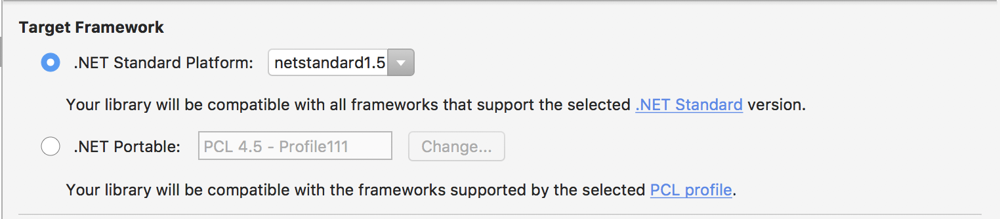

* When setting a project to use netstandard, Xamarin Studio will:
    – Add `packages.config` or, if necessary, convert packages.config to `project.json`.
    – Ensure that the **NetStandard.Library** package is added to `project.json`.
    – Set the NuGet framework in `project.json` to the selected netstandard profile.
    – Set the target framework in the .csproj to `NETPortable,Version=5.0`.

* When setting a project to use PCL, Xamarin Studio will:
    - Remove the NetStandard.Library package and set the Nuget framework to the PCL profile, if project has `project.json`.
    - Set the target framework in the .csproj to `NETPortable,Version=5.0`

## Microsoft Identity

This release introduces the ability to log in to Xamarin Studio with your Microsoft account. Logging in with your Microsoft account provides the following benefits:

* Your subscription level for Visual Studio will activate the corresponding license in Xamarin Studio without having to be logged in with a Xamarin account.
* You can log in with additional accounts to provide IDE access to Azure subscriptions. This enables Xamarin Studio to be able to provision new Azure App Services.

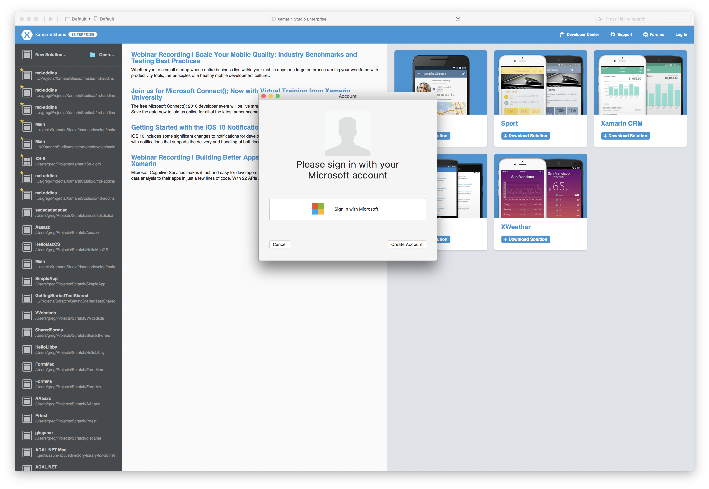

### Known Issues with identity

* Prompts for your Microsoft account credentials are displayed by a `mono-sgen32` process.
* The login process can sometimes take some time.

## Connected Services

Support for **Connected Services** is new in this release. These services bring cloud capabilities to your mobile app, such as Azure Mobile App Services.

Projects that have one or more supported **Connected Services** will have a new node in the *Solution Pad*. This Connected Services node will open a gallery of services that are available to be added to the project.
Adding a service to your project will add all required NuGet dependencies and add any required initialization code to the project. Services can also be added to all other compatible projects at this time.

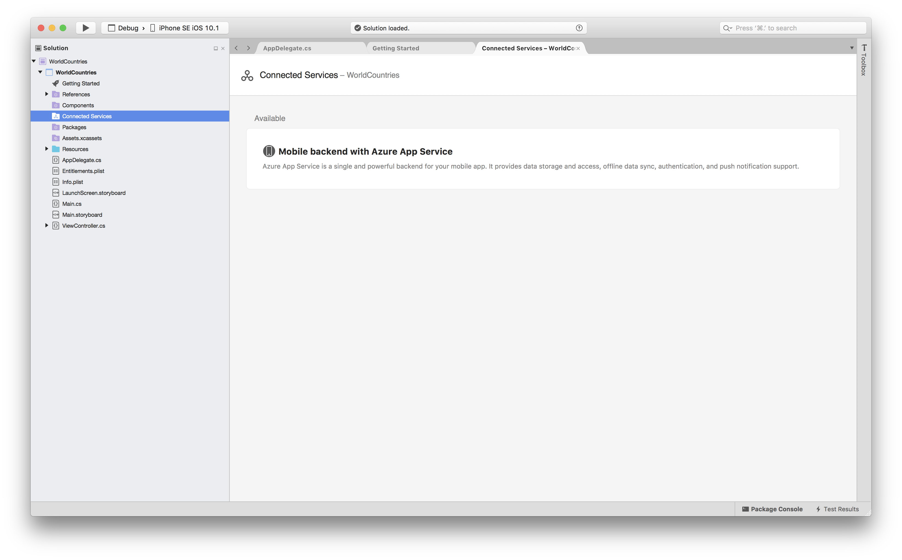

Clicking on a service in the gallery will open up the details tab for that service, allowing you to perform any additional post-installation tasks, such as creating an Azure App Service or discovering additional features and documentation to get you started with the service.

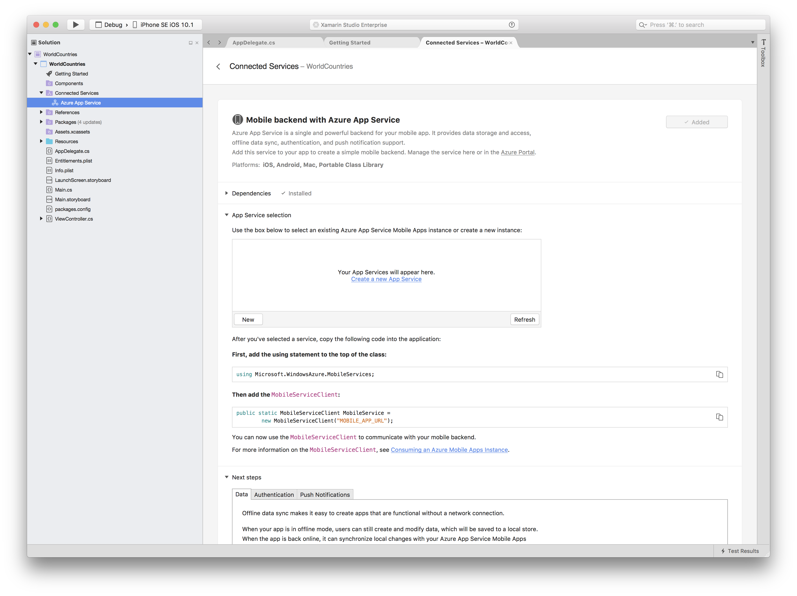

### Mobile backend with Azure App Service

This is the first Connected Service that we are providing. It enables you to connect your mobile app to an Azure App Service backend, providing easy access to Authentication, Push Notifications, and the ability to have offline Data Syncing.

It is possible to create a new App Service right from within the *Connected Service* detail tab and have it provisioned without having to go to the Azure Portal.

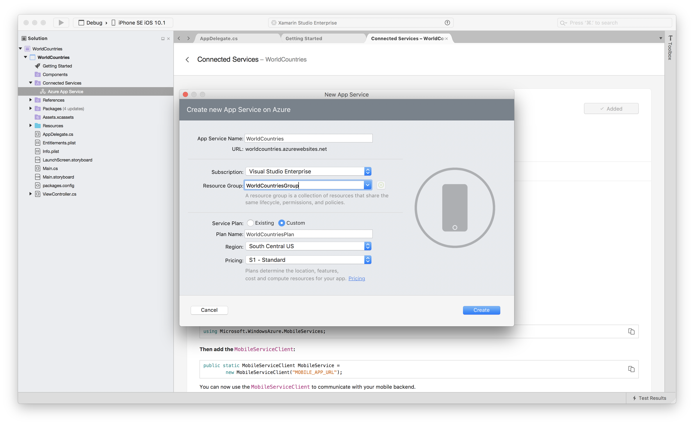

## Getting Started pages

We are adding new landing pages for specific project types to help you get started with new projects. These *Getting Started* pages provide access to additional documentation and tasks specific for each project type.

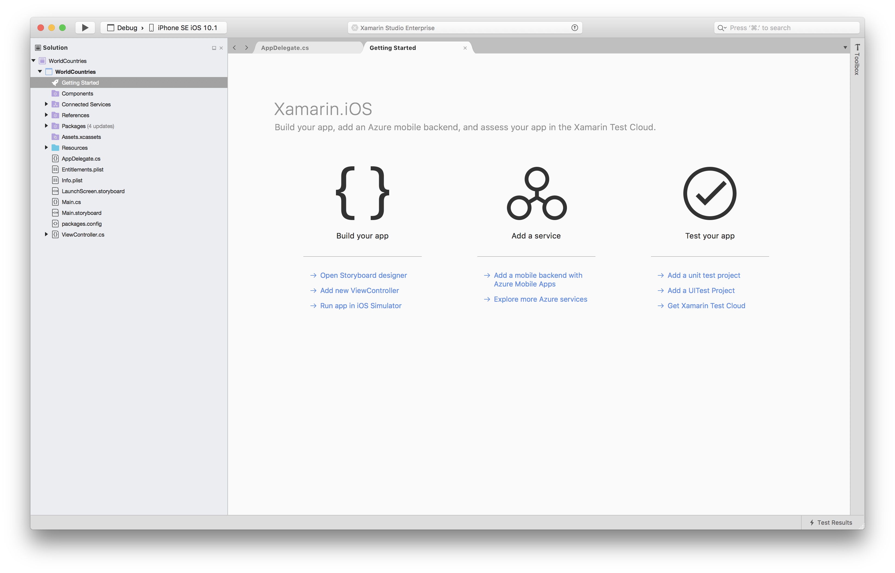

## NuGetizer 3000

NuGetizer 3000 adds integrated IDE support and build tooling for creating NuGet packages. The design was inspired by [NuProj](http://nuproj.net). It adds:

 * Project templates for creating NuGet packages
 * Create a NuGet package from an existing project
 * Reference assembly generation for Portable Class Library profiles

The following sections will look at the NuGetizer3000 support in Xamarin Studio. More detailed information is available in the [NuGetizer 3000 spec](https://github.com/NuGet/Home/wiki/NuGetizer-3000).

### Project Templates

There are two new project templates available.

 * Multiplatform Library
    * Category: Multiplatform/Library
 * NuGet package
    * Category: Other/.NET

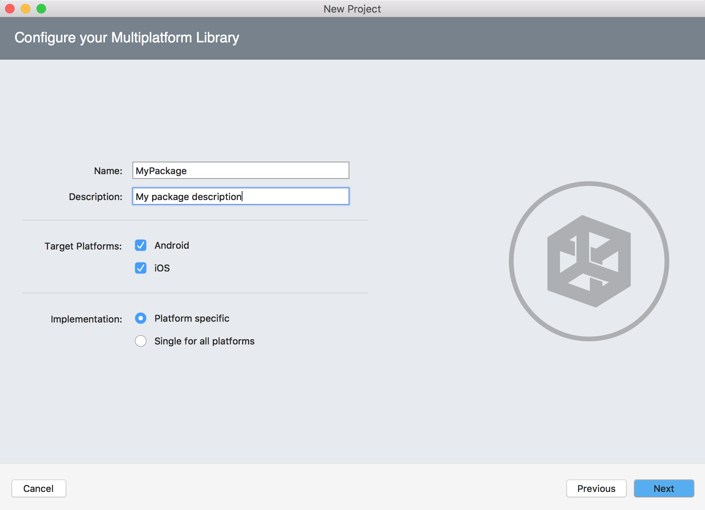

### Multiplatform Library - Single for all platforms

This will create a Portable Class Library project with NuGet package metadata. To create the NuGet package right click the project and select Create NuGet Package. This will generate a NuGet package (.nupkg) in the output directory with the PCL assembly in the correct lib directory inside the NuGet package.

### Multiplatform Library - Platform specific

This will create a shared project, an iOS project, an Android project and a NuGet packaging project. The iOS and Android project will reference the shared project. The NuGet packaging project will reference the iOS and Android projects. The NuGet packaging project has the NuGet package metadata. When the NuGet packaging project is built it will create the NuGet package in its output folder and inside the NuGet package will be the Android and iOS output assemblies in the appropriate lib folders.

## NuGet Packaging Project

The NuGet packaging project can be used to create a meta NuGet package, which is a NuGet package that has no content itself but references other NuGet packages, or it can reference other projects and add their output to a NuGet package. If the referenced project has NuGet package references then these will be added to the generated NuGet package as dependencies.

NuGet packages can be added to the NuGet packaging project in the normal way using the Add Packages dialog.

To include files in the NuGet packaging project the files need to have Include in Properties set to true. This can be done right clicking the file in the solution window, selecting Properties and selecting Include in Properties from the NuGet section in the Properties window.

### Adding NuGet Package Metadata

NuGet package metadata can be added to any .NET project by selecting the NuGet Package - Metadata page in the project options. Once NuGet package metadata has been added then the NuGet.Build.Packaging NuGet package will be added to the project. This NuGet package is responsible for creating the NuGet package for the project.

NuGet package metadata should be added to project if you want to be able to create a NuGet package for that project on its own. Without NuGet package metadata the project would need to be referenced by a NuGet packaging project or another project with NuGet package metadata for it to be included in a NuGet package.

If a NuGet packaging project references a project with NuGet package metadata then a dependency will be added to the NuGet package created by the NuGet packaging project. The referenced project's output assembly would not be included in the NuGet package created by the packaging project.

### Generating a NuGet Package

To generate a NuGet package you can right click the project and select Create NuGet Package.

For NuGet packaging projects you can also build the project and it will generate the NuGet package.

For a .NET project that has NuGet package metadata you can generate a NuGet package when building the project by enabling the "Create a NuGet Package when building the project." option in Project Options - NuGet Package - Build.

### Adding Platform Implementations

If you have a Portable Class Library with NuGet package metadata you can add platform specific implementations for iOS and Android by right clicking the project and selecting Add - Add Platform Implementation. This will open a dialog where you can choose to select iOS and Android, and also whether to create a shared project. After clicking OK an Android and iOS project will be created along with a NuGet packaging project that references these projects. The NuGet package metadata will be moved from the PCL project to the NuGet packaging project. If the shared project option was selected then the code from the PCL project will be moved to the shared project. The shared project will be referenced by the iOS and Android project.

### Reference Assembly Generation

In the Project Options for a NuGet Packaging project there is a Reference Assemblies page under the NuGet Package category. This pages shows a list of Portable Class Library profiles that can be selected. Reference assemblies for the selected profiles will be generated based on the output assemblies from the projects referenced by the NuGet packaging project.

## NuGet

* Xamarin Studio has been updated to use NuGet 3.5. Full details on the new features of NuGet 3.5 can be found in the [Announcing NuGet 3.5 RTM blog post](http://blog.nuget.org/20161027/Announcing-NuGet-3.5-RTM.html) and the [NuGet 3.5 RTM release notes](http://docs.nuget.org/ndocs/release-notes/nuget-3.5-RTM).

## F# Support

* Azure Connected Services integration
* Overhauled Android support. We no longer rely on F# CodeDOM for Resource file IntelliSense but instead use a Type Provider which fixes many issues.
* Support for expand/shrink selection
* Updated all F# templates to use NuGet version of FSharp.Core
* Updated FSharp.Compiler.Service to 8.0.0 - Improves performance when you have a project that references other projects.
* Fixed referencing F# projects from a C# project.
* Many bug fixes.

## iOS

### Debugging iOS App Extension Projects

This release introduces the ability to debug an iOS App Extension project.

To debug an iOS App Extension project, you'll first need to set the App Extension project as the startup project.
At this point, if you hit the *Play* button, Xamarin Studio will attempt to launch an appropriate application
for your app extension and wait for you to select the extension in the application to start debugging.

You can also edit your **Run Configuration** in your **Project Options** to configure which application gets
launched when you hit **Play**. A number of pre-defined applications will appear in the drop-down menu that
you can choose from. If your preferred application is not in that list, you can choose to enter the
*CFBundleIdentifier* associated with the application you'd prefer to launch instead.

### Entitlements Editor

We restored descriptions for entitlements in this release to help you better understand what a given capability is for, before you enable it.
The editor now lets you add the new SiriKit capability as well as Apple Push Notifications and Game Center (in Info.plist).

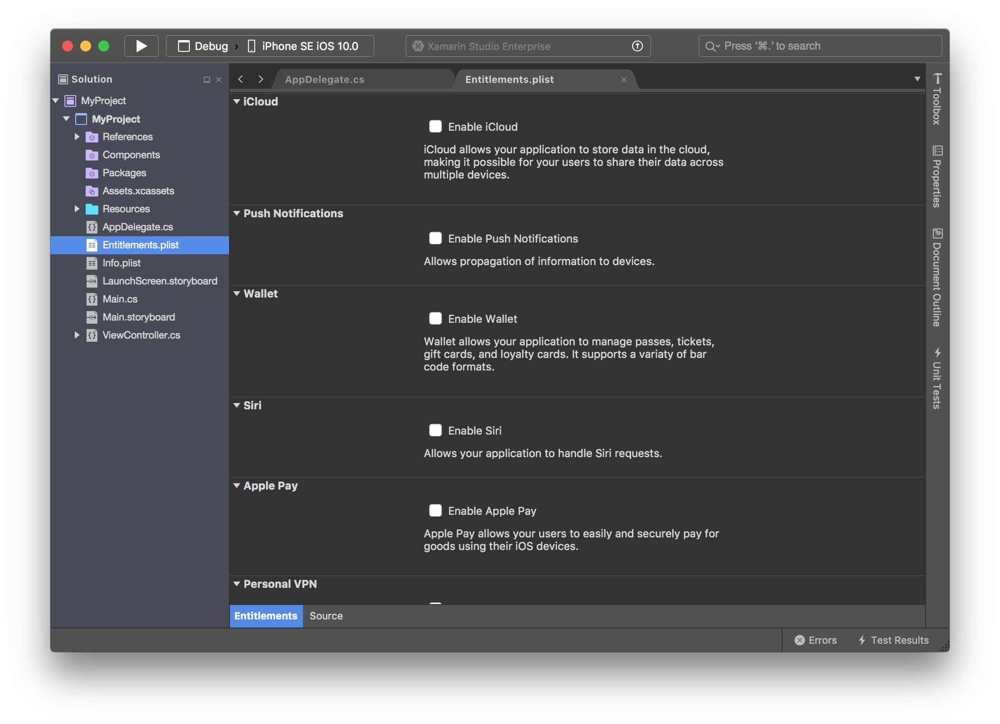

### Other Improvements

* iOS Simulators are now filtered out based on the `UIRequiredDeviceCapabilities` defined in the project's Info.plist.
* Added support for debugging the main iOS App and the Watch App simultaniously.
* Improved Xcode-sync support for Xcode 8+.

## Android

### Binding project build options

You can now set the value of `AndroidClassParser` from within the project options for an Android binding project.
This property tells Xamarin.Android how it should parse .jar files. For more information please see [Binding Project Build Properties.](https://developer.xamarin.com/guides/android/under_the_hood/build_process/#Binding_Project_Build_Properties)

## Android Designer

<strong>Warning:</strong> The designer now requires Java 1.8 to be installed to work correctly. You can <a href="http://www.oracle.com/technetwork/java/javase/downloads/jdk8-downloads-2133151.html">download a 1.8 JDK from Oracle website</a>.

### Android API 24 and API 25 support

Android API 24/25 rendering support has been added to the designer. In addition, we now support more recent Nexus and Pixel devices as rendering targets:

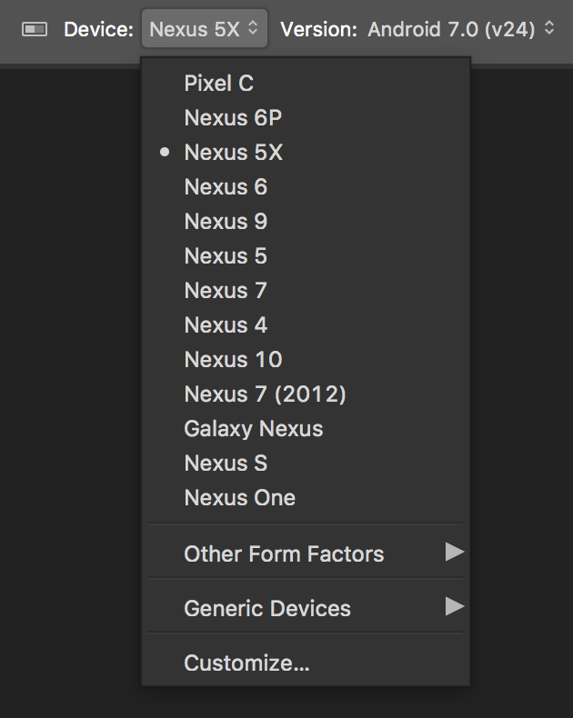

### Improvements to Width & Height Fields in the Property Panel

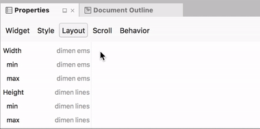

We improved the Android property panel to have a more logical input for width and height (for wigets such as `Button` and `TextView`) with entries that can represent two Android properties at the same time.

Those entries will intelligently infer the right property to set based on the context, simply enter the value you intend for width or height (either a number or a dimension) and the correct underlying XML will be created.

Appropriate warnings are also given when:

 - Two properties are set in the XML that affect the same dimension as one will override the other.
 - The input is invalid for both properties.

Additionally, autocompletion was added for these new types of entries and other types of composite entries (such as X/Y):

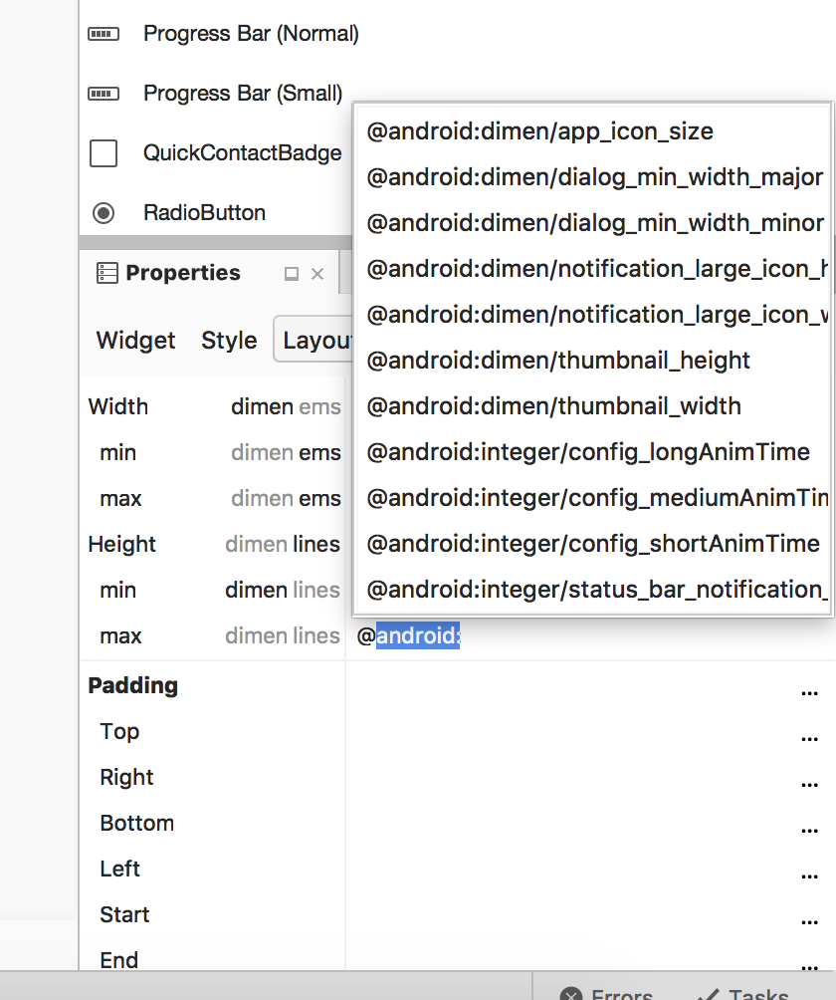

### Custom controls

A lot of work was done to improve the reliability and recovery of custom controls in the designer.

A new exception popover is now displayed when a custom control throws an exception in some part of its operation:

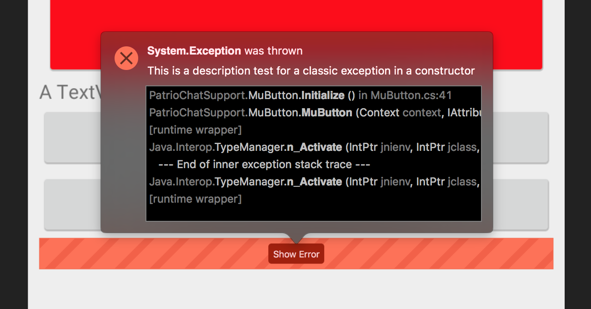

### Android Layout Editor Improvements

Custom controls and their attributes now show up in the autocompletion window

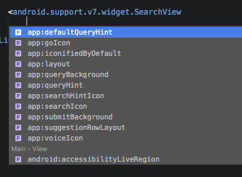

Other minor fixes and enhancements were made to improve the overall experience.

### Misc

- Better handling of Android Wear various device resolution
- Better support of Android Wear devices with a chin (aka flat-tire screens)
- Improved visual alignment in property panel

## iOS Designer

### Xcode 8.1 support

The iOS Designer is now compatible with the Xcode 8 and Xcode 8.1 format Interface Definition files. It supports all the new properties introduced in Xcode 8 and Xcode 8.1.

### Notable improvements:

* Some combinations of Simulated Metrics used to cause some scenes to re-render unnecessarily. This won't happen now.
* Several small fixes to UICollectionReusableView, UICollectionViewCell and UITableViewCell when editing them in SizeClass mode.
* Improve how the Property Panel handles two different object types which have same Custom Class. For example when a UILabel and a UIButton are both given the same custom class `MyView`.
* Fixed an issue where some of the ComboBox based properties associated with Segues would always select the last item in the ComboBox.
* Fixed an issue where sometimes colors would not update on the design surface after being edited in the Property Panel.

## Xamarin Forms Previewer

There have been many enhancements to the Forms Previewer to increase the range of supported controls and xaml constucts. Errors and warnings are now more reliably reported, especially during the initialization process.

We advise that you install the latest Xamarin.Android release and update to the latest Xamarin.Forms nuget in order to get the best experience in the Previewer.

### Notable Improvements

* A clear error message will be displayed if your Xaml control is missing a parameterless constructor.
* `Application.Current` should be set now, which means controls which reference `Application.Current` will no longer null ref inside the previewer.
* The corresponding C# class for a given xaml file will be instantiated in every case now.
* Greatly improved handling for when a control references other Xaml based controls. Now the latest version of the xaml for the associated controls will always be used.

## Version Control

## Multi process debugging

Xamarin Studio can now allow you to launch and debug multiple projects at once giving you the ability to debug, for example, a phone and companion watch app at the same time.

This can be achieved in two ways:
* Right-click on each project in the solution pad and start debugging. Each project will continue to run and hit breakpoints until you press Stop.
* Add a new "Solution Run Configuration" in solution settings under Run->Configurations panel. Here you can create configurations that use specific
  *Run Configurations* of each project instead of the *Default* Run Configuration. You use this new configuration by selecting it from the
  configuration selector in the main menu bar.

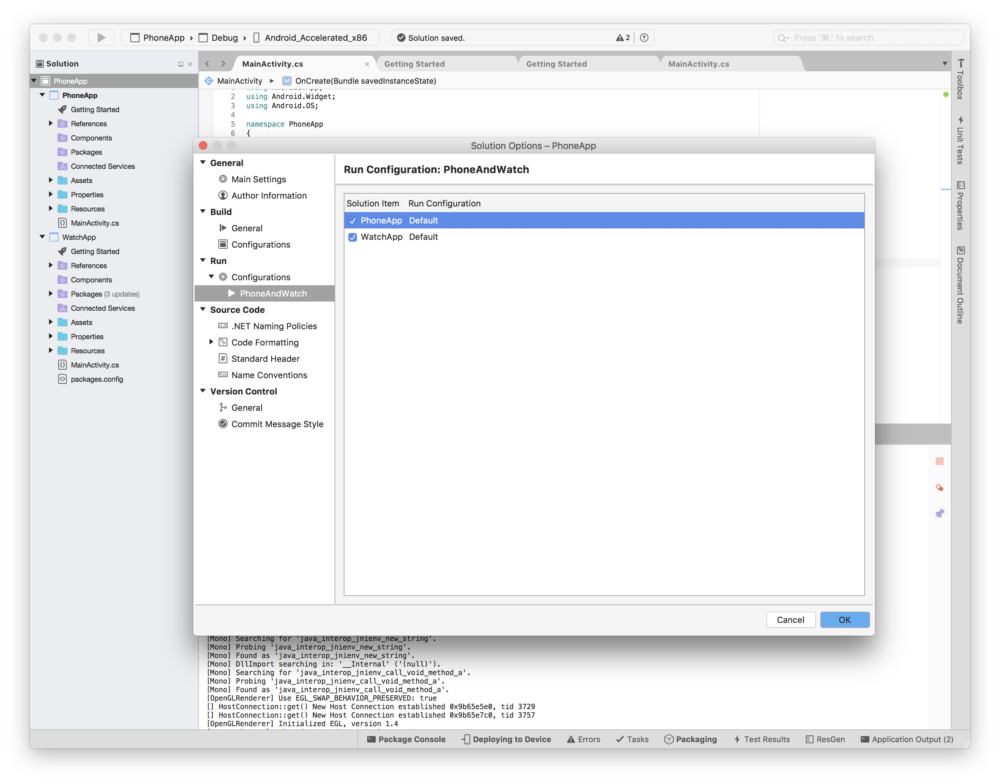

Each project that is being debugged will have it's own Application Output pad.

## Performance

We have spent a lot of effort to improve performance and there are many improvements that make this release a lot more stable and performant.

Notable improvements:

* Optimized Xamarin Studio memory consumption and fixed a lot of memory leaks.
* Optimized editor fluidity, there should be fewer lockups on writing code now.
* Optimized redrawing of the main window, allowing for smoother resizing.
* Optimized solution loading and parsing and reloading, providing a faster access to the workbench.
* Optimized the underlying UI toolkit to be a thinner layer altogether, allowing more responsive UI interaction.
* Optimized typesystem construction speed, especially the time it takes to load searchbar results.
* Optimized editor drawing and parsing to be deferred, only parsing code actions for documents that have been opened and realized, greatly decreasing CPU load post solution load.
* Debugging should no longer take a long time to resolve breakpoints in big assemblies.
* A lot of other small, miscellaneous improvements.

## Other improvements and bug fixes

* Fixed: 45556 - F# Project References don't work from C# projects.
* Fixed: 11288 - Auto completion window of Expression Evaluator does not allow the user to select using mouse click or up down arrow.
* Fixed: 18835 - Solution Pad: Renaming a file doesn't respect pad font size.
* Fixed: 28033 - Search notification in different language than the rest of Xamarin Studio.
* Fixed: 32315 - Inspecting a variable gives information from the incorrect symbol.
* Fixed: 33733 - Breakpoints not hit in methods with same full typename.
* Fixed: 36249 - double clicking in build output hangs XS.
* Fixed: 38791 - Update default product templates to benefit from C#6.
* Fixed: 40794 - Dark Theme Hides Dialog Color Names.
* Fixed: 40877 - Solution pad shows active focus color even when editor has focus.
* Fixed: 41397 - Provide feedback when installing to watch .
* Fixed: 41738 - The 'TextTemplatingFileGenerator' T4 code generator crashed: Object reference not set to an instance of an object.
* Fixed: 42049 - XIB with Simulated Metrics crashes.
* Fixed: 42237 - Crash on checkout using Unix Subversion.
* Fixed: 42239 - F# Cannot use single-character DU case sub-label names.
* Fixed: 42252 - Subversion Checkout fails with error.
* Fixed: 42362 - User is not able to migrate from iOS Classic to Unified project.
* Fixed: 42494 - Error indications are appearing at right side in Text Editor for WinPhone project.
* Fixed: 42496 - Fatal exception when quickly opening/closing projects.
* Fixed: 42539 - Moving a control into or out of a subview removes the controls name.
* Fixed: 42558 - Broken System reference causes T4 compilation failure.
* Fixed: 42588 - Generated documentation do not includes "returns" tag for a method that returns a value.
* Fixed: 42591 - XS generates documentation for preprocessor directives.
* Fixed: 42593 - Cannot open the Info.plist in a watchos extension project.
* Fixed: 42657 - [Android Designer] Values gets disappear in Properties Panel on re-selecting the widgets on designer.
* Fixed: 42743 - HttpClientHandler combo is not shown for Community license.
* Fixed: 42746 - Xamarin Studio is crashed when user try to edit the properties after sorting 'Properties Window' alphabetically.
* Fixed: 42765 - Unable to ever build release XM on machine w\ no certificates.
* Fixed: 42819 - RECS0135 code analysis warning incorrectly raised.
* Fixed: 42896 - "Move to file" in shared project creates file in different project.
* Fixed: 42925 - Unable to validate archive in XS.
* Fixed: 42952 - Parameter info not working for extension methods in different namespace.
* Fixed: 43011 - Simplify SDK vs min target OS settings.
* Fixed: 43051 - Could not load solution; Load operation failed.
* Fixed: 43188 - Sporadic build error (Out of memory) leaves solution in unbuildable state until reload of project.
* Fixed: 43311 - Code formattion - Indentation previews do not update in C# formatting policy dialog.
* Fixed: 43317 - Session isn't reloaded after initial layout loading error.
* Fixed: 43423 - F# Interactive crashes on code completion.
* Fixed: 43472 - Run configuration aren't respected when debugging.
* Fixed: 43509 - Failure to evaluate msbuild item properties.
* Fixed: 43522 - MonoDevelop.UnitTesting.NUnit.NUnitAssemblyTestSuite.RunUnitTest throws error on large test suite.
* Fixed: 43566 - iOS Designer initialization causes any already running iOS 10 simulator to hang.
* Fixed: 43588 - Getting error on reloading an unsupported project in XS.
* Fixed: 43641 - Enter doesn't work in name textbox for new run config.
* Fixed: 43754 - Deprecate WatchKit App (for watchOS 1) as Apple won't be allowing them June 1st, 2016 onwards.
* Fixed: 43771 - Cannot view UIView width/height/X/Y values due to UI issue with Storyboard Designer.
* Fixed: 43886 - Check if UIRequiredDeviceCapabilities are supported on target device before launching.
* Fixed: 43899 - App doesn't seem to pass "Arguments Passed On Launch" to Objective-C side.
* Fixed: 43909 - Getting "Waiting for the debugger..." in XS status bar while running Broadcast Upload Extension Project.
* Fixed: 43913 - Getting build error with "Call Directory Extension" Project.
* Fixed: 43917 - "SpriteKit Game Extension" Project of WatchOS getting crashed as soon as it launches.
* Fixed: 43933 - Refactorings "to property" changes visibility modifiers.
* Fixed: 43940 - Uncaught Exception Dialog: UX problems.
* Fixed: 44022 - Getting message "Waiting for the debugger..." in XS status bar while running tvos Broadcast Upload Extension Project.
* Fixed: 44030 - Hovering over async warning yields a dialog with no text.
* Fixed: 44063 - [mdtool] Building Xamarin.Forms projects with mdtool fails with NRE.
* Fixed: 44124 - Importing CustomCommands fails if the command is null.
* Fixed: 44172 - Code template expansion not generating the right thing for arrays.
* Fixed: 44266 - Unable to change variable values whilst debugging.
* Fixed: 44285 - Xcode interface builder quits every time I open Xamarin Studio.
* Fixed: 44303 - Very strange ordering in breadcrumb.
* Fixed: 44319 - Android OpenGL 3.0 template raises a warning because the template does not use string interpolation correctly.
* Fixed: 44343 - Xaml forms previewer issues - Object reference not set to an instance of an object and others.
* Fixed: 44370 - [Android Designer] Layout does not render correctly on 'Create Layout Variation' window and under 'Alternative Layout' section as well.
* Fixed: 44389 - Syntax highlighting is broken in Shared project.
* Fixed: 44392 - [watchOS] new InterfaceController.cs classes don't compile (missing `using WatchKit;`).
* Fixed: 44478 - Designer initialisation code crashes if user already has system enviroment variable set.
* Fixed: 44492 - mdtool generates Unhandled exception in CreateSenders related to Xamarin components.
* Fixed: 44537 - XS 6.x branches are not reading XML documentation from 3rd party libraries.
* Fixed: 44550 - Wrong warning message about invalid Xcode's path.
* Fixed: 44597 - XS is not updating the correct framework value in project.json when switching from netstandard to PCL.
* Fixed: 44610 - Default http client handler should be NSUrlSessionHandler.
* Fixed: 44620 - Unable to kill application in Glance mode on Watch device 2.2.
* Fixed: 44746 - Regression - The type Xyz conflicts with the imported type Xyz - Shared Projects and iOS Today Extension.
* Fixed: 44760 - Changing iOS SDK location causes Xamarin Studio to freeze up.
* Fixed: 44767 - Project loaded with blank .cs file in text editor area of XS.
* Fixed: 44809 - PCL Projects does not allow switching from '.Net Standard Platform' to '.Net Portable' in Windows.
* Fixed: 44838 - [Android Designer] Device 'Nexus 7' is not appearing in Device dropdown for Android designer.
* Fixed: 44928 - Unable to add component from component store to Android project in XS.
* Fixed: 45023 - Toolbox list stops filtering after switching tabs.
* Fixed: 45034 - Exception caught dialog is not dismissed when pressing Esc.
* Fixed: 45071 - [Roslyn Update] Global search results are truncated.
* Fixed: 45074 - Unable to deploy Android application on emulator, however iOS application deploy on simulator successfully.
* Fixed: 45085 - Semaphore overflow in XS on Windows.
* Fixed: 45090 - Multiline C# Comments do not autocomplete close.
* Fixed: 45098 - [watchOS] The "SSL/TLS implementation" option in the build options should be removed.
* Fixed: 45100 - [watchOS] The "Code Generation & Runtime" section in the "watchOS Build" properties is useless for Watch App projects.
* Fixed: 45104 - Duplicated code block on closing bracket.
* Fixed: 45115 - Assembly Name is getting overwritten in strange ways.
* Fixed: 45145 - 'New Project' window does not go away after creating Xam.Mac template.
* Fixed: 45150 - Android designer failed to load.
* Fixed: 45167 - Size of 'New Configuration' popup window gets decrease while entering text in 'Name' text field.
* Fixed: 45237 - Update the simulator architecture for new project to be x86_64 (so we avoid iOS warning).
* Fixed: 45247 - XS always uses discrete GPU on sierra.
* Fixed: 45256 - Expression Evaluator "Close" button doesn't work.
* Fixed: 45291 - iOS Intents Extension is using nameof C# 6 feature.
* Fixed: 45297 - Completion doesn't match on lowercase.
* Fixed: 45334 - Breakpoints not working on iOS simulator if i386+x64 architecutres enabled.
* Fixed: 45377 - [Android Designer] Widgets get blink on changing the cursor focus in Width/Height fields in Property Panel.
* Fixed: 45389 - Follow-up to Bug 44285: "The workspace file that was at ... obj/Xcode/0/UnifiedSingleViewIphone1.xcodeproj/project.xcworkspace ... has disappeared." if Xcode sync project is open when adding new IB document in Xamarin Studio.
* Fixed: 45525 - Syntax highlighting no longer working for XML files with custom extension.
* Fixed: 45730 - New project added in solution when user click on overwrite file while creating new solution.
* Fixed: 45792 - Exponential memory usage when loading mdb files.
* Fixed: 46040 - Message "Adding <package name>" is showing continuously in XS status bar when Xamarin Component using Pre-Release packages.
* Fixed: 46056 - Duplicate csproj reference breaks typesystem.
* Fixed: 46196 - Error in SignatureMarkupCreator.GetTypeReferenceString.
* Fixed: 46283 - Renaming a class breaks 'find in files'.
* Fixed: 46359 - Error in ConvertConditionalTernaryToNullCoalescingAnalyzer.
* Fixed: 46376 - Closing XS before it's finished loading can cause XS to crash.
* Fixed: 5946 - Add file templates for new Android Service and IntentService.
* Fixed: 8506 - Adding Existing Folders/Files should open up to file path of the previous added folder/file.
* Fixed: 9222 - Key Bindings for External Tools.
* Fixed: 2487 - Userprefs has absolute filenames.
* Fixed: 3062 - Hide internal non-user frames when debugging user code.

## Changes since last preview

### November 28, 2016

6.2.0.1483

* New: Multi-process debugging. Startup and debug multiple projects at the same time.
* Updated: Nuget 3.5 support.
* Fixed: 41969 - On Mac with "Arabic" in the configured language list, Studio UI can end up right-to-left and unusable.
* Fixed: 46332 - Getting Started landing page has wrong command for adding unit test project.
* Fixed: 46412 - Xamarin Designer crash when editing classes in property pane.
* Fixed: 46504 - [Identity] Huge amount of empty space when not Logged in.
* Fixed: 46505 - [Identity] Can add duplicate accounts.
* Fixed: 46523 - Xamarin Studio creates invalid storyboard which crashes Xcode.
* Fixed: 46545 - 1024x768 Icon not displayed in Asset Catalog editor after adding and closing and re-opening XS.
* Fixed: 46553 - Missing watchOS complication families in XS UI.
* Fixed: 46598 - [Getting Started] "Open Storyboard designer" doesn't work on XM "Getting started" page.
* Fixed: 46608 - [Getting Started] "Add new ViewController" on Getting started page of XM projects doesn't work.
* Fixed: 46609 - [Getting Started] Get Xamarin Test Cloud button on "Getting Started" doesn't work.
* Fixed: 46622 - [Identity] Able to remove Primary MS Account from window XS.
* Fixed: 46623 - [Identity] Profile Image of Primary MS Account user is not displayed in Accounts window on MAC XS.
* Fixed: 46633 - [Getting Started] Not getting link for 'Run app in Android Emulator' for Xam.forms application in Getting started page.
* Fixed: 46686 - Cannot create a WatchOS SceneKit and SpiriteKit game.
* Fixed: 46687 - WatchKit2 template warning: The watch complication set "Complication" has an unassigned item "ExtraLarge".
* Fixed: 46694 - [XS- Connected Services] Getting build error with tvOS application after adding Azure Service.
* Fixed: 46697 - [Getting Started] 'Add a mobile backend with Azure Mobile Apps' and 'Explore more Azure services' links are not working for X.forms(shared project) in getting started page.
* Fixed: 46701 - New Project template window does’t remember last project template.
* Fixed: 46705 - [XS Connected Services][Win] User is not able to create a new instance for Azure App Service Mobile Apps.
* Fixed: 46707 - Deadlock opening a project.
* Fixed: 46751 - Getting exception on selecting "Android Wear Round chin/Android Wear Square/Android Wear Round" devices under device list in Android Designer.
* Fixed: 46788 - [Getting Started] 'Getting started page' is not automatically landed when X.form(shared project) is loaded in XS.
* Fixed: 46960 - File MyClass.cs could not be written. error when adding new shared library to solution.
* Fixed: 46961 - Func<> intellisense tooltip is wrong.
* Fixed: 46976 - [XS- Connected Services] Getting an error popup window after creating X.forms application in XS.
* Fixed: 46977 - [Getting Started] UI of Getting Started page is distorted on Windows 7 in XS.
* Fixed: 46980 - Storyboard fails to show on either stable or alpha branches.
* Fixed: 47083 - Index was outside bounds of the array in debug mode.
* Fixed: 47085 - [XS- Connected Services] User should redirected directly to "Microsoft Account window" when click on "Sign in with your Microsoft Account".
* Fixed: 47114 - Project name with dot creates invalid xaml class name.
* Fixed: 47335 - [Getting Started] 'Getting started page' is not automatically landed when Xamarin cross-platform native(PCL or shared) is loaded in XS.
* Fixed: 47339 - [Getting Started] 'Add a mobile backend with Azure Mobile Apps' and 'Explore more Azure services' links are not working for Xamarin.CrossPlatform(shared) project in XS.
* Fixed: 47340 - [Identity][Yosemite only] Not able to sign in with Microsoft account.
* Fixed: 47344 - [Getting Started] Getting Discrepancy between the behavior of Xam.forms(PCl or shared) and Xam.forms(native) in Getting started page.

### December 5, 2016

6.2.0.1499

* Fixed: 41738 - The 'TextTemplatingFileGenerator' code generator crashed: Object reference not set to an instance of an object.
* Fixed: 46506 - Recieved 429 HTTP error response when getting my subscriptions.
* Fixed: 46585 - [Getting Started] "New" button is disabled in new XAML ContentPage dialog.
* Fixed: 46808 - [Getting Started] Getting started page widget seems slightly too big as the "resize" pane cursor does not always show.
* Fixed: 47348 - Package license acceptance dialog cannot cancel by Esc key.
* Fixed: 47590 - "Add a Service" Icon is missing on Getting started page in Xamarin.Forms Shared project.
* Fixed: 47709 - [Xcode8Xml] XS Root view controller's 'Accessibility' section results in mismatched storyboard XML with Xcode.
* Fixed: 48017 - Unable to execute run configuration with environment variable.
* Fixed: 48256 - Inspector addin breaks because DebuggingService.DebuggerSession null when DebuggingService.DebugSessionStarted raised.
* Fixed: 48263 - [Xcode8Xml] Getting difference in xml file for Collection Reusable View widget.

### December 13, 2016

6.2.0.1515

* New: Build options for Android Binding projects.
* Fixed: 40966 - [Cycle 7] Cursor is not displaying at proper location.
* Fixed: 45134 - "Go to folder" shortcut in file dialogs doesn't accept Cmd+v.
* Fixed: 46514 - When adding a new service, it returned with no data and just showed it showing as not existing.
* Fixed: 47797 - Clicking "Manage Google Emulators..." from the devices drop-down results in duplicated windows.
* Fixed: 47830 - 'Default' option is not selected by default in dropdown list for '.jar file parser' property.
* Fixed: 47929 - Getting difference in XML file of Bar Button Item widget with XS & Xcode.
* Fixed: 48399 - [Getting Started] 'Add a mobile backend with Azure Mobile Apps' and 'Explore more Azure services' links should be removed from X.mac Application.
* Fixed: 48677 - [Expression Evaluator] "Show Value" isn't clickable.
* Fixed: 48693 - [Getting Started] "Run App in iOS simulator" should be removed for Xam .form(PCL or Shared) application in Windows XS.
* Fixed: 48695 - Bad user experience when credentials are expired (?).

### December 19, 2016

6.2.0.1686

* New: NuGetizer3000
* Fixed: 43510 - Fully qualified references do not work with spaces in the reference.
* Fixed: 43791 - Not possible to debug a tool using mdtool as the external program to run with a Run Configuration.
* Fixed: 44564 - Wrong tooltip activation offset in ExtensibleTreeView.
* Fixed: 44761 - "Application has not been built" error message when deploying XM app with a custom TargetOuputPath.
* Fixed: 45265 - Running Xamarin.Mac app after building library does not build app.
* Fixed: 46323 - Not getting "Getting Started" page with tvOS applications in XS.
* Fixed: 46768 - [XS - Updater] Updater window is not available after cancel + auth error.
* Fixed: 47088 - [Connected Services][Win] 'Create' Button in disable mode on 'New App Service page' in XS.
* Fixed: 48026 - Cannot use macros in environment variables with run configurations.
* Fixed: 49031 - Window stuck behind window in Android custom config window.
* Fixed: 49036 - UI issues with account switcher.
* Fixed: 49301 - MSBuild Clean failures are not reported.
* Fixed: 49500 - Null reference when installing a NuGet package.
* Fixed: 49517 - Cannot create a Forms project (PCL or Shared) using New Project Dialog.

### January 4, 2017

6.2.0.1701

* Improved: Designer support for Xcode 8.2.1.
* Improved: Xamarin.Forms templates use Profile111 instead of Profile259.
* Fixed: 40721 - Null reference exception when loading android designer with F# project.
* Fixed: 45911 - ERROR ITMS-90474: "Invalid Bundle. iPad Multitasking support requires these orientations: 'UIInterfaceOrientationPortrait,UIInterfaceOrientationPortraitUpsideDown,UIInterfaceOrientationLandscapeLeft,UIInterfaceOrientationLandscapeRight'.
* Fixed: 47826 - XS gets crashed on toggling 'Vibrancy' checkbox for control 'Visual Effect View with Blur'.
* Fixed: 49468 - [Android Designer] On changing the widgets Width/Height properties from Properties Panel, every time same widgets adding on the android designer.
* Fixed: 49828 - Incorrect tooltip documentation for `HttpClient implementation`.
* Fixed: 50552 - Info.plist GUI editor will not change the supported device Orientations for iPad, they only affect iPhone.
* Fixed: 50619 - [Identity] Accounts window shows the entitlement level of the keychain account (which is lower).
* Fixed: 51172 - Error message is cropped in the Xamarin.Forms Previewer.

### January 10, 2017

6.2.0.1718

* Fixed: 49941 - Remove "Measurement" Google Play Service Packages from the list as it is no longer supported.
* Fixed: 50464 - Running xunit.runner.console.exe on xunit.net test DLL from Xamarin Studio as a Default Run Configuration causes exception.
* Fixed: 50993 - Not getting iOS device log in XS.
* Fixed: 51160 - Error in intellisense.
* Fixed: 51214 - We should use the ExceptionCallout to display ProxiedExceptions to the user.
* Fixed: 51268 - Renaming an F# file results in no tooltips or completion being shown.
* Fixed: 51273 - Multiplatform library uses PCL Profile 78 instead of Profile 111.

### January 18, 2017

6.2.0.1742

* Fixed: 43200 - Getting "Can't load AMD 64-bit.dll" error with Android Previewer in 32bit System.
* Fixed: 48212 - Unnecessary Expand icon is displaying with "Resources" folder.
* Fixed: 48234 - Unable to determine which `Application Output` pad belongs to which project.
* Fixed: 49086 - ArgumentException when trying to attach to a process.
* Fixed: 49518 - F# PCL - Project Options - General shows nothing.
* Fixed: 49816 - Unable to select text on 'Find' box.
* Fixed: 51141 - Devices and Emulators should appear into three categories 'Physical device', 'Virtual device' and 'Incompatible API level' for Android application in XS.
* Fixed: 51300 - Completion etc stops working for shared projects when a file has been renamed.
* Fixed: 51311 - Previewer should show a proper message when installed old version of JDK and SDK.
* Fixed: 51417 - Xamarin Studio Preferences -> Other -> Xamarin Studio Maintenance says "MonoDevelop Maintenance".
* Fixed: 51469 - Search (command dot) not working after opening iOS project properties.

6.2.0.1757

* Fixed: 45207 - Setting ImageView Image undo leaves name on current and new ImageViews.
* Fixed: 50415 - XS keeps rewriting greater than symbol in csproj file.
* Fixed: 50711 - API Documentation getting crash while open.
* Fixed: 51348 - Mouse hovering on a drawable resources (like color, image), preview popup is not getting appear.
* Fixed: 51497 - Packages are updated to pre/beta-release version if you update all packages.
* Fixed: 51527 - [Installer]XS failed to open when Xcode.app is not set.

### January 23, 2017

6.2.0.1778

* Fixed: 40882 - GTK# project template availabe for F# and VB even though GTK# addin is disabled.
* Fixed: 44337 - Some test names are not shown in Unit Tests Pad.
* Fixed: 45026 - Option-Backspace deleting in editor while find popup is open and focused.
* Fixed: 46634 - User is not seeing Xamarin Profiler version in About Xamarin Studio.
* Fixed: 46681 - Solution Pad: Expanding a Xamarin.Mac project References node makes other nodes disappear.
* Fixed: 49219 - Xaml Previewer doesn't default to selected platform.
* Fixed: 50192 - Impossible to set Debug info to Full for Release|iPhone.
* Fixed: 51353 - Remove native code when publishing a watchOS 2.x+ app.
* Fixed: 51576 - Welcome page gets distorted when open it via Windows -> Welcome page option.
* Fixed: 51593 - Entitlements are not cached.
* Fixed: 51632 - [Getting Started Styling] 'Add an Azure Mobile Backend' and 'Explore more Azure Services' are not working for Multiplatform Native(PCL) application.

### January 30, 2017

6.2.0.1798

* Improved: The identity service shows the correct name when requesting access to the Key Chain on Mac.
* Fixed: 51736 - Non Asset Catalog support for iPad Pro 12inch assets are missing.
* Fixed: 51644 - "Mac Application: Save to disk" publishing fails with Cocoa App if "Use a Different App Name in Dock" is checked.
* Fixed: 51610 - Toolbar switches back from Release to Debug on adding/removing a file.
* Fixed: 50636 - Unable to add XAML files while creating F# Forms apps as 'use XAML..' options missing.
* Fixed: 37638 - [Xamarin Studio] Git plugin fails to log into GitHub, no error message is displayed to user.

### February 7, 2017

6.2.0.1809

* Fixed: 50797 - F# sample android project fails to load in VS (XS was storing files in the wrong order)
* Fixed: 51738 - Container border is not appearing in Android designer when click on Highlight Containers icon
* Fixed: Button handler added through storyboard editor results in malformed *.designer.cs code
* Creating a new Xamarin Forms project will now create a shared project with the user interface created with XAML. Previously it was possible to optionally create a Portable Class Library (PCL) project and optionally use XAML instead of code for the user interface.

### February 13, 2017

6.2.0.1812

* Fixed: 44831 - Dragging new constraint only shows line/handle on left portion of designer surface.
* Fixed: 52378 - Code completion broken on standalone files.

### February 22, 2017

6.2.0.1821 (Stable Release)

* Fixed: 37557 - [Roslyn] Editor always inserts tabs instead of spaces in F# files.
* Fixed: 49219 - Xaml Previewer doesn't default to selected platform.
* Fixed: 52401 - Changes not saved when switch from Source to Designer.
* Fixed: 52588 - Current error "The previewer requires a 64bit version of Java ... https://java.com/en/download" for Forms Previewer with 32-bit JDK has 
incorrect download link and doesn't instruct the user to set the JDK in "Xamarin > Android Settings".
* Updated: PCL is back as an option when creating a Forms project.
