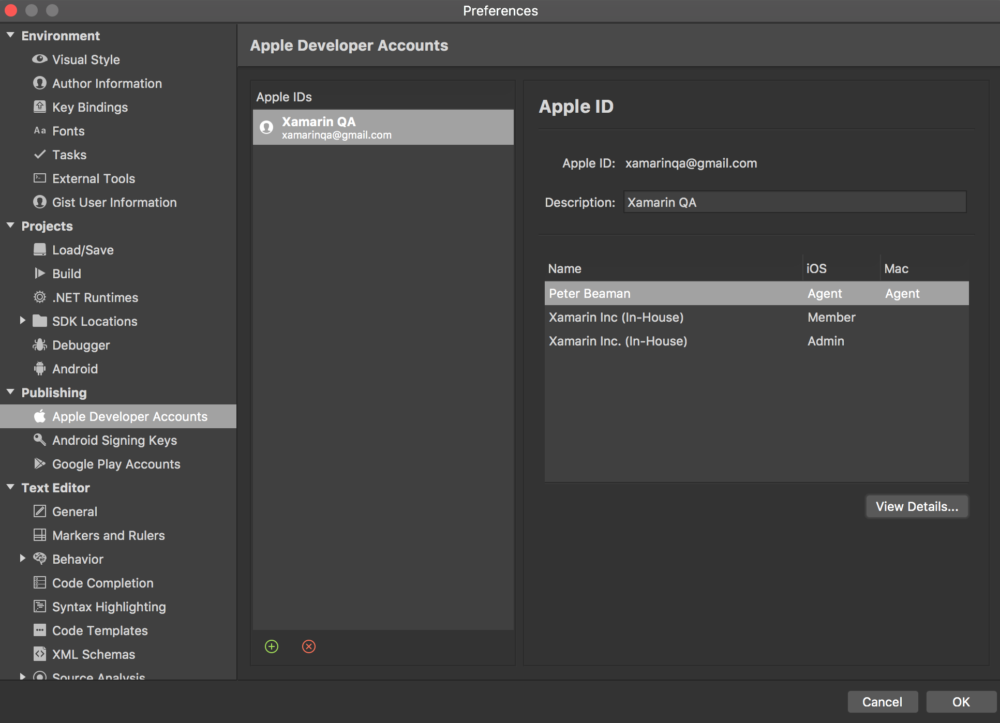
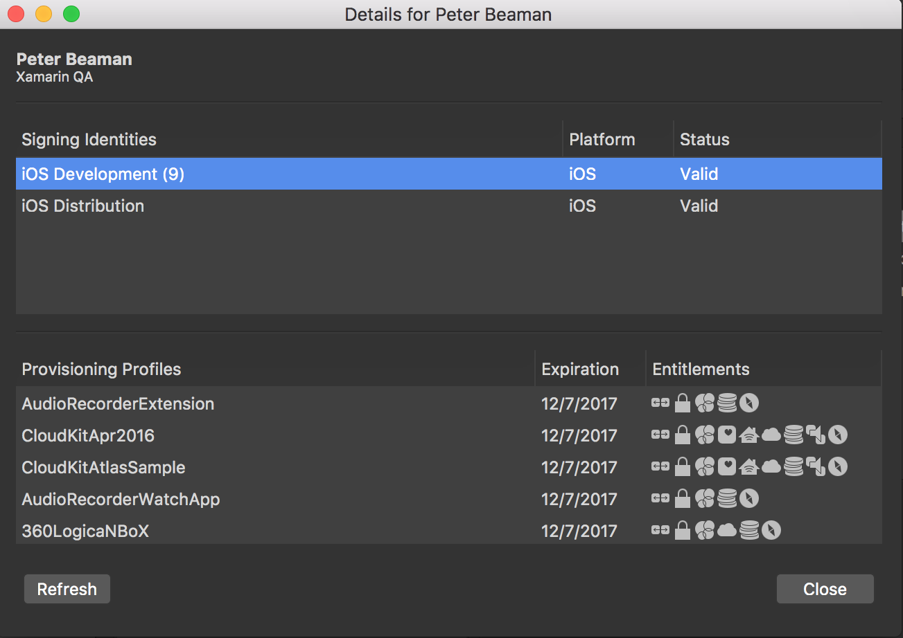
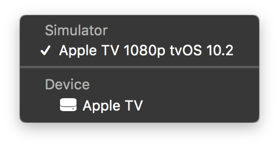
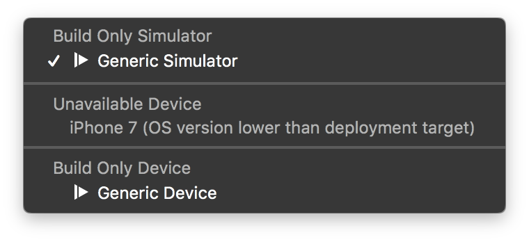
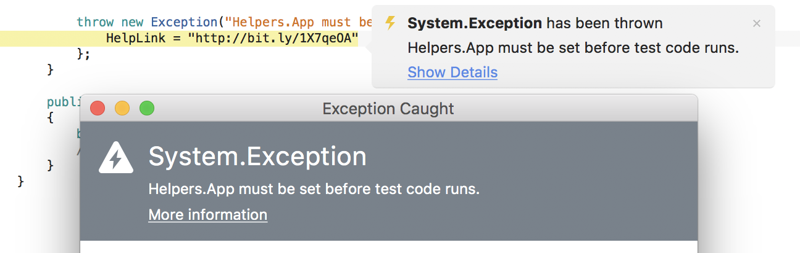
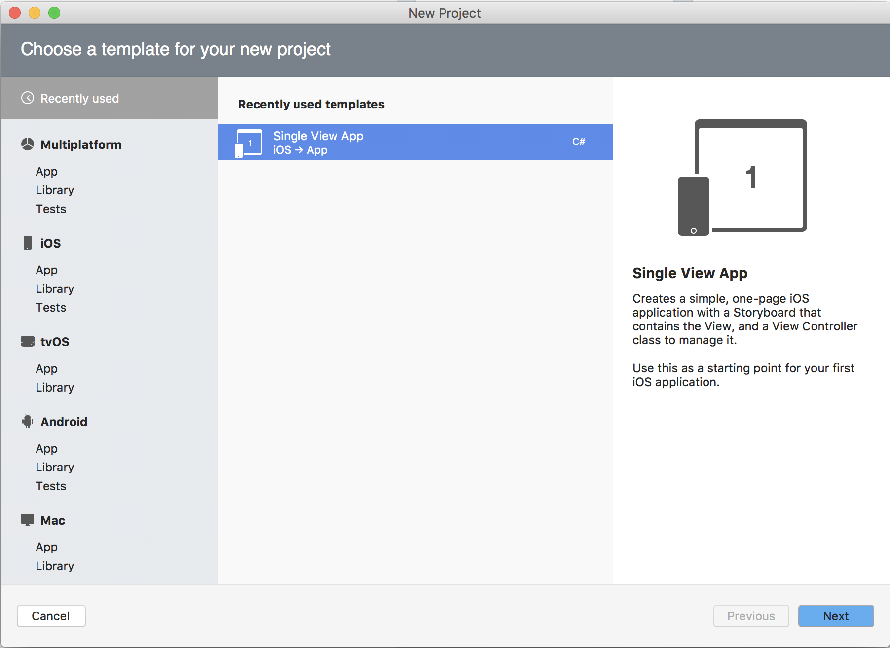

id:{DFD82C96-6F8B-4EAF-BF0A-E63422E67A80}
title:Xamarin Studio 6.3  

> ℹ️  Update for May 10, 2017: Xamarin Studio 6.3 is the final release of Xamarin Studio. We recommend that developers now use Visual Studio on both Windows and Mac. [Visual Studio for Mac](https://www.visualstudio.com/vs/visual-studio-mac/) has all the features of Xamarin Studio, adds cloud and web development, and contains improvements for cross-platform mobile development.

## Apple Developer Account management

This release introduces the ability to manage Apple developer accounts and iOS/macOS code signing entitlements with Xamarin Studio. The new interface provides a way to view all development teams associated with an Apple ID, and displays a list of Signing Identities, and Provisioning Profiles for each team.

Browse to **Preferences > Publishing > Apple Developer Account** to add an Apple ID. Authentication of your Apple ID is performed on the command line with *[fastlane](https://fastlane.tools/)*. *fastlane* must be installed on your machine for you to be successfully authenticated. More information on *fastlane* and how to install it is detailed in the [*fastlane* documentation](https://developer.xamarin.com/guides/ios/deployment,_testing,_and_metrics/provisioning/fastlane/#Installation).

### Known issues.
- The login process doesn't support accounts with two step authentication turned on.
- [[Bug #53906](https://bugzilla.xamarin.com/show_bug.cgi?id=53906)] The team details dialog is empty. In certain scenarios signing identities and provisioning profiles are not displayed, even if they are installed and valid on the users machine. We are currently working to release a fix for this as soon as possible.

## iOS

### Debug App Extensions on Device

New in this release of Xamarin Studio is the ability to debug iOS App Extensions on device. However, in order to
do this, you will first need to edit your **Project Options** for your existing App Extension project(s) and then
change the Debugger Port setting located in the **iOS Debugger** settings page. It is recommended that you change
the port to some value other than 10000 (or whatever port your main application is configured to use).

New App Extension projects will automatically be assigned a random debugger port to avoid this problem
in the future.

### Execution targets improvements

The iOS add-in is using new features of the Main Toolbar introduced in Xamarin Studio 6.3 to improve the user experience such as custom icons, tooltips and the ability to grey out execution targets.

We also improved our logic to always show you the devices that are connected to your Mac and tell you exactly **why** they are "unavailable" for deployment.  
This is great because there are a variety of ways a device can be unavailable: wrong device family, wrong capabilities or an OS version which doesn't match the deployment target.  
Now your device will show up in the "Unavailable Device" section and there will be a short explanation of the issue next to its name. If you hover your mouse over the device name a tooltip will often give you more details.

Here's the list of all the changes:

* New device icons in the Main Toolbar for iOS, watchOS, tvOS and macOS device targets.
* When we cannot show simulators or devices, instead of showing "Default" we now have Generic Simulator/Device under a "Build Only" menu separator.
* We now always show the "Device" menu separator in the toolbar, like we do for Simulator.
* We now show a message to connect devices in the toolbar when none are.
* Mac project now show an actual execution target named “MyMac” with an iMac icon instead of “Default” with an iPhone icon.

### Audio Unit Wizard

The new Audio Unit Extension wizard adds 3 options to customize the Audio Unit project template's plist.  

- Audio Unit Type
  - Instruments
  - Generator
  - Effect
  - Music effect
- Subtype Code: has to be 4 characters exactly
- Manufacturer Code: has to be 4 characters exactly

### Remove TLS Provider option

TLS Provider is not needed in the iOS build options anymore because:  

1. AppleTLS is the default since C7 and support up to TLS 1.2.
2. MonoTLS is limited to SSLv3 and TLSv1: both are being deprecated.

*Note: Xamarin.iOS 10.4 release notes already mention MonoTLS is deprecated and that it will be removed in the future.*

### Other improvements and bug fixes

* We now show a progress bar when deploying to device. This is especially useful for watchOS. *(Requires Xamarin.iOS 10.5.0.323+)*.
* We now use known OS versions from Xamarin.iOS to populate the deployent target dropdowns.  
The two advantages are that we can give you the exact minimum version for each App Extensions type, as well as avoid showing OS versions, based on Xcode, that Xamarin.iOS does not *yet* support.
* Any image asset that exists within the Images.xcassets (or Assets.xcassets) directory that is not imported by the *.csproj file will be ignored by the build.

## Debugger

* Support for HelpLink in exceptions. If an exception has a HelpLink then clicking on *More Information* at the top of the
  exception dialog will open the link in the default browser.

  

## Microsoft Identity

* Xamarin Studio no longer needs to launch an external process in order to capture login details when signing in to
  your Microsoft account.

## General

* The *New Project* dialog now shows a list of recently used templates.

  

* Xamarin.UITest project templates have been updated to the latest stable versions.
  - Xamarin.UITest 2.0.6
  - Xamarin.TestCloud.Agent 0.20.3

* Many other bug fixes and performance improvements.  

## Other improvements and bug fixes

* Update all templates descriptions.

### Xamarin Studio 6.3.0.834 (March 16, 2017)

* Fixed: iOS Extensions aren't installed before launch.
* Fixed: Unable to debug extension app a second time in device or simulator.
* Fixed: Unable to debug Keyboard extension on device or simulator.
* Fixed: Unable to debug tvOS extension app.
* Fixed: iOS Provisioning profile not yet expired not usable.
* Fixed: Changing label or button text through properties has to be done character by character.
* Fixed: When trying to run keyboard extension, XS installs the extension instead.
* Fixed: Missing 'Launched $app with $pid' message in mtouch/mlaunch output.
* Fixed: [Xcode8.3] Unable to deploy to device; Xamarin.Launcher.LauncherException: Unknown command line argument: '--install-progress'.
* Fixed: BindingContext become null after change control template in Forms apps.

### Xamarin Studio 6.3.0.858 (March 26, 2017)

* Fixed: App doesn't seem to pass "Arguments Passed On Launch" to Objective-C side.
* Fixed: Document is not part of the workspace exception.
* Fixed: "Quick Fix > Encapsulate field: '...' (and use property)" refactoring command does nothing.
* Fixed: 'Could not load file or assembly Xamarin.Forms.Core, Version=1.4.0.0' previewing Mobile CRM sample.
* Fixed: [Build Options] Add feature check for Concurrent GC iOS build option.
* Fixed: GetCompileItemsFromCoreCompileDependenciesAsync cache is not invalidated.
* Fixed: "Recently Used Template" section does not populate the breadcrumb of Category and Template for WatchOS template.

### Xamarin Studio 6.3.0.863 (April 4, 2017)

* Fixed: Crash running msbuild targets.
* Fixed: While creating XS Cross Platform(PCL/Shared/Class Library) project, getting "Could not add packages." error.

### Xamarin Studio 6.3.0.864 (April 25, 2017)

* This version adds support for migrating to Visual Studio for Mac when it is released. Checking for updates will prompt you to install Visual Studio for Mac if it 
has not already been installed. You can try out the Visual Studio for Mac Preview by switching to Alpha or Beta channel.
