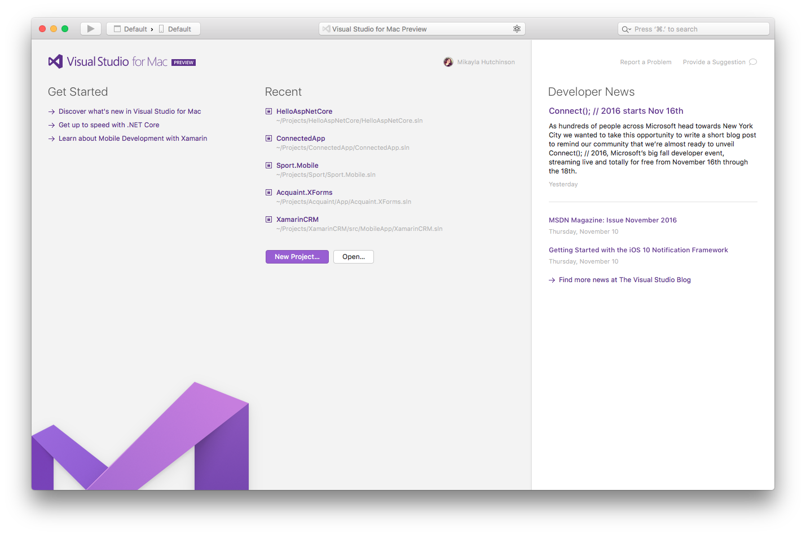
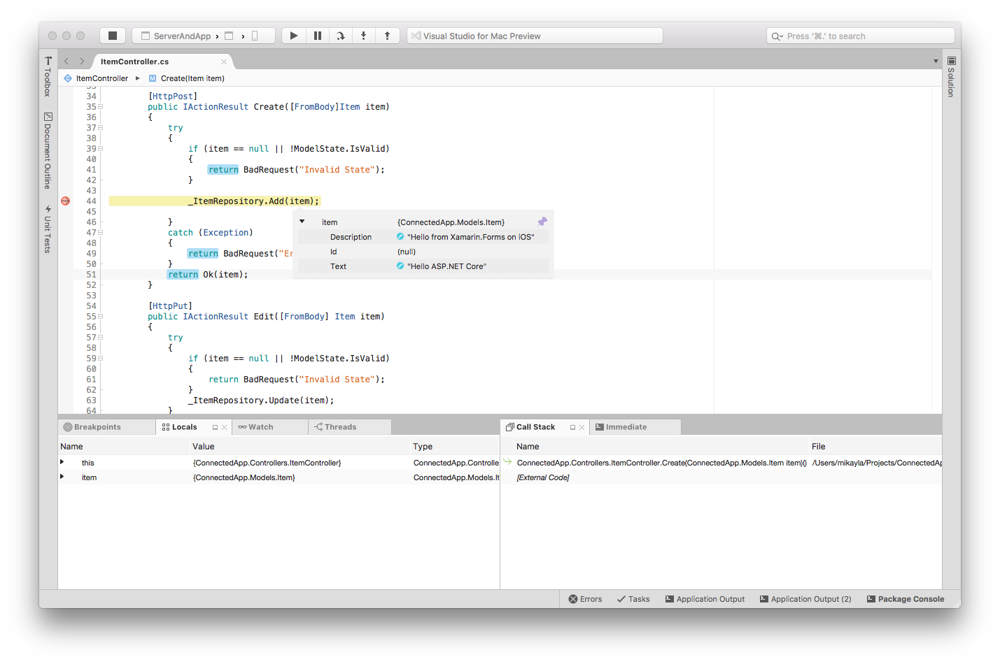
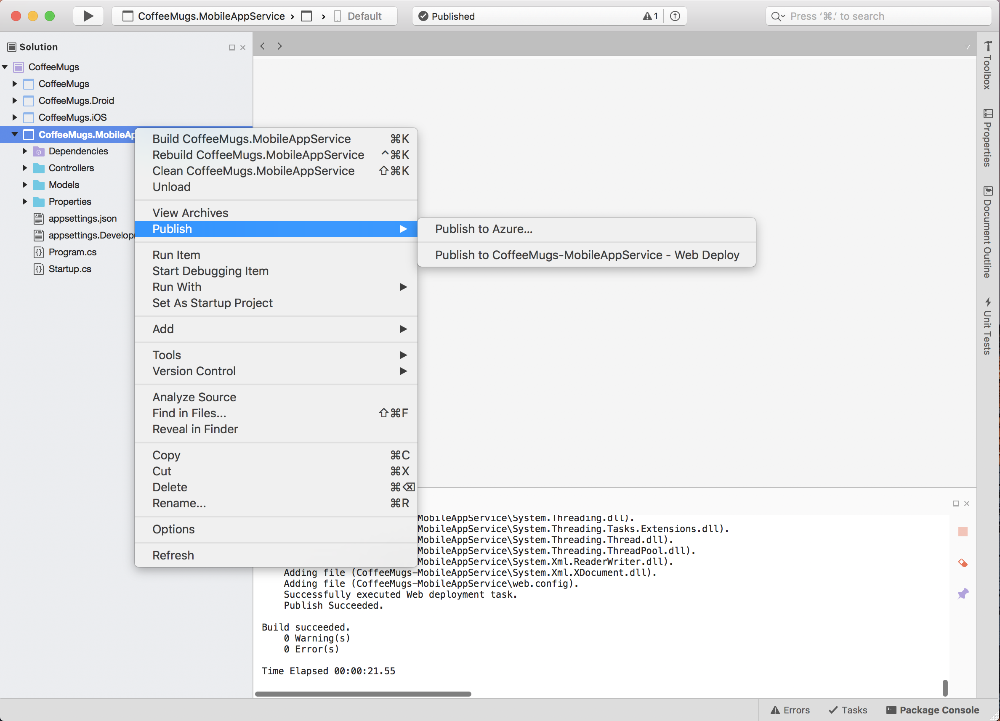
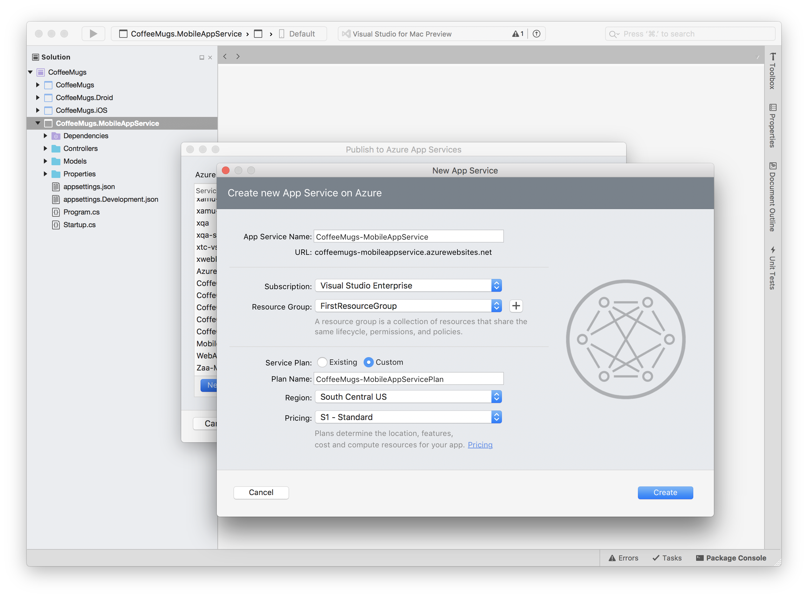
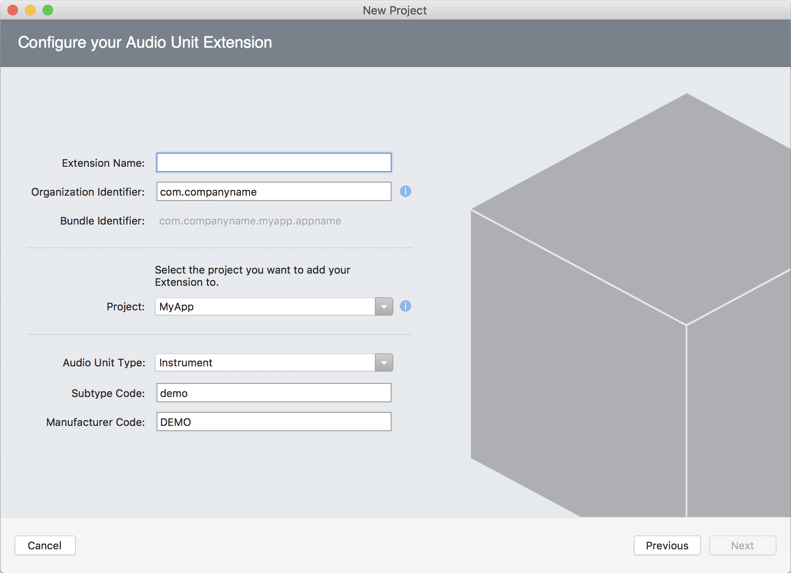
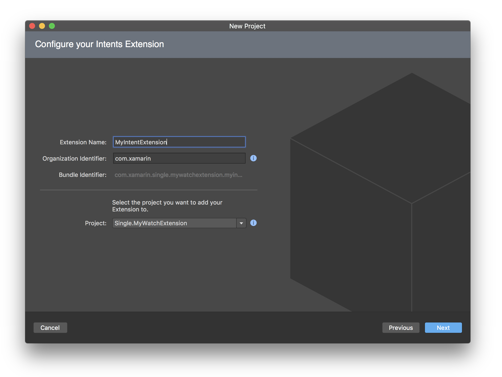
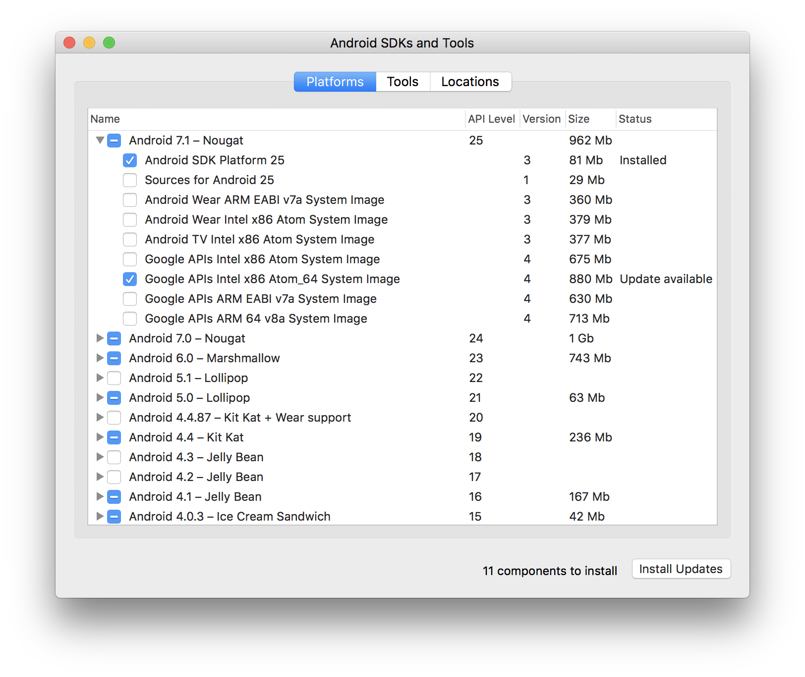

> ⚠️  
> View the latest Visual Studio for Mac release notes on [docs.microsoft.com](https://docs.microsoft.com/visualstudio/releasenotes/vs2017-mac-relnotes).
> 

Visual Studio for Mac is a new member of the Visual Studio family focused on
mobile and cloud development using Xamarin and .NET Core.

## Overview

Visual Studio for Mac is an evolution of Xamarin Studio, and
includes all the functionality of Xamarin Studio 6.2.

Many changes have been made to the look-and-feel, terminology and default
settings to to align more closely with Visual Studio, while remaining
a Mac-centred development experience.

### Core Functionality

Visual Studio for Mac has everything you would expect from a
modern IDE, including a full-featured source editor, code search and
navigation, a powerful debugger, a
customizable workspace, git integration, and a rich extension system.

Other features include:

* Roslyn-based C# IntelliSense, refactoring, analyzers and code fixes
* NuGet-based package management
* Visual Studio compatible project format
* MSBuild build engine
* Integrated unit testing
* Support for F# out-of-the-box

### Xamarin Platform

First-class support for the [Xamarin
Platform](https://developer.xamarin.com/) allows you to develop rich native
experiences for iOS, Android and Mac. The Xamarin.Forms cross-platform
library helps you share XAML-based UI code between iOS, Android and UWP
(though UWP is not supported on Mac) without limiting access
to native functionality.

This includes:

* Building, deployment, debugging and profiling
* Drag-and-drop UI designers for iOS and Android
* Live preview for Xamarin Forms
* .NET Standard compatible framework
* Bindings to native APIs

## New Features

The following features are new in Visual Studio for Mac Preview:

### .NET Core Support

[.NET Core](https://www.microsoft.com/net/core) is a platform for creating applications
that run on Windows, Linux and Mac. Visual Studio for Mac has support for loading,
creating, running and debugging .NET Core projects.

In order to run .NET Core projects the .NET Core SDK should be
[downloaded and installed](https://aka.ms/vs/mac/install-netcore).

.NET Core support includes:

* C# and F# IntelliSense.
* .NET Core project templates for console, library and web applications.
* Full debugging support, including breakpoints, call stack, watch window, etc.
* NuGet PackageReferences and MSBuild-based restore.
* Integrated unit testing support for running and debugging tests with the [Visual Studio Test Platform](https://github.com/Microsoft/vstest) that is included with the .NET Core SDK.
* Migration from old project.json format. 

### Web Tooling

Visual Studio for Mac adds new web tooling support for HTML, CSS and JSON files.

#### HTML

* New HTML template.
* Improved smart indent and formatting.
* Improved colorization.
* Improved tag Intellisense.
* Entity IntelliSense.
* Attribute and value IntelliSense.
* Code folding (must be enabled).
* Comment/uncomment.
* Improved Undo.
* Unminify command.
* Improved Code Templates (snippets).
* Surround selection with `
`.
* Option up/down moves selected text up/down.
 
#### CSS

* Improved smart indent and formatting.
* Improved colorization.
* Selector IntelliSense.
* Directive IntelliSense.
* Improved Attribute and Value IntelliSense.
* Code folding.
* Comment/uncomment.
* Many Code Templates (snippets).
* Option up/down moves selected text up/down.
 
#### JSON

* Schema picker with access to schemastore.org
* Validation from schema
* IntelliSense from schema
* Improved smart indent and formatting
* Improved colorization
* Comment/uncomment
* Quote injection and brace matching
* Option up/down moves selected text up/down

### Multiplatform App Templates

The Multiplatform _Forms App_ and the _Native App_ project templates now offer a quick way to create a
multiplatform mobile app and its cloud backend.

These templates create multiple projects: a Xamarin.iOS app project and
a Xamarin.Android app project that share code via a shared project, and a
.NET Core Web API project that implements a back-end service for the apps.

### Publishing ASP.NET Core Web Apps to Azure App Services

It is possible to publish your ASP.NET Core web apps to Azure App Services.

In this release, publishing to Azure is the only publish destination but we will be adding more in later releases.

To publish your web app, select the _Publish | Publish to Azure_ command from the _Solution Pad_ or from the _Project_ menu.
Then choose the _App Service_ you wish to deploy to, or create a new Azure _App Service_. Output from the publishing will be logged to
a _Publish_ output pad and a publishing profile will be created under _Properties\PublishProfiles_ in the project.

All publish profiles defined in the project will be shown as options within in the _Publish_ menu so that you can deploy again without having
to select the _App Service_ a second time.

### Multi-Process Debugging

In Xamarin Studio, projects have _Project Run Configurations_ which specify options
and arguments for running your project. A dropdown in the toolbar lets you
view and change the current active Run Configuration.

Visual Studio for Mac extends this by adding _Solution Run Configurations_
which allow multiple projects to be launched at once. You can create solution
run configurations in the _Solution Options_ dialog.

Using solution run configurations, you can debug multiple projects
at once. This is very useful for debugging how a mobile app interacts with
its backend service.

### TextMate Bundles

Visual Studio for Mac has support for TextMate language bundles, which you
can use to add:

* Editor color themes
* Code snippets
* Grammars for new languages, enabling highlighting and basic IntelliSense

You can add TextMate bundles in _Preferences > Text Editor > Language Bundles_.

### iOS

#### Audio Unit Wizard

The new Audio Unit Extension wizard adds 3 options to customize the Audio Unit project template's plist.  

- Audio Unit Type
  - Instruments
  - Generator
  - Effect
  - Music effect
- Subtype Code: has to be 4 characters exactly
- Manufacturer Code: has to be 4 characters exactly

#### Remove TLS Provider option

TLS Provider is not needed in the iOS build options anymore because:  

1. AppleTLS is the default since C7 and support up to TLS 1.2.
2. MonoTLS is limited to SSLv3 and TLSv1: both are being deprecated.

*Note: Xamarin.iOS 10.4 release notes already mention MonoTLS is deprecated and that it will be removed in the future.*

#### Mac/iOS API issue analyzer

- Fix duplicated marker when analyzer is triggered.  
  We used to answer to too many `SyntaxKind` in `RegisterSyntaxNodeAction`.  
  This resulted in the source analysis marker to show up on both the object and the method, duplicating the message.
- Get the "message" (piece of information in the framework explaining why the API is deprecated/obsolete) from the attribute.  
  We now append that extra information to the different availability messages.
- Updated all availability messages to improve clarity.
- Use the symbol's name in the availability message.  
  This also improves clarity, moving from:  
  `API Usage Issue: this API requires iOS 10.0 or later`  
  to:  
  `'MyMethod' is only available on iOS 10.0 or newer`

#### watchOS extension wizard

In Xcode 8.3, Apple introduced watchOS extensions (similar to the iOS ones), starting with the Intents extension (Siri).

The extension wizard has been upated to support watchOS extensions and we now have a dedicated Intents extension template.

#### Other improvements and bug fixes

* Handle `Deprecated` and `Obsoleted` attributes in autocompletion window. This allows Xamarin.iOS obsoleted and deprecated APIs to be shown as struck through.
* We now show a progress bar when deploying to device. This is especially useful for watchOS. *(Requires Xamarin.iOS 10.5.0.323+)*.
* We now use known OS versions from Xamarin.iOS to populate the deployent target dropdowns.  
The two advantages are that we can give you the exact minimum version for each App Extensions type, as well as avoid showing OS versions, based on Xcode, that Xamarin.iOS does not *yet* support.

### Android

* New SDK Manager

Recently Google deprecated the SDK manager that ships with the Android SDKs in favor of using the SDK manager within Android Studio. Visual Studio for Mac
now also includes its' own SDK manager.

* Deploying your project to device or emulator is now done via the `/t:Install` msbuild target. Previously Visual Studio for Mac
would use it's own internal logic for deploying applications to devices but now it uses same common targets that you can 
employ from Terminal, or that are used in Visual Studio on Windows. One of the benefits of this is that there are now
better logs available to diagnose deployment issues.

* `class-parse` is now the default for new binding projects. `class-parse` can parse Java bytecode directly wihout the need
for a JVM and is able to extract parameter names from Java bytecode which contains debug symbols, e.g. bytecode compiled with javac -g.
'class-parse' also doesn't "skip" classes which inherit from or contain members of unresolvable types.

### Accessibility

* This version of Visual Studio for Mac contains support for assistive
technologies such as Voice Over. Many parts of the user interface, such as the
editor and solution explorer, have been made accessible through these
technologies, however it is still a work in progress and futher improvements
will be made in coming releases.

## Feedback

Please report any problems you encounter with the Visual Studio for Mac Preview using
the _Help > Report a Problem_ menu.

If there is any functionality that you would like to be changed or added to Visual
Studio for Mac, please use the
[Visual Studio for Mac UserVoice](https://aka.ms/vs/mac/provide-suggestion) to share your
ideas and vote on suggestions made by other people. You can also access this from
_Help > Provide a Suggestion_.

We can't respond to all feedback directly, but we do read it all and it very much
helps us prioritize improvements to make Visual Studio for Mac work better for you.

## System Requirements

Visual Studio for Mac Preview requires macOS 10.11 or later. For Xamarin development
there are additional requirements listed [here](https://developer.xamarin.com/guides/cross-platform/getting_started/requirements/#macOS_Requirements).

## Side by Side Installation with Xamarin Studio

Visual Studio for Mac can be installed side by side with Xamarin Studio.

However, Visual Studio for Mac requires Mono 5.0, and installing or updating the
stable or beta version of Xamarin Studio will downgrade Mono to an older version.

You can work around this by switching Xamarin Studio to the alpha update channel,
or by opting out of Mono 4.6 downgrades in the Xamarin Studio update dialog. If
you need to reinstall Mono 4.8, you can get it
[here](https://go.microsoft.com/fwlink/?linkid=835346).

## Known Issues

This is a preview release, and ships with several known issues and limitations that will be addressed
in future updates.

* [54993](https://bugzilla.xamarin.com/show_bug.cgi?id=54993) "The root assembly
  ... conflicts with another assembly" build error can occur for Xamarin.iOS
  projects in Xamarin.VisualStudio 4.4.0 on Windows due to the incompatible
  Xamarin.iOS 10.10.0 Alpha version that is installed on the Mac by the latest
  Visual Studio for Mac Preview. Visual Studio 2015 and 2013 users can
  optionally update to the Alpha [updater
  channel](https://developer.xamarin.com/recipes/cross-platform/ide/change_updates_channel/#visualstudio)
  to get the compatible Xamarin.VisualStudio 4.5.0 Alpha version. For VS 2017
  users and users who do not wish to use the Alpha versions on Windows, please
  refer to the [bug report](https://bugzilla.xamarin.com/show_bug.cgi?id=54993)
  for a few other options for how to resolve this issue.
* Debugging F# .NET Core projects is not working with Mono 5.
* Changes in files on disk are not picked up by wildcards until the project is reloaded.
* There are very few ASP.NET Core specific file templates.
* The first time you build an Android project that uses the Google Android Support
  Libraries, the build may appear to hang with no output while the download takes
  place.
* The new Multiplatform Forms App and Native App templates currently require the app to be manually configured
  with the address of the service on the host machine, except when using the iOS
  Simulator.
* The Xamarin.Forms XAML previewer can cause Visual Studio for Mac to become unresponsive.
* The [File Nesting extension version 0.1](http://addins.monodevelop.com/Project/Index/237) causes 
  NuGet package restore to fail with Visual Studio for Mac Preview. This extension should be disabled
  in the Extension Manager until a new version is published that is compatible.

## Changed in Preview 10

* Included with Visual Studio for Mac is a new Android SDK Manager that replaces the Google SDK Manager that was recently removed from the Android SDK.

### Bug Fixes

* Fixed: Visual Studio for Mac crashes on opening a solution.
* Fixed: Code completion not working for F# file.
* Fixed: Error popup shown in wrong place.
* Fixed: Css property difficult to see on some dark Color Themes.
* Fixed: UITest project fail to run tests in projects created with the Multiplatform - Native App template.
* Fixed: UI hang if main menu is open when Nuget licence acceptance dialog displayed.
* Fixed: Visual Studio hangs if MSBuild returns 2000 errors.
* Fixed: UISegmentedControl does not get the constraint handles when in the designer.
* Fixed: Save as, then open original CSS or HTML file, you get "An Autosave file has been found for this file".
* Fixed: Visual Studio crashes when adding a Cocoa project.
* Fixed: Code completion lost when moving files.
* Fixed: Incorrect behavior and exception when trying to move a file that is modified in the editor.
* Fixed: Show Next / Previews commands don't open files in the right location.
* Fixed: Syntax highlighting breaks after using literal string with "$@" prefix.
* Fixed: Format document no longer works for F# documents.
* Fixed: .NET Core test runner output shown on single line in Test Results window.
* Fixed: Weird formatting behavior.
* Fixed: Setting Build Action to None for C# file is ignored.
* Fixed: Updating NuGet package in .NET Core project does not update project.assets.json file.
* Fixed: Lose the ability to type in JSON files.
* Fixed: NullReferenceException when trying to restore packages in xUnit project.
* Fixed: New project and files templates do not use the IDE's code formatting rules.
* Fixed: Nugetizer adds NuGet.Build.Packaging version 0.1.157-dev but latest available is 0.1.248.
* Fixed: Selecting recent solution when unsaved files open does not open solution.

## Changes in Preview 9

### Bug Fixes

* Fixed: Visual Studio for Mac cannot recover if the external MSBuild builder dies.
* Fixed: Chinese translations include the mnemonics key.
* Fixed: Svn is not working.
* Fixed: Editor inserts BOMs sometimes.
* Fixed: Truncation on Czech translation in the Info.plist editor.
* Fixed: Visual Studio for Mac does not archive .pdb files when archiving an Android app for publication.
* Fixed: Focus improperly set to toolbar on changing documents.
* Fixed: Russian truncation, Apple Developer Accounts.
* Fixed: Unable to build the PCL blank Xamarin.Forms solution.
* Fixed: Tooltip in publishing dialog flickers.
* Fixed: Azure app service name validation is not reliable.
* Fixed: Source Analysis C# rules makes the tooltip unusable.
* Fixed: Log message when .NET Core is not installed.
* Fixed: VS Mac not remembering some code formatting options.
* Fixed: UI is getting truncated on Sign and Distribute page.
* Fixed: Parenthesis autocomplete doesn't work.
* Fixed: Save as, then open original CSS or HTML file, you get "An Autosave file has been found for this file".
* Fixed: IntelliSense not working with excluding conditional ItemGroup.
* Fixed: Incorrect target framework names.
* Fixed: Fatal Error in F# Completion when a transient reference is missing.
* Fixed: Issue when trying to create a new project while a file has changes.
* Fixed: Undo doesn't bring files back to unmodified status.
* Fixed: TypeSystem task loops which causes flickering "Gathering Class Information".

## Changes in Preview 8

### Bug Fixes

* Fixed: Namespaces of new files aren't set identical to Visual Studio.
* Fixed: [Android] Sign and Distribute workflow silently fails if package name contains unsupported character.
* Fixed: ASP.NET Core project - Start debugging and then stop, it does not close the terminal window.
* Fixed: Warning about incorrect extension path when installing addin.
* Fixed: Failure to import TextMate theme (Antigua).
* Fixed: Difficult to read text in some editor themes.
* Fixed: Ocasional crash on startup.
* Fixed: First two characters in project file removed when adding file or folder.
* Fixed: Implicit property evaluation can't be disabled.
* Fixed: Cannot debug .NET Core test project.
* Fixed: Pressing return in a string literal no longer creates two strings joined with '+'.
* Fixed: Exception thrown from MonoDevelop.CodeIssues.AnalyzersFromAssembly.AddAssembly.
* Fixed: Unable to add in-app entitlements b/c of Fastlane. "App ID is not available, Please enter a different string"
* Fixed: NullReference trying to insert code into a document.
* Fixed: Highlight identifier references only working for assignments when file not in project.
* Fixed: Unable to open Storyboard files from Visual Studio for Mac.
* Fixed: Highlight Current Line doesn't work
* Fixed: Adding new shared project to existing solution has MyClass.cs defined as None MSBuild item.
* Fixed: Unable to type in third '/' when gathering class information.
* Fixed: Deleting a project from the solution segfaults the IDE.
* Fixed: Unable to view "Forms" item templates in Shared Project.
* Fixed: New ASP.NET projects do not compile.
* Fixed: Multiplatform Forms Template does not build.
* Fixed: String constant with null character does not show in the preview tooltip in the code editor.
* Fixed: Save As of a file that is part of a Core project breaks IntelliSense.
* Fixed: Undo commented region deletes extra text.
* Fixed: Documentation browser does not open.

## Changes in Preview 7

* Default target framework for new projects is now .NET 4.6.2
* Added ASP.NET Core Web API Controller file template.
* Added support refreshing .NET Core projects in the solution window.

### Bug Fixes

* Fixed: Unable to open Storyboard files from Visual Studio for Mac
* Fixed: Formatting preferences are not stored.
* Fix build action of MyClass.cs when adding new shared project to solution.
* Fixed: type system references not updated after NuGet restore.
* Fixed: .NET Core project build error after location changed.
* Fixed: .DS_Store files shown in Solution pad after refresh.
* Fixed: Unable to type in third '/' in comment when gathering class information.
* Fixed: Failure to import TextMate theme (Antigua).
* Pressing return in a string literal no longer creates two strings joined with ‘+’.
* Fixed: First two characters in project file removed when adding file or folder.
* Fixed: Code completion automatically closes parenthesis, instead of offering completions.
* Fixed: [Android] Improve the error message shown when the package name does not contain a period.
* Fixed: When Mac Publishing with "App Store" fails, it asks to check "Build Output", but build passes. 
* Fixed: Unable to create Mac/iOS Development certificate for Member & Admin.

## Changes in Preview 6

* New: Azure Publishing.
* New: watchOS extension wizard.
* New: Accessibility support.
* New: Web tooling support for HTML, CSS and JSON files.
* Updated: New: Mac/iOS API issue analyzer.
* Updated: Roslyn 2.0 support and support C# 7.
* Updated: Improvements to Fastlane support for Apple Developer Account management.
* Updated: New Text Editor infrastructure.
* Updated: Debugger support for async methods.

### General

* /usr/local/bin is added to the PATH when starting Visual Studio for Mac

### .NET Core Support Improvements

* .NET Core project templates if .NET Core SDK is not installed.
* Environment tag helpers in Core Web App now use Development by default.
* .NET Core projects now open an external console by default.
* Fixed new F# files not being saved in .NET Core F# project.
* Fixed unable to to CoreCLR error when debugging on Mac 10.12.4.

### Bug Fixes

* Fixed development dependencies not marked in project.assets.json
* Fixed restore error for .NET Core project referencing shared project
* Fixed duplicate F# files in Solution window
* Fixed null reference when missing project reference when restoring a .NET Core project 
* Fixed StartProgram and StartAction arguments being ignored for .NET Core projects
* Fixed save failed after deleting file from .NET Core project 
* Fixed being unable to re-order F# files in the Solution window
* Fixed empty ItemGroups added to .NET Core project
* Fixed build error when .NET Core project is referenced
* Fixed new F# files not being saved in .NET Core F# project 
  
## Changes in Preview 5

### General

* Application icon updated

### .NET Core Support Improvements

* Added support for setting PipeTransport settings when running .NET Core application
* .NET Core debugger now supports running in external console
* ASP.NET Core run configuration dialog simplified
* Updated to NuGet 4.0.0.2323
* Updated to latest .NET Core SDK 1.0.1 project templates
* Updated to latest stable Visual Studio Test client 15.0.0

### Bug Fixes

* Fixed dotted filenames not excluded correctly
* Fixed F# tutorial project template
* Fixed runtimes not restored for .NET Core projects 
* Fixed PackageTargetFallback being ignored for .NET Core projects
* Fixed Android project showing errors in text editor for types
* Fixed wrong .NET Core SDK download url shown in download dialog
* Fixed no code completion in new C# file
* Fixed F# interactive window not working
* Fixed debug files being generated in the wrong location
* Fixed global MSBuild properties not used for project build
* Fixed MSBuild Remove item added when file was deleted
* Fixed failure to building legacy MonoMac projects
* Fixed hard coded wildcard globs for Sdk projects
* Fixed error when installing extensions

## Changes in Preview 4

### General

* This release includes all the new features and fixes included in Xamarin Studio 6.3 ([release notes](https://developer.xamarin.com/releases/studio/xamarin.studio_6.3/xamarin.studio_6.3/)).
* MSBuild is now the default build engine instead of xbuild.
* Portable and embedded compiler options can now be specified in project options.
* Various optimizations, memory usage and performance improvements across the IDE.

### .NET Core Support

* Integrated unit testing support for running and debugging tests with the [Visual Studio Test Platform](https://github.com/Microsoft/vstest) that is included with the .NET Core SDK.
* Integrated the .NET Core templating engine and project templates.
* F# .NET Core projects are now supported.
* Support for migrating projects project.json/xproj to csproj.
* References and Packages folders have been removed from the Solution window. This information is shown in the Dependencies folder under the Assemblies, Projects, Packages and SDK folders.
* Allow multiple NuGet packages to be select and removed in one step for .NET Core projects.
* A message dialog is now displayed if .NET Core SDK is missing or unsupported with a download link.
* Added ASP.NET Core run configuration settings in project options. App url, launch url and enabling/disabling launching the browser can now be configured.

### Bug Fixes

* Fixed license acceptance dialog not shown for .NET Core projects
* Fixed crash at startup if the ~/Library/Preferences/Xamarin directory is owned by another user
* Base class constructor tooltip does not contain all constructor definitions
* Fixed Find References of All Overloads not returning all items
* Fixed language selection for recent templates not showing correct lanuage used
* Fixed quick task drawing glitch
* Fixed incorrect working directory used when running .NET Core projects
* Fixed Lamba argument renaming shows code completion items
* Fixed disabled breakpoints being hit when debugging .NET Core project
* Fixed restore errors after renaming project file
* Fixed unevaluated MSBuild expression being shown in the project options as the compiler's Define Symbol for .NET Core projects.
* Fixed potential race condition on saving an MSBuild project
* Fixed Description not saved in .NET Core project file if modified
* Fixed RootNamespace to be updated from project options for .NET Core projects
* Refresh NuGet packages after target framework changed in project options
* Fixed target framework changes made in project options not saved
* MSBuild project option is no longer shown for .NET Core projects
* Show correct target frameworks in project options for .NET Core projects
* Remove extra metadata saved with ProjectReferences
* Fixed app freezing whilst attempting to debug on iOS Simulator
* Fixed intellisense fails when referencing an iOS binding project
* Fixed scrolling to type when using Go To Definition with Assembly Browser
* Fixed crash on adding breakpoint to any line of Main.axml file
* Hide diagnostics when severity is hidden.
* Fixed formatting on pasting large blocks of unformatted code
* Fixed crash when using the Assembly Browser
* Fixed library reference alias change not reflected in the type system
* Tabs to Spaces defaults to true for F# projects
* Fixed code completion on standalone files
* Fixed open statements greyed out that contain operators
* Fixed floating versions not handled in package references
* Fixed document is not part of the workspace exception
* Item groups now merged in F# projects for Visual Studio compatibility 
* Increase length of strings shown in Watch window
* Fixed copying the contents of a debugger expression does not copy just the value
* Fixed crash on opening .cs file in Hex Editor
* Fixed build error after referencing another .NET Core project
* Restore after modifying project references 
* Fixed Clean failures not reported on Rebuild 
* Fixed broken code completion after referencing a project 
* Fixed main toolbar switches back from Release to Debug on adding/removing a file
* Fixed not being able to reference .NETStandard projects from .NET Core projects
* Fixed hovering over constructor not showing resolved constructor overload
* Fixed xmlns being added to .NET Core SDK projects
* Fixed PackageReference elements added with a Version element instead of using an attribute

## Changes in Preview 3

### General

* Recently used project templates are now displayed in the New Project dialog.
* Open Url context menu is now available for hyperlinks in the text editor.

### .NET Core Support Improvements

* Updated the .NET Core CLR debug adapter to version to 1.6.3
* Project templates updated to use the new simplified MSBuild Sdk style projects.
* Support simplified MSBuild .NET Core projects that use the Sdk attribute.
* Simplified MSBuild .NET Core projects require the [.NET Core SDK 1.0.0-rc4](https://dotnetcli.blob.core.windows.net/dotnet/Sdk/rel-1.0.0/dotnet-dev-osx-x64.latest.pkg) to be installed and Mono 4.8.0.392 or higher.
* Show packages from .NET Core project file by default in the Dependencies folder whilst
  waiting for dependency information to be returned from MSBuild.
* NuGet packages are now restored on saving the project file after it has been edited in the text editor.
* NuGet is now used to restore .NET Core packages instead of running MSBuild restore.

### iOS

* [Audio Unit Wizard](#Audio_Unit_Wizard).
* [Remove TLS Provider Option](#Remove_TLS_Provider_option).
* [Other improvements and bug fixes](#Other_improvements_and_bug_fixes)

### Bug Fixes

* Fixed text editor not highlighting code correctly for pre-processor directives.
* Fixed C# brace matching.
* Fixed code templates not working correctly from "Insert Template..." dialog.
* Fixed enter in code generator not implicitly selecting current item.
* Fixed format document changing position of caret.
* Fixed C# code completion for Android shows XML.
* Fixed Go To Matching brace not working for regions.
* Fixed TextMate indentation engine not reading the on the fly formatting IDE setting.
* Fixed text editor scrolling there are many IExtendingTextLineMarkers.
* Fixed invalid search pattern error with certain wildcard items.
* Fixed non-C# files not displayed in Solution window for .NET Core projects.
* Fixed build error after renaming a .NET Core project.
* Fixed breakpoint not hit in .cshtml files.

## Changes in Preview 2

* Solutions now load much faster.
* Visual Studio for Mac now uses NuGet 4.0.0.2098.
* The XAML previewer is more reliable.
* NuGet package source information is now reloaded if the NuGet.Config file is
  modified in the text editor or externally.
* The external console is now used for new .NET Core console applications by default.
  This can be changed in Project Options - Run - Configurations - Default.
* Welcome Page
  * Recent project / solution list can be filtered and removed.
  * The page can be navigated using keyboard.
  * Fixed activation / deactivation issue when opening and closing a solution.

### Bug Fixes

* Fixed  _Report a Problem_ on macOS 10.11.
* Fixed IntelliSense and syntax highlighting in XAML files.
* Fixed application icon rendering issue.
* Fixed NuGet package sources information not available when NuGet.Config read fail.
* Fixed NuGet package sources with encrypted passwords not being supported.
* Fixed install error when installing a NuGet package, such as Microsoft.AspNetCore.Mvc,
  which has package dependencies not in the local NuGet package cache into a
  .NET Core project.
* Fixed NuGet package restore information not displayed for the Connected
  Service project templates.
* Fixed potential user interface hang on opening a .NET Core project.
* Fixed execution error when an environment variable is used in a run configuration.
* Fixed potential crash when switching active run configuration.
* Many other bug fixes!

