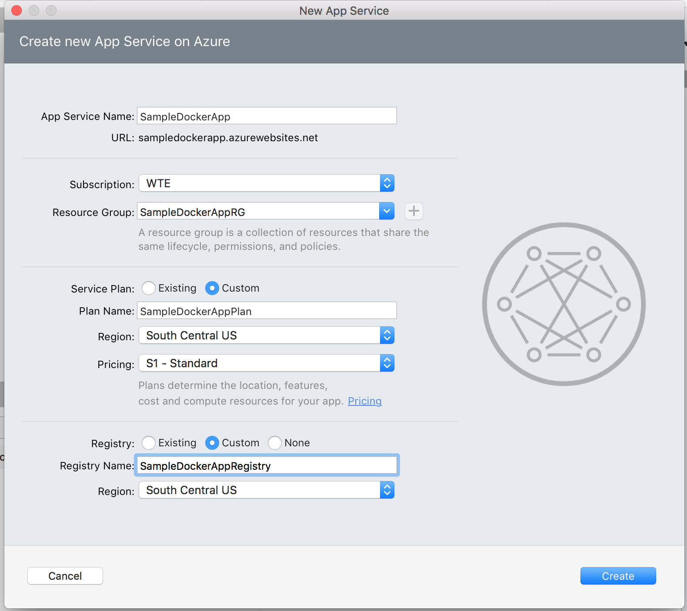
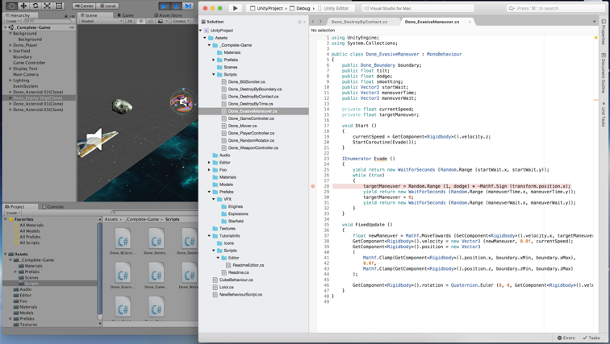

> ⚠️  
> View the latest Visual Studio for Mac release notes on [docs.microsoft.com](https://docs.microsoft.com/visualstudio/releasenotes/vs2017-mac-relnotes).
> 

<!--
## Docker Support

You can now publish Asp.Net Core apps to docker containers and run them from an App Service.

To enable docker support to your project, right click on your Asp.Net Core web app and `Add > Add Docker Support`.

To publish your web app to a docker container, use the `Publish > Publish to Azure` workflow introduced in Visual Studio for Mac (right click on the web app project in the `Solution Pad`).

During publishing the following resources are created on Azure

- a container registry is created tha the Docker image is published to. Container registry requires Azure storage which will also be created.
- an App Service is created that will download the image from the container registry and run it.

During publication:

- a new docker image is created, tagged and pushed to the Azure container registry.
- the App Service downloads the new image and runs it.

Note:
* If you use an existing Resource Group, it must be in the same region as the App Service Plan you are creating.
* If you are creating a new Resource Group, you must set the Container Registry and the App Service plan to be in the same region (e.g. both must be in “West US”).
* The VM size of the App Service Plan must be `S1` or larger.

## Xamarin Live Player

Xamarin Live Player enables developers to continuously deploy and debug their app, straight to an iOS or Android device.
For more information visit https://xamarin.com/live.

## Xamarin Iot

Xamarin IoT allows developers to create native Linux applications using with the flexibility and elegance of a modern language (C#), the power of the .NET Base Class Library (BCL), and a first-class IDEs - Visual Studio, Visual Studio for Mac/Linux.

## Unity

[Unity](https://unity3d.com/) is a game creation tool you can use to create high quality cross-platform games for all the major platforms: mobiles, desktops, consoles, AR and VR devices and even the web.

Starting with Unity 5.6.1, you can use Visual Studio for Mac to write and debug your Unity game. To get started, simply set Visual Studio to be Unity’s 5.6.1 script editor.

The Tools for Unity include:

* Support for scripts written in C#.
* Unity solution pad.
* One click debugging of the Unity Editor.
* IntelliSense for Unity messages.
* Code coloration for Unity’s shaders.
* Access to the Unity documentation.

-->

## .NET Core 2 support

Visual Studio for Mac supports building .NET Core 2.0 applications, including libraries, console apps, as well as web applications and services with ASP.NET Core.

Note that the .NET Core 2.0 SDK needs to be installed via a separate download to enable .NET Core 2.0 development in Visual Studio 2017 for Mac Version 7.1. You can get it at [www.dot.net/core](https://www.dot.net/core). Visual Studio enables side-by-side support of multiple .NET Core SDKs. This also means you can experiment with the latest daily build of the .NET Core SDK, while also developing with the latest public releases.

## iOS signing workflow updates

This release introduces the ability to create required signing artifacts for iOS and tvOS apps. With Visual Studio for Mac, it's possible to:

* Create new signing identities and install them to the local Keychain
* Create new Provisioning Profiles
* Add a new signing identity to an existing profile
* Provision new devices: register a device in the Apple Developer Portal and add them to a provisioning profile

To try out these new signing features right-click on your project and browse to **Options > iOS Bundle Signing**.

### Using the Signing Identity section

For a signing must satisfy the following criteria:

* Displayed on Apple Developer Portal in "Certificates" section (not revoked)
* Issued for selected team/developer
* Both certificate and private key should be installed in local Keychain
* Certificate should not be expired

Use **Create signing identity...** option of the dropdown if no identities are available on your current machine.

### Using the Provisioning Profile section

In order to be shown in the "Provisioning Profile" drop-down profile must satisfy the following criteria:

* Not expired
* Valid (include registered devices and valid certificates)
* Match current distribution type (Debug or Release based on switches at the top)
* Match bundle identifier. Wild card profiles with a matching pattern will be also displayed in this list.

Use "Create provisioning profile..." item of the dropdown if no profiles were found.

If you need to switch back to the previous version of signing controls, and set the provisioning profile and signing identity manually, set the team to **None**. New signing controls will be replaced with old ones. However, we strongly encourage you to try new functionality and provide us with feedback in case of any problems.

Limitations:

* Provisioning profiles created in Visual Studio for Mac will not take into account entitlements selected in your projects (Entitlements.plist). This functionality will be added in future versions of the IDE.
* Distribution provisioning profiles by default will target App Store. In House or Ad Hoc profiles should be created manually.

