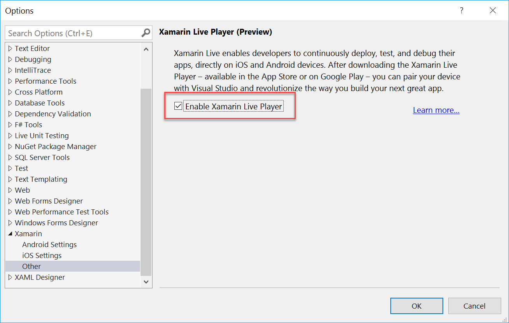
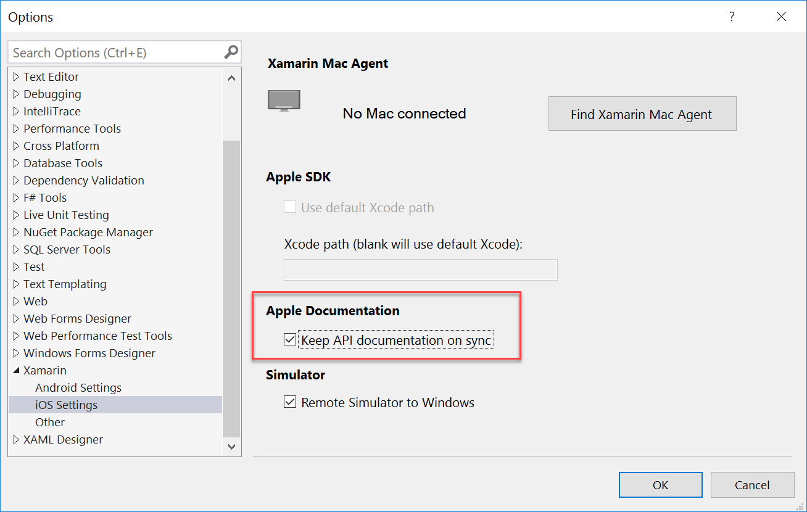
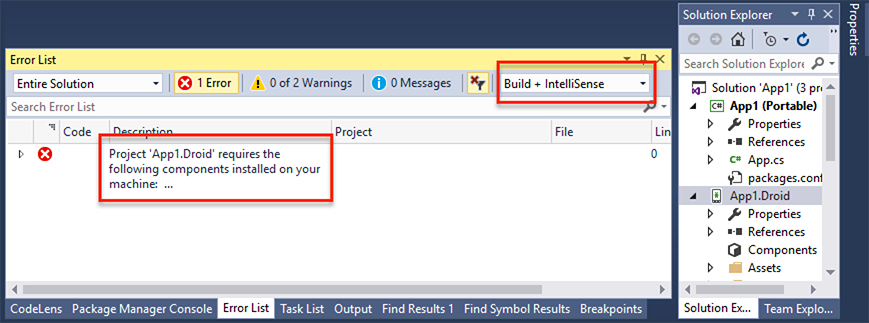

id:92e1df56-5062-4b5e-bf27-796449a55f17  

---
id: 27b478f9-9f03-4ad3-be56-3fb22dd2eed0
title: "Visual Studio Tools for Xamarin 4.7"
version: 4.7
releasedate: 2017-07-27
---

This release contains updated support for the Xamarin SDKs for iOS and Android:

* [Xamarin.iOS 10.14](/releases/ios/xamarin.ios_10/xamarin.ios_10.14/)
* [Xamarin.Android](/releases/android/xamarin.android_7/xamarin.android_7.5/)


## What’s New

### Xamarin Live

[Xamarin Live](https://www.xamarin.com/live) enables developers to continuously deploy, test, and debug their apps, directly on iOS and Android devices. After downloading the Xamarin Live Player - available in the App Store or on Google Play - you can pair your device with Visual Studio and begin building mobile apps using just Visual Studio and your mobile device. In this release, we have integrated Xamarin Live into the IDE.


To enable Xamarin Live functionality, go to **Tools > Options > Xamarin > Other** and check **Enable Xamarin Live Player**.



This release also adds some additional functionality when building apps with the Live Player, including:


- Integration with console and debug windows. Any logging your app executes on device will appear in these windows.
- New order in debug targets list. Live Player devices are no longer the default deployment target and will be listed below all other possible debug targets (such as simulators, emulators, and/or devices).
- Disables the Mac Agent window from appearing until required. The “Pair to Mac” functionality (also known as the “Mac Agent”) from displaying unless required by operations such as opening the iOS designer or attempting to build to a simulator/device.

To use the latest Xamarin Live Player app for iOS and Android, be sure to join the [Xamarin Live Player Alpha Program](https://forums.xamarin.com/discussion/98529/join-the-xamarin-live-player-app-alpha-program).

### Android Oreo support

Android 8.0 Oreo is by far the sweetest version of Android to date, with great new features including notification channels, notification badges, custom fonts in XML, downloadable fonts, instant apps, background limits, autofill, and picture-in-picture (PIP). We’re excited to announce Xamarin.Android support for Android Oreo in [Xamarin.Android 7.5](https://developer.xamarin.com/releases/android/xamarin.android_7/xamarin.android_7.5/#Android_Oreo_Support), which is available in this release.

### Xcode 9 Support
We’ve updated Xamarin.iOS to support Xcode 9 so you can begin submitting iOS 11, tvOS 11, and watchOS 4 app updates to the Apple App Store immediately. Check out [this blog post](https://blog.xamarin.com/get-apps-ready-ios-11/) on how you can get your apps ready for iOS 11 and take advantage of new features such as ARKit, CoreML, and Drag and Drop!

### Making the Xamarin smarter and smaller

We have been working to make the Xamarin workload smarter (to ensure you have everything you need with our default installation options) and smaller.

#### 42% reduction in install footprint

The Xamarin workload has gone on a diet! In Visual Studio 2017 version 15.3, the default installation size was 25.72 GB. Visual Studio 2017 version 15.4 has reduced this install footprint to 14.96 GB, or a 42% percent reduction in size.

#### Android API 25

Android API 25 SDKs are now shipped as part of our Visual Studio installer. Additionally, we now ship two preconfigured emulators by default in the box - an x86 Intel HAXM emulator and an ARM emulator. All Xamarin.Forms templates have been updated to include Android Support Libraries 25.4.0.2, or the latest stable packages available. 

### Automatically copy .app bundles back to Windows

When building iOS apps in Visual Studio, the .app bundle is not copied back to the Windows machine after building on a Mac, something our amazing developers have been asking us to help enable continuous integration scenarios. This release adds a new *CopyAppBundle* property that allows developers to copy .app bundles back to Windows.

To use this functionality, add the *CopyAppBundle* property to your .csproj under the property group you wish to apply this functionality to (such as debug-only builds). For example:

``` <propertygroup condition=" '$(Configuration)|$(Platform)' == 'Debug|iPhoneSimulator' ">
    <copyappbundle>true</copyappbundle>
</propertygroup>


```

### Ability to enable/disable iOS documentation sync

Documentation sync (also known as “DocSync”) enables you to view documentation for iOS APIs offline. This release adds a new off-by-default setting that allows this functionality to be enabled or disabled. To enable or disable documentation sync, go to **Tools > Options > Xamarin > iOS** and check **Keep API documentation in sync**.




## Bug Fixes


- #[24421](https://bugzilla.xamarin.com/show_bug.cgi?id=24421): Files in the .app bundle in the output folder are empty on Windows.
- #[28826](https://bugzilla.xamarin.com/show_bug.cgi?id=28826): Permissions not saved when you set them using the spacebar.
- #[33331](https://bugzilla.xamarin.com/show_bug.cgi?id=33331): iOS LaunchImages & AppIcons dialog window in Asset Catalog editor have nearly invisible light-grey labels.
- #[39285](https://bugzilla.xamarin.com/show_bug.cgi?id=39285): High CPU use on the Mac build host appears to cause UI pauses in paired instance of Visual Studio.
- #[42368](https://bugzilla.xamarin.com/show_bug.cgi?id=42368): Building an iOS app immediately after Mac Server connection finishes makes the build fails without errors
- #[42618](https://bugzilla.xamarin.com/show_bug.cgi?id=42618): Accumulation of sshd instances on OSX build host resulting in eventual build failures.
- #[42717](https://bugzilla.xamarin.com/show_bug.cgi?id=42717): Building app sometimes spins up MSBuild instances that are orphaned in the background.
- #[43597](https://bugzilla.xamarin.com/show_bug.cgi?id=43597): Add Mac dialog description is too small for Spanish translation.
- #[43613](https://bugzilla.xamarin.com/show_bug.cgi?id=43613): Xamarin options dialog UI issues when language is set to Spanish.
- #[45682](https://bugzilla.xamarin.com/show_bug.cgi?id=45682): Scp doesn't copy entire file Messaging.g.cs.
- #[45328](https://bugzilla.xamarin.com/show_bug.cgi?id=46328): Build Agent: Entering incorrect IP gives no indication for a long time that it is trying to connect.
- #[49160](https://bugzilla.xamarin.com/show_bug.cgi?id=49160): Inform user when attempting build that XMA hasn't finished yet.
- #[50086](https://bugzilla.xamarin.com/show_bug.cgi?id=50086): Breakpoints in PCL projects no longer hit.
- #[51262](https://bugzilla.xamarin.com/show_bug.cgi?id=51262): Cannot run / debug WatchKit app on Simulator in Visual Studio 2015.
- #[51759](https://bugzilla.xamarin.com/show_bug.cgi?id=51759): Getting build error for iOS sample 'Simpleapp-with-framework'.
- #[52184](https://bugzilla.xamarin.com/show_bug.cgi?id=52184): Archive Manager/Android Key Manager doesn't show complete error messages.
- #[52661](https://bugzilla.xamarin.com/show_bug.cgi?id=52661): "Not Responding" appears in VS window title when the new "Installing Android components..." dialog is initiated by building a new template project.
- #[52685](https://bugzilla.xamarin.com/show_bug.cgi?id=52685): watchOS SceneKit Game template defaults to iPhone as the solution platform when it should be iPhoneSimulator.
- #[52932](https://bugzilla.xamarin.com/show_bug.cgi?id=52932) : Xamarin.Forms project and added Xamarin.Forms library have differing PCL Profile.
- #[53073](https://bugzilla.xamarin.com/show_bug.cgi?id=53073): 32bit-only simulators should not be listed when you have a 64bit-only app.
- #[54226](https://bugzilla.xamarin.com/show_bug.cgi?id=54226): Mac connection disconnects when screen is locked.
- #[54446](https://bugzilla.xamarin.com/show_bug.cgi?id=54446): Debugging iOS project skips constructor.
- #[55518](https://bugzilla.xamarin.com/show_bug.cgi?id=55518): xma.exe is no longer installed causing the Tools -> iOS -> Open Mac Agent Console item to fail.
- #[55649](https://bugzilla.xamarin.com/show_bug.cgi?id=55649): Unable to build iOS projects while switching mac agents with error "An unexpected error occurred while checking consistency between the local app and the remote build".
- #[55673](https://bugzilla.xamarin.com/show_bug.cgi?id=55673): Cannot debug iOS project. Error checking consistency between local and remote.
- #[55886](https://bugzilla.xamarin.com/show_bug.cgi?id=55886): Cannot reconnect to build host without restarting Visual Studio.
- #[56100](https://bugzilla.xamarin.com/show_bug.cgi?id=56100): Unable to deploy tvOS extension app in debug mode. No tvOS simulators in device dropdown.
- #[56200](https://bugzilla.xamarin.com/show_bug.cgi?id=56200): When connecting to XMA build host, Output ->Xamarin does not log when a successful connection is established.
- #[56276](https://bugzilla.xamarin.com/show_bug.cgi?id=56276): Debug mode doesn't stop automatically when app is terminated or crashed.
- #[56673](https://bugzilla.xamarin.com/show_bug.cgi?id=56673): Exception windows doesn't shows the exception summary window.
- #[56975](https://bugzilla.xamarin.com/show_bug.cgi?id=56975): Immediately disconnecting from XMA agent when attempting to pair, and getting `System.ArgumentException: username`.
- #[56993](https://bugzilla.xamarin.com/show_bug.cgi?id=56993): tvOS F# application display error pop-up as "File Modification Detected outside the environment" on project creation.
- #[57007](https://bugzilla.xamarin.com/show_bug.cgi?id=57009): Visualization error in Xamarin Live Player for ListView item template.
- #[57239](https://bugzilla.xamarin.com/show_bug.cgi?id=57239): Intermittent iOS build timeouts.
- #[57325](https://bugzilla.xamarin.com/show_bug.cgi?id=57325): IDE Simulator device list does not get updated when changing from higher to lower iOS versions.
- #[57340](https://bugzilla.xamarin.com/show_bug.cgi?id=57340): Mac build host connection failed, though UI shows as connected.
- #[57454](https://bugzilla.xamarin.com/show_bug.cgi?id=57454): "Open Mac Agent Console..." menu command does not work.
- #[57646](https://bugzilla.xamarin.com/show_bug.cgi?id=57646): Android Manifest project page does not contain "Application Theme" field.
- #[57647](https://bugzilla.xamarin.com/show_bug.cgi?id=57647): Inconsistent casing for Android Manifest field labels.
- #[57653](https://bugzilla.xamarin.com/show_bug.cgi?id=57653): Cannot rename assembly name in Xamarin.Android project.
- #[57724](https://bugzilla.xamarin.com/show_bug.cgi?id=57724): Opening Device Log should not default to "Select a Device" if a device is already plugged in, available via abd, and selected as debug target.
- #[57751](https://bugzilla.xamarin.com/show_bug.cgi?id=57751): Typo in iOS Bundle Signing property page.
- #[57753](https://bugzilla.xamarin.com/show_bug.cgi?id=57753): Despite successful build and device deploy, iOS Profiler will not launch.
- #[57830](https://bugzilla.xamarin.com/show_bug.cgi?id=57830): Connection to another Mac in the same VS instance fails the first time.
- #[57844](https://bugzilla.xamarin.com/show_bug.cgi?id=57844): Info.plist should be opened when "Change Deployment Target..." command is executed.
- #[57847](https://bugzilla.xamarin.com/show_bug.cgi?id=57847): iOS Run Options property page allows for empty environment variables to be set and saved.
- #[57891](https://bugzilla.xamarin.com/show_bug.cgi?id=57891): iOS device name changes do not appear in the target list.
- #[57892](https://bugzilla.xamarin.com/show_bug.cgi?id=57952): Android manifest missing important metadata like package name, version number, and version name.
- #[58007](https://bugzilla.xamarin.com/show_bug.cgi?id=58007): Server list doesn't refresh after add new server or forget an existing one.
- #[58046](https://bugzilla.xamarin.com/show_bug.cgi?id=58046): iOS deployment target dropdown options in Info.plist is not dark theme friendly.
- #[58047](https://bugzilla.xamarin.com/show_bug.cgi?id=58047): "iOS Bundle Signing" settings page misleadingly shows "Automatic" when unknown Signing Identity or Provisioning Profile is currently saved in the .csproj file.
- #[58058](https://bugzilla.xamarin.com/show_bug.cgi?id=58058): Error when creating new Asset Catalog in iOS class library project.
- #[58067](https://bugzilla.xamarin.com/show_bug.cgi?id=58067): Consecutive deployments to an already running AVD fail after closing solution or relaunching Visual Studio.
- #[58070](https://bugzilla.xamarin.com/show_bug.cgi?id=58070): Visual Studio never deploys an AdHoc release app.
- #[58146](https://bugzilla.xamarin.com/show_bug.cgi?id=58146): NullReferenceException observed when trying to build iOS Apps when Mac Agent connection is in process
- #[58151](https://bugzilla.xamarin.com/show_bug.cgi?id=58151): No logs appear on Xamarin console output window for successful "Start without debugging" on remote simulator.
- #[58249](https://bugzilla.xamarin.com/show_bug.cgi?id=58249): Multiple files missing error pop up observed while creating Xamarin.Forms + Azure project template.
- #[58364](https://bugzilla.xamarin.com/show_bug.cgi?id=58364): Unable to build iOS project. Icon missing error observed on building Xamarin.Forms + Azure project template.
- #[58425](https://bugzilla.xamarin.com/show_bug.cgi?id=58425): Xamarin Mac agent icon gets disabled when 'Add Server' button is selected while connecting with Mac agent.
- #[58456](https://bugzilla.xamarin.com/show_bug.cgi?id=58456): “Connect to Mac” window is not properly localized.
- #[58515](https://bugzilla.xamarin.com/show_bug.cgi?id=58515): XML key "UIMainStoryboardFile" is not saved in Info.plist.
- #[58607](https://bugzilla.xamarin.com/show_bug.cgi?id=58607): Xamarin.UITest templates target platform is set to blank if .Net Framework 4.5 is not installed.
- #[58729](https://bugzilla.xamarin.com/show_bug.cgi?id=58729):  UpdateAndroidResgen fails for Android wear app.
- #[58853](https://bugzilla.xamarin.com/show_bug.cgi?id=58853):  Use Fast Deployment field is not disabled when release configuration is selected on Android Options.
- #[59001](https://bugzilla.xamarin.com/show_bug.cgi?id=59001): Android toolbar buttons are no-ops when Android Studio is installed.
- #[59022](https://bugzilla.xamarin.com/show_bug.cgi?id=59022): Visual Studio Emulator for Android cannot be launched for debugging.
- #[59100](https://bugzilla.xamarin.com/show_bug.cgi?id=59100): Invalid Java SDK path is stored in registry when setting is saved via Android settings.

## Known Issues

To provide feedback about your experience with the Visual Studio Tools for Xamarin, visit [Visual Studio Developer Community](https://developercommunity.visualstudio.com/) or use [**Report a Problem**](https://docs.microsoft.com/en-us/visualstudio/ide/how-to-report-a-problem-with-visual-studio-2017)” from within Visual Studio. Thanks for helping to build a better Xamarin!

### Build canceled with error: Project '*****project_name*****' requires the following components installed on your machine:

Building Android applications may require installing additional components. This can be needed in several cases, like if you're using a new component, NuGet Package, or if it's the first Xamarin.Forms solution you're building on a given machine. Xamarin automatically detects the lack of these resources, and shows an error informing you to download and install them:



To resolve this error, double-click on the error in the errors window to start downloading and installing missing components.

If you try to build any project in the solution without installing the missing components, the build will be canceled. You cannot build without installing those components. Please ensure Intellisense errors are visible to be able to start installing them.